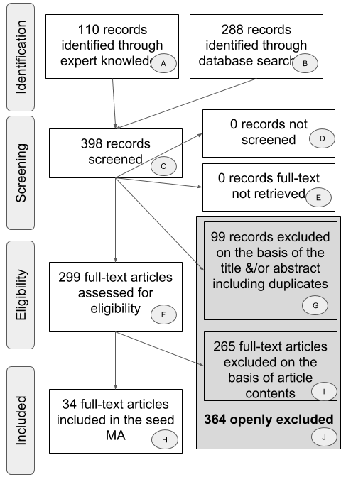

```{r Setup, echo = FALSE, warning=FALSE, error = FALSE, message = FALSE, tidy = TRUE}
knitr::opts_chunk$set(echo = FALSE, warning = FALSE, tidy = TRUE, message = FALSE, error = FALSE)

# wordcount()
# doesn't work...
# https://github.com/benmarwick/wordcountaddin


### Load libraries
library(papaja)
library(metafor)
library(meta)
library(pwr)
library(knitr)
library(ggplot2)
library(wesanderson)
library(grid)
library(gridExtra)
library(xtable)
library(schoRsch)
library(multcomp)
library(poibin)
library(tidyverse)

# can't call reshape here, because it will interfere with other libraries
#library(reshape)

r2 <- function(x){ round(x, 3)}

psig <- function(x){
  ifelse(x < .001, "< .001",
         #ifelse(x < .001, "< .001",
                #ifelse(x < .01, "< .01",
                       ifelse(x > .001 & x < .05, paste("=", r2(x), sep = " "), paste("=", r2(x), sep = " ")))#))
}

# function for creating 1 line paired t.test results
t.xtable <- function(x) as.data.frame(xtable(
  t_out(toutput=x, n.equal = TRUE, welch.df.exact = TRUE, welch.n = NA,
        d.corr = TRUE, print = TRUE)
))


g_SE <- function(x) paste0(r2(x$estimate), " (SE = ", r2(x$se), ")")

CI_p <- function(x) paste0("(CI [", r2(x$ci.lb), ", ", r2(x$ci.ub), "], *p* ", psig(x$pval), ")")

full_estimate <- function(x) paste0(" = ", r2(x$estimate), ", SE = ", r2(x$se), ", 95% CI[",  r2(x$ci.lb), ", ", r2(x$ci.ub),"], *p* ", psig(x$pval))


# moderator test
mod_test <- function(x) paste0("QM(", r2(x$m), ") = ", r2(x$QM), ", *p* ", psig(x$QMp))


# Create the function for mode.
getmode <- function(v) {
   uniqv <- unique(v)
   uniqv[which.max(tabulate(match(v, uniqv)))]
}

```


```{r ReadIn}

#Get the effect size data
source("scripts/calculateES.R")

```

```{r Preprocess}


noES <- db_ET %>%
  filter(is.na(d_calc)) %>%
  group_by(short_cite) %>%
  summarise(n_records = n())

db_ET$same_infant_calc <- paste(db_ET$study_ID, db_ET$expt_num, db_ET$same_infant, sep = "_")

# assign language families

db_ET$lang_family = ifelse(db_ET$native_lang=="American English" | db_ET$native_lang=="British English" | db_ET$native_lang=="Dutch" |
db_ET$native_lang=="Danish" | db_ET$native_lang=="Swedish" |
db_ET$native_lang=="English" | db_ET$native_lang=="German", "Germanic", ifelse(db_ET$native_lang == "French" | db_ET$native_lang == "Catalan" | db_ET$native_lang == "Spanish" | db_ET$native_lang == "Catalan-Spanish" | db_ET$native_lang == "Swiss French", 
                                "Romance", "Sino-Tibetian"))

descriptive_dat <- db_ET

db_ET <- db_ET %>%
  filter(!is.na(d_calc))


db_ET <- db_ET %>%
  mutate(age.C = (mean_age_1-mean(mean_age_1, na.rm=TRUE))/30.44) %>%
  filter(mean_age_months < 31)


#Split into correct and MP database

db_ET_correct <- db_ET[db_ET$is_correct=="1",]
db_ET_MP <- db_ET[db_ET$is_mp=="1",]


#remove outliers
db_ET_MP$nooutlier = ifelse(db_ET_MP$g_calc > mean(db_ET_MP$g_calc, na.rm = TRUE) + 3*sd(db_ET_MP$g_calc, na.rm = TRUE) 
                         | db_ET_MP$g_calc < mean(db_ET_MP$g_calc, na.rm = TRUE) - 3*sd(db_ET_MP$g_calc, na.rm = TRUE),FALSE, TRUE)

n_outlier_MP = sum(db_ET_MP$nooutlier==FALSE)

db_ET_MP = db_ET_MP[db_ET_MP$nooutlier,]

# 3 outliers

db_ET_correct$nooutlier = ifelse(db_ET_correct$g_calc > mean(db_ET_correct$g_calc, na.rm = TRUE) + 3*sd(db_ET_correct$g_calc, na.rm = TRUE) 
                         | db_ET_correct$g_calc < mean(db_ET_correct$g_calc, na.rm = TRUE) - 3*sd(db_ET_correct$g_calc, na.rm = TRUE),FALSE, TRUE)

n_outlier_correct = sum(db_ET_correct$nooutlier==FALSE)
  
db_ET_correct = db_ET_correct[db_ET_correct$nooutlier,]
  

# 2 outliers


# make sure that both correct and mispronounced conditions are considered in descriptives

db_ET_correct$condition <- 1
db_ET_MP$condition <- 0

dat <- bind_rows(db_ET_correct, db_ET_MP)

# need data set of unique short cite by expt_num
# in order to calculate total number of infants

# need data set of unique short cite by condition

sum_dat <- dat[!duplicated(dat[c("short_cite", "same_infant")]),]
time_wind_dat <- dat[!duplicated(dat[c("short_cite", "offset", "post_nam_dur")]),]
distract_dat <- dat[!duplicated(dat[c("short_cite", "object_pair")]),]
mix_co_mp <- dat[!duplicated(dat[c("short_cite", "word_correct_and_MP")]),]


```


```{r PlotAPATheme}
# Plotting defaults

#Themes and plot
apatheme=theme_bw()+
  theme(panel.grid.major=element_blank(),
    panel.grid.minor=element_blank(),
    panel.border=element_blank(),
    axis.line=element_line(),
    text=element_text(family='Times', size=25))

# Color Blind palette:
cbPalette <- c("#E69F00", "#56B4E9", "#009E73", "#F0E442", "#0072B2", "#D55E00", "#CC79A7")

```


# Introduction

Acquiring a first language means that young learners are solving a host of tasks in a short amount of time. As infants develop into toddlers during their second and third years they learn new words in earnest while simultaneously refining their knowledge about the sounds that make up these words [@Kuhl2004; @Curtin2007; @Werker2005; @Best1994; @Best1995]. In a mature phono-lexical system, word recognition must balance flexibility to slight variation (e.g., speaker identity, accented speech) while distinguishing between phonetic details that differentiate words in a given language (e.g. cat-hat). To build robust language knowledge, it seems useful to acquire this ability early during development. Indeed, before children can correctly pronounce a word, they already are aware that slight phonological deviations might signal a change in word meaning [@clark1977]. This mispronunciation sensitivity reflects the specificity with which infants represent the phonological information of familiar words. As infants continue to develop into expert language users, their language processing matures and becomes more efficient, including their knowledge of what constitutes a permissible versus word-changing phonological deviation. In this paper, we aggregate and analyze the nearly 20 years of literature investigating mispronunciation sensitivity in infants in an attempt to uncover its characteristics and the trajectory of its development.

  At the turn of the millenium, infant language acquisition researchers had established that during their first two years of life, infants are sensitive to changes in the phonetic detail of newly segmented words [@Jusczyk1995] and learned minimal pairs [@Stager1997]. Furthermore, when presented with familiar image pairs, children fixate on the referent of a spoken label [@Fernald1998; @Tincoff1999]. @Swingley2000 were the first to tie these lines of research together and investigate mispronunciation sensitivity in infant familiar word recognition: Children aged 18 to 23 months learning American English saw pairs of images (e.g. a baby and a dog) and their eye movements to each image were recorded. On "correct" trials, children heard the correct label for one of the images (e.g. "baby"). On "mispronounced" trials, children heard a mispronounced label of one of the images (e.g. "vaby"). The mean proportion of fixations to the target image (here: a baby) was calculated separately for both correct and mispronounced trials by dividing the target looking time by the sum of total looking time to both target and a distractor (proportion of target looking or PTL). Mean fixations in correct trials were significantly greater than in mispronounced trials, and in both conditions looks to the target were significantly greater than chance. We refer to this pattern of a difference between looks to correct and mispronounced words as *mispronunciation sensitivity* and of looks to the target image above chance in each condition as *object identification*. @Swingley2000 concluded that already before the second birthday, children represent words with sufficient detail to be sensitive to mispronunciations.  

  The study of @Swingley2000 as well as subsequent studies examining mispronunciation sensitivity address two complementary principles that infants must discover in early phonological development in order to form adult-like word representations and processing capabilities: *phonological constancy* and *phonological distinctiveness*. Phonological constancy is the ability to resolve phonological variation across different instances of a word, as long as the variation does not compromise the overall identity of the word. For example, different speakers - particularly across genders and accents - produce the same word with notable acoustic variation, although the word remains the same. In contrast, phonological distinctiveness describes the ability to differentiate between different words that happen to be phonologically similar, such as bad/bed or cat/hat. To successfully recognize words, speakers of a given language must therefore simultaneously use both phonological constancy and distinctiveness to determine where phonological variation is appropriate and where it changes a word's meaning. Both abilities have to be acquired, because language systems differ in which sounds signal a meaning change. 

  In the current study, we focus on infants' developing ability to correctly apply the principles of phonological constancy and distinctiveness by using a meta-analytic approach to investigate mispronunciation sensitivity. Considering that infants are sensitive to mispronunciations and that, in general, their processing matures with development, we examine the shape of mispronunciation sensitivity over the course of the second and third year. There are three distinct possibilities how mispronunciation sensitivity might change as infants become native speakers, which are all respectively supported by single studies and additionally two possibilities are predicted by key theoretical accounts. By aggregating all publicly available evidence using meta-analysis, we can examine developmental trends making use of data from a much larger and diverse sample of infants than is possible in most single studies ([see @Frank2017; for a notable exception). Before we outline the meta-analytical approach and its advantages in detail, we first discuss the proposals this study seeks to disentangle and the data supporting each of the accounts.
  
  
  Young infants may begin cautiously in their approach to word recognition, rejecting any phonological variation in familiar words and only later learning to accept appropriate variability. According to the Perceptual Attunement account, this describes a shift away from specific native phonetic patterns to a more mature understanding of the abstract phonological structure of words [@Best1994; @Best1995]. This shift is predicted to coincide with the vocabulary spurt around 18 months, because it is causally related to vocabulary growth. In this case, we would expect the size of mispronunciation sensitivity to be larger at younger ages and *decrease* as the child matures and learn more words, although children continue to detect mispronunciations.
Indeed, young infants are more perturbed by accented speakers than older infants in their recognition of familiar words [@Best2009; @Mulak2014] or learning of new words [@Schmale2011].

  According to a different theoretical framework, young infants may instead begin with phonologically broad representations for familiar words and only refine their representations as language experience accumulates. PRIMIR [Processing Rich Information from Multidimensional Interactive Representations; @Curtin2007; @Curtin2011; @Werker2005] describes the development of phonemic categories emerging as the number of word form-meaning linkages increases. Vocabulary growth, therefore, promotes more detailed phonological representations in familiar words. Following this account, we predict an *increase* in mispronunciation sensitivity as infants mature and add more words to their growing lexicon. 
  
  
  Finally, sensitivity to mispronunciation may not be modulated by development at all. Infants' overall language processing becomes more efficient, but their sensitivity to mispronunciations may not change. Across infancy and toddlerhood, mispronunciations would thus be detected and lead to less looks at a target than correct pronunciations, but the size of this effect would not change, nor be related to vocabulary size. This pattern is not predicted by any mainstream theory of language acquisition, but for completeness we mention it here.

  Research following the seminal study by @Swingley2000 has extended mispronunciation sensitivity to infants as young as 9 months [@Bergelson2017], indicating that from early stages of the developing lexicon onwards, infants can and do detect mispronunciations. Regarding the change in mispronunciation sensitivity over development, however, only about half of studies have compared more than one age group on the same mispronunciation task (see Table 1). In those single studies all possible patterns of development lined out above have been reported, making the current meta-analysis very informative. 
  
  One study has found evidence for infants to become *less* sensitive to mispronunciations as they develop. @Mani2011 presented 18- and 24-month-olds with mispronunciations varying in the number of phonological features changed (e.g., changing an p into a b, a 1-feature change, versus changing a p into a g, a 2-feature change). 18-month-olds were sensitive to mispronunciations, regardless of the number of features changed. 24-month-olds, in contrast, fixated the target image equally for both correct and 1-feature mispronounced trials, although they were sensitive to larger mispronunciations. In other words, for 1-feature mispronunciations at least, sensitivity decreased from 18 to 24 months, providing support to the prediction that mispronunciation sensitivity may decrease with development.

  In contrast, other studies have found evidence for *greater* mispronunciation sensitivity as children develop. More precisely, the difference in target looking for correct and mispronounced trials is reported to be smaller in younger infants and grows as infants develop. @Mani2007 tested 15-, 18-, and 24-month-olds learning British English; although all three groups were sensitive to mispronunciations, 15-month-olds showed a less robust sensitivity. An increase in sensitivity to mispronunciations has also been found from 20 to 24 months [@vanderFeest2015] and 15 to 18 months [@Altvater2014] in Dutch infants, as well as German infants from 22 to 25 months [@Altvater2010]. Furthermore, @vanderFeest2015 found that sensitivity to specific kinds of mispronunciations develop at different ages depending on language infants are learning. In other words, the native language constraints which *kinds* of mispronunciations infants are sensitive to first, and that as infants develop, they become sensitive to other mispronunciations. These studies award support to the prediction that mispronunciation sensitivity increases with development.

Finally, some studies have found no difference in mispronunciation sensitivity at different ages. @Swingley2000 tested infants over a wide age range of 5 months (18 to 23 months).  They found that age correlated with target fixations for both correct and mispronounced labels, whereas the difference between the two (mispronunciation sensitivity) did not. This suggests that as children develop, they are more likely to look at the target in the presence of a correct or mispronounced label, but that the difference between looks elicited by the two conditions does not change. A similar response pattern has been found for British English learning infants aged between 18 and 24 months [@Bailey2002] as well as younger French-learning infants at 12 and 17 months [@Zesiger2012]. These studies award support to the prediction that mispronunciation sensitivity does not change with development.

  Why would mispronunciation sensitivity change as infants develop, and would it increase or decrease? The main hypotheses attribute change to vocabulary growth. Both the Perceptual Attunement [@Best1994; @Best1995] and PRIMIR [@Curtin2007; @Werker2005; @Curtin2011] accounts situate a change in mispronunciation sensitivity occurring along with an increase in vocabulary size, particularly with the vocabulary spurt at about 18 months. As infants learn more words, their focus shifts to the relevant phonetic dimensions needed for word recognition. For example, an infant who knows a handful of words with few phonological neighbors would not need to have fully specified phonological representations in order to differentiate between these words. As more phonologically similar words are learned, however, the need for fully detailed phonological representations increases [@CharlesLuce1995]. Furthermore, a growing vocabulary also reflects increased experience or familiarity with words, which may sharpen the detail of their phonological representation [@Barton1980]. If vocabulary growth leads to an increase in the phonological specificity of infants' word representation, we should find a relationship between vocabulary size and mispronunciation sensitivity.

  Yet, the majority of studies examining a potential association between mispronunciation sensitivity and vocabulary size have concluded that there is no relationship [@Swingley2000; @Swingley2002; @Swingley2009; @Zesiger2012; @Mani2008; @Bailey2002; @Mani2007; @Ballem2005]. One notable exception comes from @Mani2010kepstups. Here, 12-month-old infants were divided into a low and high vocabulary group based on median vocabulary size. High vocabulary infants showed greater sensitivity to vowel mispronunciations than low vocabulary infants, although this was not the case for consonant mispronunciations. Taken together, although receiving considerable support from theories of phono-lexical processing in language acquisition, there is very little evidence for a role of vocabulary size in mispronunciation sensitivity. In our current meta-analysis, we include the relationship between mispronunciation sensitivity and vocabulary size to further disentangle the disconnect between theory and experimental results. 
  
In sum, the studies we have reviewed begin to paint a picture of the development of infants' mispronunciation sensitivity. Each study contributes one separate brushstroke and it is only by examining all of them together that we can achieve a better understanding of the big picture of early language development. Meta-analyses can provide unique insights by estimating the population effect, both of infants' responses to correct and mispronounced labels, and of their mispronunciations sensitivity. Because we aggregate data over various age groups, this meta-analysis can also investigate the role of maturation by assessing the impact of age and vocabulary size. As a consequence, our results will be important in evaluating theories and drive future research. We also make hands-on recommendations for experiment planning, for example by providing an effect size estimate for a priori power analyses [@Bergmann2018]. 


# Methods

The present meta-analysis was conducted with maximal transparency and reproducibility in mind. To this end, we provide all data and analysis scripts on the supplementary website (https://osf.io/rvbjs/) and open our meta-analysis up for updates [@Tsuji2014]. The most recent version is available via the website and the interactive platform MetaLab [https://metalab.stanford.edu; @Bergmann2018]. Since the present paper was written with embedded analysis scripts in R [@R] using the papaja package [@papaja] in R Markdown [@RMarkdown], it is always possible to re-analyze an updated dataset. In addition, we followed the Preferred Reporting Items for Systematic Reviews and Meta-Analyses (PRISMA) guidelines and make the corresponding information available as supplementary materials [@Moher2009]. Figure \@ref(fig:PRISMA-image) plots our PRISMA flowchart illustrating the paper selection procedure.

## (Insert Figure 1 about here)

```{r PRISMA-image, echo= FALSE, fig.cap="A PRISMA flowchart illustrating the selection procedure used to include studies in the current meta-analysis."}



# ! [Figure X. PRISMA Flowchart.] (Users/KatesOld/Documents/R_Git/figures/PRISMA_MA_Mispronunciation.png)

```

## Study Selection

```{r SummaryTable, results = "asis"}


dat_st <- descriptive_dat

Sum_table <- dat_st %>%
      group_by(short_cite) %>% 
      summarise(Publication = unique(publication_status),
        Ages_Tested_months = paste(unique(trunc(mean_age_1/30.44)), collapse=', '),
                Vocabulary = ifelse(all(is.na(r_comprehension)) & all(is.na(r_production)), "None",
                                ifelse(!all(is.na(r_comprehension)) & !all(is.na(r_production)), "Comp/Prod",
                                       ifelse(!all(is.na(r_comprehension)) & all(is.na(r_production)), "Comp", "Prod"))),
        Effect_sizes_n = n())

#kable(Sum_table, col.names = c("Paper", "Publication format", "Age", "Vocabulary", "N Effect Sizes"))
apa_table(Sum_table, col.names = c("Paper", "Publication format", "Age", "Vocabulary", "N Effect Sizes"), caption = "Summary of all studies. Age is calculated by truncating the mean age reported in the paper. The abbreviations Comp and Prod refer to comprehension and production, respectively.", landscape = TRUE)


```


We first generated a list of potentially relevant items to be included in our meta-analysis by creating an expert list. This process yielded 110 items. We then used the google scholar search engine to search for papers citing the original @Swingley2000 publication. This search was conducted on 22 September, 2017 and yielded 288 results. We removed 99 duplicate items and screened the remaining 299 items for their title and abstract to determine whether each met the following inclusion criteria: (1) original data was reported; (2) the experiment examined familiar word recognition and mispronunciations; (3) infants studied were under 31-months-of-age and typically developing; (4) the dependent variable was derived from proportion of looks to a target image versus a distractor in a eye movement experiment; (5) the stimuli were auditory speech. The final sample (n = *`r length(unique(descriptive_dat$short_cite))`*) consisted of `r with(descriptive_dat, n_distinct(short_cite[publication_status == "paper"]))` journal articles, `r with(descriptive_dat, n_distinct(short_cite[publication_status == "proceedings"]))` proceedings paper, `r with(descriptive_dat, n_distinct(short_cite[publication_status == "dissertation"]))` theses, and `r with(descriptive_dat, n_distinct(short_cite[publication_status == "gray paper"]))` unpublished reports. We will refer to these items collectively as papers. Table 1 provides an overview of all papers included in the present meta-analysis.

## (Insert Table 1 about here)

```{r DescriptivesPubtype}

pub_info <- dat %>%
  group_by(publication_status) %>%
  summarize(n_unique = n_distinct(short_cite), count = n())

#kable(pub_info, col.names = c("Publication Type", "# Items", "# Effect Sizes"))


```

## Data Entry

The `r length(unique(descriptive_dat$short_cite))` papers we identified as relevant were then coded with as much consistently reported detail as possible [@Tsuji2014; @Bergmann2018]. For each experiment (note that a paper typically has multiple experiments), we entered variables describing the publication, population, experiment design and stimuli, and results. For the planned analyses to evaluate the development of mispronunciation sensitivity, we focus on the following characteristics:   


1 Condition: Were words mispronounced or not;  
2 Mean age reported per group of infants, in days;  
3 Vocabulary size, measured by a standardized questionnaire or list;    


We separated conditions according to whether or not the target word was mispronounced to be able to investigate infants' looking to the target picture as well as their mispronunciation sensitivity, which is the difference between looks to the target in correct and mispronounced trials. When the same infants were further exposed to multiple mispronunciation conditions and the results were reported separately in the paper, we also entered each condition as a separate row  [e.g., consonant versus vowel mispronunciations; @Mani2007].  The fact that the same infants contributed data to multiple rows (minimally those containing information on correct and mispronounced trials) leads to shared variance across effect sizes, which we account for in our analyses (see next section). We will call each row a record; in total there were `r nrow(descriptive_dat)` records in our data.


## Data analysis

```{r DescriptivesComparison, echo = FALSE}
db_ET_correct$within_measure_descriptive <- ifelse(db_ET_correct$within_measure == "post",
 "post-naming phase compared with chance (=50%)",
ifelse(db_ET_correct$within_measure == "pre_post", "post-naming compared to pre-naming phase", "post-pre difference score compared with chance (=0)"))

comparison_info <- db_ET_correct %>%
  group_by(within_measure) %>%
  summarize(n_unique = n_distinct(short_cite), count = n())

#kable(comparison_info, col.names = c("Type of comparison", "# Papers", "# Effect Size"))
#table(db_ET_MP$es_method)
```

```{r DescriptivesES}
#how did we calculate effect sizes?

es_info <- descriptive_dat %>%
  filter(!is.na(d_calc)) %>%
  group_by(es_method) %>%
  summarize(n_unique = n_distinct(short_cite), count = n())


corr_info <- descriptive_dat %>%
  filter(!is.na(d_calc)) %>%
  group_by(imputed_corr) %>%
  summarize(n_unique = n_distinct(short_cite), count = n())

```


Effect sizes are reported for infants' looks to target pictures after hearing a correctly pronounced or a mispronounced label (object identification) as well as the difference between effect sizes for correct and mispronounced trials (i.e. mispronunciation sensitivity). The effect size reported in the present paper is based on comparison of means, standardized by their variance. The most well-known effect size from this group is Cohen's *d* [@cohen]. To correct for the small sample sizes common in infant research, however, we used Hedges' *g* instead of Cohen's *d* [@Hedges1981; @morris2002combining]. 

We calculated Hedges' *g* using the raw means and standard deviations reported in the paper (*n* = `r with(es_info, sum(count[es_method == "group_means_one" | es_method == "group_means_two"]))` records from `r with(es_info, sum(n_unique[es_method == "group_means_one" | es_method == "group_means_two"]))` papers) or reported t-values (*n* = `r with(es_info, sum(count[es_method == "t_one" | es_method == "t_two"]))` records from `r with(es_info, sum(n_unique[es_method == "t_one" | es_method == "t_two"]))` papers). Two papers reported raw means and standard deviations for some experimental conditions and just t-values for the remaining experimental conditions [@Swingley2016; @Altvater2014]. Raw means and standard deviations were extracted from figures for `r with(descriptive_dat, n_distinct(short_cite[ x_from_graph == "yes"]))` papers. In a within-participant design, when two means are compared (i.e. looking during pre- and post-naming) it is necessary to obtain correlations between the two measurements at the participant level to calculate effect sizes and effect size variance. Upon request we were provided with correlation values for one paper [@Altvater2010]; we were able to compute correlations using means, standard deviations, and t-values for `r with(corr_info, n_unique[imputed_corr == "no"])` papers [following @Csibra2016; see also @Rabagliati2018]. Correlations were imputed for the remaining papers [see @Black2017 for the same procedure]. For two papers, we could not derive any effect size [@Ballem2005; @Renner2017], and for a third paper, we do not have sufficient information in one record to compute effect sizes [@Skoruppa2013]. We compute a total of `r sum(dat$is_mp == 0)+n_outlier_correct` effect sizes for correct pronunciations and `r sum(dat$is_mp == 1)+n_outlier_MP` for mispronunciations. Following standard meta-analytic practice, we remove outliers, i.e. effect sizes more than 3 standard deviations from the respective mean effect size. This leads to the exclusion of `r n_outlier_correct` records for correct pronunciations and `r n_outlier_MP` records for mispronunciations. 


To take into account the fact that the same infants contributed to multiple datapoints, we analyze our results in a multilevel approach using the R [@R] package metafor [@metafor]. We use a multilevel random effects model which estimates the mean and variance of effect sizes sampled from an assumed distribution of effect sizes. In the random effect structure we take into account the shared variance of effect sizes drawn from the same paper, and nested therein that the same infants might contribute to multiple effect sizes.


Mispronunciation sensitivity studies typically examine infants' proportion of target looks (PTL) in comparison to some baseline measurement. PTL is calculated by dividing the percentage of looks to the target by the total percentage of looks to both the target and distractor images. Across papers the baseline comparison varied; since other options were not available to us, we used the baseline reported by the authors of each paper. Most papers (*n* = `r with(comparison_info, count[within_measure == "pre_post_naming_effect"])` records from `r with(comparison_info, n_unique[within_measure == "pre_post_naming_effect"])` papers) subtracted the PTL score for a pre-naming baseline phase from the PTL score for a post-naming phase and report a difference score.


Other papers either compared post- and pre-naming PTL with one another (*n* = `r with(comparison_info, count[within_measure == "pre_post"])` records from `r with(comparison_info, n_unique[within_measure == "pre_post"])` papers), thus reporting two variables, or compared post-naming PTL with a chance level of 50% (*n* = `r with(comparison_info, count[within_measure == "post"])` records from `r with(comparison_info, n_unique[within_measure == "post"])` papers). For all these comparisons, positive values (either as reported or after subtraction of chance level or a pre-naming baseline PTL) indicate target looks towards the target object after hearing the label, i.e. a recognition effect. Standardized effect sizes based on mean differences, as calculated here, preserve the sign. Consequently, positive effect sizes reflect more looks to the target picture after naming, and larger positive effect sizes indicate comparatively more looks to the target. 


## Publication Bias

In the psychological sciences, there is a documented reluctance to publish null results. As a result, significant results tend to be over-reported and thus might be over-represented in our meta-analyses [see @Ferguson2012]. To examine whether this is also the case in the mispronunciation sensitivity literature, which would bias the data analyzed in this meta-analysis, we conducted two tests. We first examined whether effect sizes are distributed as expected based on sampling error using the rank correlation test of funnel plot asymmetry with the R [@R] package metafor [@metafor]. Effect sizes with low variance were expected to fall closer to the estimated mean, while effect sizes with high variance should show an increased, evenly-distributed spread around the estimated mean. Publication bias would lead to an uneven spread. 

Second, we analyze all of the significant results in the dataset using a p-curve from the p-curve app [v4.0, http://p-curve.com; @pcurve]. This p-curve tests for evidential value by examining whether the p-values follow the expected distribution of a right skew in case the alternative hypothesis is true, versus a flat distribution that speaks for no effect being present in the population and all observed significant effects being spurious. 

Responses to correctly pronounced and mispronounced labels were predicted to show different patterns of looking behavior. In other words, there is an expectation that infants should look to the target when hearing a correct pronunciation, but studies vary in their report of significant looks to the target when hearing a mispronounced label (i.e. there might be no effect present in the population); as a result, we conducted these two analyses to assess publication bias separately for both conditions.

## Meta-analysis

The models reported here are multilevel random-effects models of variance-weighted effect sizes, which we computed with the R [@R] package metafor [@metafor]. To investigate how development impacts mispronunciation sensitivity, our core theoretical question, we first introduced age (centered; continuous and measured in days but transformed into months for ease of interpreting estimates by dividing by 30.44) as a moderator to our main model. Second, we analyzed the correlation between reported vocabulary size and mispronunciation sensitivity using the R [@R] package meta [@meta]. Finally, for a subsequent exploratory investigation of experimental characteristics, we introduced each characteristic as a moderator (more detail below).

# Results

## Publication Bias

```{r FunnelPlotAsymm_correct}

rma_correct = rma.mv(g_calc, g_var_calc, data = db_ET_correct, random = ~ same_infant_calc | short_cite)
# Publication bias can become visible in funnel plot asymmetry. 
# Metafor comes with several options to check this, I chose ranktest and regtest
# correct object identification
rmac <- ranktest(rma_correct)
#rmac

```

```{r FunnelPlotAsymm_misp}

rma_MP = rma.mv(g_calc, g_var_calc, data = db_ET_MP, random = ~ same_infant_calc | short_cite)

# mispronounced object identification
rmam <- ranktest(rma_MP)
#rmam
```

Figure \@ref(fig:FunnelCombo) shows the funnel plots for both correct pronunciations and mispronunciations [code adapted from @Sakaluk2016]. Funnel plot asymmetry was significant for both correct pronunciations (Kendall's $\tau$ = `r r2(rmac$tau)`, *p* `r psig(rmac$pval)`) and mispronunciations (Kendall's $\tau$ = `r r2(rmam$tau)`, *p* `r psig(rmam$pval)`). These results, quantifying the asymmetry in the funnel plots (Figure \@ref(fig:FunnelCombo)), indicate bias in the literature. This is particularly evident for correct pronunciations, where larger effect sizes have greater variance (bottom right corner) and the more precise effect sizes (i.e. smaller variance) tend to be smaller than expected (top left, outside the triangle).

The stronger publication bias for correct pronunciation might reflect the status of this condition as a control. If infants were not looking to the target picture after hearing the correct label, the overall experiment design is called into question. However, even in a well-powered study one would expect the regular occurrence of null results even though as a population infants would reliably show the expected object identification effect.

We should also point out that funnel plot asymmetry can be caused by multiple factors besides publication bias, such as heterogeneity in the data. There are various possible sources of heterogeneity, which our subsequent moderator analyses will begin to address. Nonetheless, we will remain cautious in our interpretation of our findings and hope that an open dataset which can be expanded by the community will attract previously unpublished null results so we can better understand infants' developing mispronunciation sensitivity.

```{r FunnelPrep}
### Plots adapted from Sakaluk, 2016, see also Black & Bergmann, 2017
### https://sakaluk.wordpress.com/2016/02/16/7-make-it-pretty-plots-for-meta-analysis/

#Themes and plot
funnel_theme=theme_bw()+
  theme(#panel.grid.major=element_blank(),
    #panel.grid.minor=element_blank(),
    #panel.border=element_blank(),
    axis.line=element_line(),
    text=element_text(family='Times', size=18),
    legend.position='none')

```

```{r FunnelCorrect}

#Rename a bunch of things for ease
dat_co = db_ET_correct %>% 
  rename(cite = short_cite,
         yi = g_calc,
         vi = g_var_calc) %>%
  mutate(study_ref = paste(cite, expt_num, same_infant, sep=',')) %>% 
  dplyr::select(cite, expt_num, same_infant, mean_age_1, yi, vi) %>%
  arrange(desc(yi))

#Reorder bibliographic info based on value of g (yi), so effect sizes can be plotted in descending order


#Get standard errors from variances
dat_co$se = sqrt(dat_co$vi)

#Calculate 95% CI values
dat_co$lowerci = (-1.96*dat_co$se)+dat_co$yi
dat_co$upperci = (1.96*dat_co$se)+dat_co$yi


#Store the meta-analytic estimate and its standard error from whatever model you run
#summary(rma_correct)
estimate_co = coef(summary(rma_correct))$estimate
se_co = coef(summary(rma_correct))$se

#Store a vector of values that spans the range from 0
#to the max value of impression (standard error) in your dataset.
#Make the increment (the final value) small enough (I choose 0.001)
#to ensure your whole range of data is captured
se.seq_co=seq(0, max(dat_co$se), 0.001)

#Now, compute vectors of the lower-limit and upper limit values for
#the 95% CI region, using the range of SE that you generated in the previous step, 
#and the stored value of your meta-analytic estimate.
ll95_co = estimate_co-(1.96*se.seq_co)
ul95_co = estimate_co+(1.96*se.seq_co)

#You can do this for a 99% CI region too
ll99_co = estimate_co-(3.29*se.seq_co)
ul99_co = estimate_co+(3.29*se.seq_co)

#And finally, do the same thing except now calculating the confidence interval
#for your meta-analytic estimate based on the stored value of its standard error
meanll95_co = estimate_co-(1.96*se_co)
meanul95_co = estimate_co+(1.96*se_co)

#Now, smash all of those calculated values into one data frame (called 'dfCI').
#You might get a warning about '...row names were found from a short variable...'
#You can ignore it.
dfCI_co = data.frame(ll95_co, ul95_co, ll99_co,
                  ul99_co, se.seq_co, estimate_co, meanll95_co, meanul95_co)

#Now we can actually make the funnel plot.
#Using your original data-frame, map standard error to your x-axis (for now) and Zr to your y-axis
fp_co = ggplot(aes(x = se, y = yi), data = dat_co) +
  #Regression line for the FP asymmetry
  geom_smooth(aes(x = se, y = yi), method = "lm", colour = "darkgrey", alpha = .5, se = FALSE, data = dat_co) +
  #Add your data-points to the scatterplot
  geom_point(size = 2, colour="black", alpha = .5) +
  #
  #Give the x- and y- axes informative labels
  xlab('Standard Error') + ylab('Hedges\' g')+
  # give it a title
    ggtitle("Correct") +
    # make sure both plots have same scale
    # still ylim because we haven't flipped yet
    #coord_cartesian(ylim = c(0.5, 0))+
  #Now using the 'dfCI' data-frame we created, plot dotted lines corresponding
  #to the lower and upper limits of your 95% CI region
  #And dashed lines corresponding to your 99% CI region
  #Add lines corresponding to 0 and estimate
  geom_line(aes(x = se.seq_co, y = 0), linetype = 'solid', data = dfCI_co) +
  geom_line(aes(x = se.seq_co, y = estimate_co), linetype = 'dashed', data = dfCI_co) +
  geom_line(aes(x = se.seq_co, y = ll95_co), linetype = 'dotted', data = dfCI_co) +
  geom_line(aes(x = se.seq_co, y = ul95_co), linetype = 'dotted', data = dfCI_co) +
  #  geom_line(aes(x = se.seq, y = ll99), linetype = 'dashed', data = dfCI) +
  #  geom_line(aes(x = se.seq, y = ul99), linetype = 'dashed', data = dfCI) +
  #Now plot dotted lines corresponding to the 95% CI of your meta-analytic estimate
  #geom_segment(aes(x = min(se.seq), y = meanll95, xend = max(se.seq), yend = meanll95), linetype='dotted', data=dfCI) +
  #geom_segment(aes(x = min(se.seq), y = meanul95, xend = max(se.seq), yend = meanul95), linetype='dotted', data=dfCI) +
  #Reverse the x-axis ordering (se) so that the tip of the funnel will appear
  #at the top of the figure once we swap the x- and y-axes...
  scale_x_reverse()+
  #Specify the range and interval for the tick-marks of the y-axis (Zr);
  #Choose values that work for you based on your data
  #scale_y_continuous(breaks=seq(-.45,0.8,0.25))+
  #And now we flip the axes so that SE is on y- and Zr is on x-
  coord_flip()+
  #Finally, apply my APA-format theme (see code at end of post).
  #You could, alternatively, specify theme_bw() instead.
  funnel_theme

#Call the pretty funnel plot
#fp_co
#ggsave("figures/FunnelPlot_correct.pdf")

```

```{r FunnelMisp}

  #Rename a bunch of things for ease
dat_mp = db_ET_MP %>%
    rename(cite = short_cite,
           yi = g_calc,
           vi = g_var_calc) %>%
    dplyr::select(cite, expt_num, same_infant, mean_age_1, yi, vi) %>% 
    mutate(study_ref = paste(cite, expt_num, same_infant, sep=',')) %>% 
    arrange(desc(yi))
  
  #Reorder bibliographic info based on value of g (yi), so effect sizes can be plotted in descending order
  

  #Get standard errors from variances
  dat_mp$se = sqrt(dat_mp$vi)
  
  #Calculate 95% CI values
  dat_mp$lowerci = (-1.96*dat_mp$se)+dat_mp$yi
  dat_mp$upperci = (1.96*dat_mp$se)+dat_mp$yi
  
  
  #Store the meta-analytic estimate and its standard error from whatever model you run (substitute your own values)
  #summary(rma_MP)
  estimate_mp = coef(summary(rma_MP))$estimate
  se_mp = coef(summary(rma_MP))$se
  
  #Store a vector of values that spans the range from 0
  #to the max value of impression (standard error) in your dataset.
  #Make the increment (the final value) small enough (I choose 0.001)
  #to ensure your whole range of data is captured
  se.seq_mp=seq(0, max(dat_mp$se), 0.001)
  
  #Now, compute vectors of the lower-limit and upper limit values for
  #the 95% CI region, using the range of SE that you generated in the previous step, 
  #and the stored value of your meta-analytic estimate.
  ll95_mp = estimate_mp-(1.96*se.seq_mp)
  ul95_mp = estimate_mp+(1.96*se.seq_mp)
  
  #You can do this for a 99% CI region too
  ll99_mp = estimate_mp-(3.29*se.seq_mp)
  ul99_mp = estimate_mp+(3.29*se.seq_mp)
  
  #And finally, do the same thing except now calculating the confidence interval
  #for your meta-analytic estimate based on the stored value of its standard error
  meanll95_mp = estimate_mp-(1.96*se_mp)
  meanul95_mp = estimate_mp+(1.96*se_mp)
  
  #Now, smash all of those calculated values into one data frame (called 'dfCI').
  #You might get a warning about '...row names were found from a short variable...'
  #You can ignore it.
  dfCI_mp = data.frame(ll95_mp, ul95_mp, ll99_mp,
                       ul99_mp, se.seq_mp, estimate_mp, meanll95_mp, meanul95_mp)
  
  #Now we can actually make the funnel plot.
  #Using your original data-frame, map standard error to your x-axis (for now) and Zr to your y-axis
  fp_mp = ggplot(aes(x = se, y = yi), data = dat_mp) +
    #Regression line for the FP asymmetry
    geom_smooth(aes(x = se, y = yi), method = "lm", colour = "darkgrey", alpha = .5, se = FALSE, data = dat_mp) +
    #Add your data-points to the scatterplot
  geom_point(size = 2, colour="black", alpha = .5) +
    #
  #Give the x- and y- axes informative labels
  xlab('Standard Error') + 
    # remove y label because it will be combined with the other funnel plot
    ylab('Hedges\' g')+
    # give it a title
    ggtitle("Mispronunciation") +
    # make sure both plots have same scale
    # still xlim because we haven't flipped yet
    #coord_cartesian(xlim = c(0.5, 1))+
    #Now using the 'dfCI' data-frame we created, plot dotted lines corresponding
    #to the lower and upper limits of your 95% CI region
    #And dashed lines corresponding to your 99% CI region
    #Add lines corresponding to 0 and estimate
    geom_line(aes(x = se.seq_mp, y = 0), linetype = 'solid', data = dfCI_mp) +
    geom_line(aes(x = se.seq_mp, y = estimate_mp), linetype = 'dashed', data = dfCI_mp) +
    geom_line(aes(x = se.seq_mp, y = ll95_mp), linetype = 'dotted', data = dfCI_mp) +
    geom_line(aes(x = se.seq_mp, y = ul95_mp), linetype = 'dotted', data = dfCI_mp) +
    #  geom_line(aes(x = se.seq, y = ll99), linetype = 'dashed', data = dfCI) +
    #  geom_line(aes(x = se.seq, y = ul99), linetype = 'dashed', data = dfCI) +
    #Now plot dotted lines corresponding to the 95% CI of your meta-analytic estimate
    #geom_segment(aes(x = min(se.seq), y = meanll95, xend = max(se.seq), yend = meanll95), linetype='dotted', data=dfCI) +
    #geom_segment(aes(x = min(se.seq), y = meanul95, xend = max(se.seq), yend = meanul95), linetype='dotted', data=dfCI) +
    #Reverse the x-axis ordering (se) so that the tip of the funnel will appear
    #at the top of the figure once we swap the x- and y-axes...
    scale_x_reverse()+
    #Specify the range and interval for the tick-marks of the y-axis (Zr);
    #Choose values that work for you based on your data
    #scale_y_mpntinuous(breaks=seq(-.45,0.8,0.25))+
    #And now we flip the axes so that SE is on y- and Zr is on x-
    coord_flip()+
    #Finally, apply my APA-format theme (see previous).
    #You could, alternatively, specify theme_bw() instead.
    funnel_theme +
    theme(axis.title.y = element_blank())
  
  #Call the pretty funnel plot
  #fp_mp
#  ggsave("figures/FunnelPlot_misp.pdf")

```

## (Insert Figure 2 about here)

```{r FunnelCombo, echo = FALSE, fig.cap="Funnel plots for object identification, plotting the standard error of the effect size in relation to the effect size. The black line marks zero, the dashed grey line marks the effect estimate, and the grey line marks funnel plot asymmetry.", results="hide"}


  jpeg(filename = "figures/Figure_2_Funnel_Plots_Object_Identification.jpg", 
       width = 600, height = 400, units = "px")
  
  p <-   grid.arrange(fp_co, fp_mp, nrow = 1)
                      #top = textGrob("Object Identification", gp=gpar(fontsize=25)))
                      #top = "Figure 1. Funnel Plots")
  dev.off()

    grid.draw(p)
  
```


```{r PcurveExport, results = "hide"}

textfile_co = "p_curve_app/p_curve_co.txt"

# make sure the file is made new with our loop
if (file.exists(textfile_co)) {file.remove(textfile_co)}

for(line in 1:length(db_ET_correct$n_1)){
  if(!is.na(db_ET_correct[line,]$t)){
    newline = paste("t(", db_ET_correct[line,]$n_1-1, ")=",db_ET_correct[line,]$t, sep = "")
    write(newline, file = textfile_co, append = TRUE)
    #cat("\n")
    #write(newline, file = textfile, append = TRUE)    
  }
}

textfile_mp = "p_curve_app/p_curve_mp.txt"

# make sure the file is made new with our loop
if (file.exists(textfile_mp)) {file.remove(textfile_mp)}

for(line in 1:length(db_ET_MP$n_1)){
  if(!is.na(db_ET_MP[line,]$t)){
    newline = paste("t(", db_ET_MP[line,]$n_1-1, ")=",db_ET_MP[line,]$t, sep = "")
    write(newline, file = textfile_mp, append = TRUE)
    #cat("\n")
    #write(newline, file = textfile, append = TRUE)    
  }
}

```

```{r ReadIn_pcurve_app,  echo = FALSE, error = FALSE}


#Get the effect size data
source("scripts/p_curve_app_code.R")

# this gives the number of significant results
# the Z value
# and the significance
pcd_correct <- pcurve_app("p_curve_co.txt", "p_curve_app")
```


```{r ReadIn_pcurve_app_2,  echo = FALSE, error = FALSE}
pcd_misp <- pcurve_app("p_curve_mp.txt", "p_curve_app")

```

We next examined the p-curves for significant values from the correctly pronounced and mispronounced conditions. The p-curve based on `r pcd_correct$ksig` statistically significant values for correct pronunciations indicates that the data contain evidential value (Z = `r r2(pcd_correct$Zppr)`, *p* `r psig(pcd_correct$p.Zppr)`) and we find no evidence of a large proportion of p-values just below the typical alpha threshold of .05 that researchers consistently apply in this line of research. The p-curve based on `r pcd_misp$ksig` statistically significant values for mispronunciations indicates that the data contain evidential value (Z = `r r2(pcd_misp$Zppr)`, *p* `r psig(pcd_misp$p.Zppr)`) and there is again no evidence of a large proportion of p-values just below the typical alpha threshold of .05.

Taken together, the results suggest a tendency in the literature towards publication bias. As a result, our meta-analysis may systematically overestimate effect sizes and we therefore interpret all estimates with caution. Yet, the p-curve analysis suggests that the literature contains evidential value, reflecting a "real" effect. We therefore continue our meta-analysis.

## Meta-analysis

### Object Identification for Correct and Mispronounced Words

```{r MAcorrect}

rma_correct = rma.mv(g_calc, g_var_calc, data = db_ET_correct, random = ~ same_infant_calc | short_cite)

#summary(rma_correct)
#kable(round(coef(summary(rma_correct)), 2))

sum_eff <- coef(summary(rma_correct))[1,]

```

We first calculated the meta-analytic effect for infants' ability to identify objects when hearing correctly pronounced labels. The variance-weighted meta-analytic effect size Hedges' *g* was `r g_SE(sum_eff)` which was significantly different from zero `r CI_p(sum_eff)`. This is a small to medium effect size [according to the criteria set by @Mills-Smith2015]. That the effect size is significantly above zero suggests that when presented with the correctly pronounced label, infants tended to fixate on the corresponding object. Although the publication bias present in our analysis of funnel plot asymmetry suggests that the effect size Hedges' *g* may be overestimated for object identification in response to correctly pronounced words, the p-curve results and a CI lower bound of `r r2(sum_eff$ci.lb)`, which is substantially above zero, together suggest that this result is somewhat robust. In other words, we are confident that the true population mean lies above zero for object recognition of correctly pronounced words.


```{r MAMP}

rma_MP = rma.mv(g_calc, g_var_calc, data = db_ET_MP, random = ~ same_infant_calc | short_cite)

#summary(rma_MP)

sum_eff <- coef(summary(rma_MP))[1,]

```

We then calculated the meta-analytic effect for object identification in response to mispronounced words. In this case, the variance-weighted meta-analytic effect size Hedges' *g* was `r g_SE(sum_eff)` which was also significantly different from zero `r CI_p(sum_eff)`. This is considered a small effect size [@Mills-Smith2015], but significantly above zero, which suggests that even when presented with a mispronounced label, infants fixated the correct object. In other words, infants are able to resolve mispronunciations, a key skill in language processing We again note the publication bias (which was smaller in this condition), and the possibility that the effect size Hedges' *g* may be overestimated. But, as the p-curve indicated evidential value, we are confident in the overall pattern, namely that infants fixate the target even after hearing a mispronounced label. 


### Mispronunciation Sensitivity Meta-Analytic Effect

```{r MPEffect}

rma_MPeffect <- rma.mv(g_calc, g_var_calc, mods = ~condition, data = dat, random = ~ same_infant_calc | short_cite)
  
#summary(rma_MPeffect)  

#rma_MPeffect_1 <- rma.mv(g_calc, g_var_calc, mods = ~condition-1, data = dat, random = ~ same_infant_calc | short_cite)
  
#summary(rma_MPeffect_1)  

sum_eff <- coef(summary(rma_MPeffect))[2,]

```

The above two analyses considered the data from mispronounced and correctly pronounced words separately. To evaluate mispronunciation sensitivity, we compared the effect size Hedges' *g* for correct pronunciations with mispronunciations directly. To this end, we combined the two datasets. When condition was included (correct, mispronounced), the moderator test was significant (`r mod_test(rma_MPeffect)`). The estimate for mispronunciation sensitivity was `r g_SE(sum_eff)`, and infants' looking behavior across conditions was significantly different `r CI_p(sum_eff)`. This confirms that although infants fixate the correct object for both correct pronunciations and mispronunciations, the observed fixations to target (as measured by the effect sizes) were significantly greater for correct pronunciations. In other words, we observe a significant difference between the two conditions and can now quantify the modulation of fixation behavior in terms of standardized effect sizes and their variance. This first result has both theoretical and practical implications, as we can now reason about the amount of perturbation caused by mispronunciations and can plan future studies to further investigate this effect with suitable power. 

Heterogeneity was significant for both correctly pronounced (Q(103) = `r r2(rma_correct$QE)`, *p* `r psig(rma_correct$QEp)`) and mispronounced words, (Q(146) = `r r2(rma_MP$QE)`, *p* `r psig(rma_MP$QEp)`), as well as mispronunciation sensitivity, which included the moderator condition (QE(249) = `r r2(rma_MPeffect$QE)`, *p* `r psig(rma_MPeffect$QEp)`). This indicated that the sample contains unexplained variance leading to significant difference between studies beyond what is to be expected based on random sampling error. We therefore continue with our moderator analysis to investigate possible sources of this variance. 

### Object Recognition and Mispronunciation Sensitivity Modulated by Age

```{r MAcorrect_age}

rma_correct_age = rma.mv(g_calc, g_var_calc, mods = ~age.C, data = db_ET_correct, random = ~ same_infant_calc | short_cite)

#summary(rma_correct_age)
#kable(round(coef(summary(rma_correct_age)), 2))
#aov.type <- anova(rma_correct_age)

Csum_eff <- coef(summary(rma_correct_age))[2,]

```


```{r MAMP_age}

rma_MP_age = rma.mv(g_calc, g_var_calc, mods = ~age.C, data = db_ET_MP, random = ~ same_infant_calc | short_cite)

#summary(rma_MP_age)
#aov.type <- anova(rma_MP_age)

Msum_eff <- coef(summary(rma_MP_age))[2,]

```

To evaluate the different predictions we laid out in the introduction for how mispronunciation sensitivity will change as infants develop, we next added the moderator age (centered; continuous and measured in days but transformed into months for ease of interpreting estimates by dividing by 30.44 for Figure \@ref(fig:PlotMPEffect)). 

In the first analyses, we investigate the impact of age separately on conditions where words were either pronounced correctly or not. Age did not significantly modulate object identification in response to correctly pronounced (`r mod_test(rma_correct_age)`) or mispronounced words (`r mod_test(rma_MP_age)`). The lack of a significant modulation together with the small estimates for age (correct: $\beta$ `r full_estimate(Csum_eff)`; mispronunciation: $\beta$ `r full_estimate(Msum_eff)`) indicates that there might be no relationship between age and target looks in response to a correctly pronounced or mispronounced label. We note that the estimates in both cases are positive, however, which is in line with the general assumption that infants’ language processing overall improves as they mature [@Fernald1998]. We plot both object recognition and mispronunciation sensitivity as a function of age in Figure \@ref(fig:PlotMPEffect). 


```{r MPEffect_age}

rma_MPeffect_age <- rma.mv(g_calc, g_var_calc, mods = ~age.C*condition, data = dat, random = ~ same_infant_calc | short_cite)
  
# summary(rma_MPeffect_age)  
# 
# aov.type <- anova(rma_MPeffect_age)

sum_eff <- coef(summary(rma_MPeffect_age))[4,]

```

We then examined the interaction between age and mispronunciation sensitivity (correct vs. mispronounced words) in our whole dataset. The moderator test was significant (`r mod_test(rma_MPeffect_age)`). The interaction between age and mispronunciation sensitivity, however, was not significant ($\beta$ `r full_estimate(sum_eff)`); the moderator test was mainly driven by the difference between conditions. The small estimate, as well as inspection of Figure \@ref(fig:PlotMPEffect), suggests that as infants age, their mispronunciation sensitivity neither increases or decreases.


## (Insert Figure 3 about here)

```{r PlotMPEffect, echo = FALSE, fig.width=10,fig.height=11, fig.cap="Panel a: Effect sizes for correct pronunciations (orange) and mispronunciations (blue) by participant age. Panel b: Effect sizes for mispronunciation sensitivity (correct - mispronunciations) by participant age. For both panels, point size depicts inverse variance and the dashed line indicates zero (chance).", results="hide"}

dat$condition_label = ifelse(dat$condition==1, "Correct", "Mispronunciation")

p <- ggplot(dat, aes(mean_age_1/30.44, g_calc, color = condition_label)) + 
  ggtitle("a. Object Recognition")+
  geom_point(aes(size = weights_g),show.legend=FALSE, alpha = .5) + 
  geom_segment(aes(x = 6, y = 0, xend = 31, yend = 0), linetype="dotted", color = "black")+
  #geom_line(y= 0, linetype="dotted") + 
  geom_smooth(method = "lm", formula = y ~ log(x), aes(weight=weights_g)) +
  scale_colour_manual(values=cbPalette)+
  xlim(6, 31) +
  apatheme +
  theme(legend.title = element_blank(),
        legend.position = "bottom") + 
  xlab("Age in months") + 
  ylab("Hedges' g")
  
#p


dat.cm <- dat[,c("short_cite", "is_correct", "is_mp","condition", "g_calc", "weights_g", "mean_age_1", "n_1")]

dat.c <- subset(dat.cm, is_correct == 1)
dat.m <- subset(dat.cm, is_mp == 1)

dat.cm <- merge(dat.c, dat.m, by = c("short_cite", "mean_age_1", "n_1"))

dat.cm$Misp_sensitivity <- dat.cm$g_calc.x - dat.cm$g_calc.y
dat.cm$weight <- (dat.cm$weights_g.x + dat.cm$weights_g.y)/2

p.diff <- ggplot(dat.cm, aes(mean_age_1/30.44, Misp_sensitivity)) + 
  ggtitle("b. Mispronunciation Sensitivity")+
  geom_point(aes(size = weight),show.legend=FALSE, alpha = .3) + 
  geom_segment(aes(x = 6, y = 0, xend = 31, yend = 0), linetype="dotted", color = "black")+
  #geom_line(y= 0, linetype="dotted") + 
  geom_smooth(method = "lm", formula = y ~ log(x), aes(weight=n_1), color = "black") +
  scale_colour_manual(values=cbPalette)+
  xlim(6, 31) +
  apatheme +
  theme(legend.title = element_blank(),
        legend.position = "bottom") + 
  xlab("Age in months") + 
  ylab("Hedges' g")


# min(dat$mean_age_1/30.44)
# max(dat$mean_age_1/30.44)

#ggsave("figures/AgeEffect_log.jpg", p,height= 7,width= 6)


lay <- rbind(c(1), c(2))
#lay <- rbind(c(1,2))

  jpeg(filename = "figures/Figure_3_AgeEffect.jpg", 
       width = 500, height = 700, units = "px")
  
MS_plot <- grid.arrange(p, p.diff,
                             layout_matrix = lay)

dev.off()

  
grid.draw(MS_plot)

```

### Vocabulary Size: Correlation Between Mispronunciation Sensitivity and Vocabulary

```{r VocabularyData, echo = FALSE}
vocab_info <- dat %>%
  mutate(has_vocab = ifelse(!is.na(r_comprehension), "comprehension", 
                            ifelse(!is.na(r_production), "production", "none"))) %>%
  group_by(has_vocab) %>%
  summarize(count = n(),
            papers = n_distinct(short_cite))
  
#kable(vocab_info)

vocab_info2 <- dat %>%
  mutate(has_vocab = ifelse(!is.na(r_comprehension) | !is.na(r_production), "vocab", 
                            "none")) %>%
  group_by(has_vocab) %>%
  summarize(count = n(),
            papers = n_distinct(short_cite))

vi1 <- as.data.frame(vocab_info)
vi2 <- as.data.frame(vocab_info2)


```


Of the `r n_distinct(dat$short_cite)` papers included in the meta-analysis, `r with(vi2, papers[has_vocab == "vocab"])` analyzed the relationship between vocabulary scores and object recognition for correct pronunciations and mispronunciations (comprehension = `r with(vi1, papers[has_vocab == "comprehension"])` papers and `r with(vi1, count[has_vocab == "comprehension"])` records; production = `r with(vi1, papers[has_vocab == "production"])` papers and `r with(vi1, count[has_vocab == "production"])` records). There is reason to believe that production data are different from comprehension data.  Children comprehend more words than they can produce, leading to different estimates for comprehension and production. Production data is easier to estimate for parents in the typical questionnaire-based assessment and may therefore be more reliable [@Tomasello1994]. As a result, we planned to analyze these two types of vocabulary measurement separately. However, because only `r with(vi1, papers[has_vocab == "production"])` papers reported correlations with productive vocabulary scores, only limited conclusions can be drawn. We also note that because individual effect sizes in our analysis were related to object recognition and not mispronunciation sensitivity, we were only able to calculate the relationship between vocabulary scores and the former. In our vocabulary analysis, we therefore focus exclusively on the relationship between comprehension and object recognition for correct pronunciations and mispronunciations.


```{r ComprehensionMeta_correct}

# coweeta.uga.edu/publications/10436.pdf, page 80 as a model for writing up these results

#we're relying on the library meta function metacor
compr  <- subset(db_ET_correct, !is.na(db_ET_correct$r_comprehension) & r_comprehension > -1)

CC <- metacor(cor=r_comprehension, n=n_1, studlab = short_cite, data = compr, sm = "COR")

# https://rdrr.io/cran/meta/man/forest.html
#forest(CC)

# number of positive correlations
#CC$TE
rel <- ifelse(CC$TE > 0, "pos", "neg")
pos_rel <- sum(rel == "pos")
neg_rel <- sum(rel == "neg")
tot_rel <- pos_rel + neg_rel

min_cor <- min(CC$TE)
max_cor <- max(CC$TE)


```

```{r ProductionMeta_correct}
#we're relying on the library meta function metacor
#prodr  <- subset(db_ET_correct, !is.na(db_ET_correct$r_production) & r_production < 1)

#CP <- metacor(cor=r_production, n=n_1, studlab = short_cite, data = prodr, sm = "COR")

#Higher production scores were also associated with greater object recognition in response to correct pronunciations for 9 of 16 experimental conditions, with correlation values ranging from -0.23 to 0.44. The mean effect size XXX was again small and not significantly different from zero with 0.0601 (CI [-0.0331; 0.1533] *p* = .2061). For both comprehension and production scores, the small correlation effect sizes and large variances suggest a lack of relationship between vocabulary and object recognition for correct pronunciations. However, we note again that comparatively few studies report the correlation between vocabulary and infants' responses to correct pronunciations to begin with and thus we cannot draw any firm conclusions based on this small sample of studies.

```

We first considered the relationship between vocabulary and object recognition for correct pronunciations. Higher comprehension scores were associated with greater object recognition in response to correct pronunciations for `r pos_rel` of `r tot_rel` experimental conditions, with correlation values ranging from `r min_cor` to `r max_cor`. The weighted mean effect size Pearson's *r* of `r r2(CC$TE.fixed)` was small but did differ significantly from zero (CI [`r r2(CC$lower.fixed)`; `r r2(CC$upper.fixed)`] *p* `r psig(CC$pval.fixed)`). As a result, we can draw a tentative conclusion that there is a positive relationship between comprehension scores and object recognition in response to correct pronunciations.


```{r ComprehensionMeta_MP}
#we're relying on the library meta function metacor
compr  <- subset(db_ET_MP, !is.na(db_ET_MP$r_comprehension) & r_comprehension > -1)

MC <- metacor(cor=r_comprehension, n=n_1, studlab = short_cite, data = compr, sm = "COR")

# number of positive correlations
#CC$TE
rel <- ifelse(MC$TE > 0, "pos", "neg")
pos_rel <- sum(rel == "pos")
neg_rel <- sum(rel == "neg")
tot_rel <- pos_rel + neg_rel

min_cor <- min(MC$TE)
max_cor <- max(MC$TE)

```

```{r ProductionMeta_MP}
#we're relying on the library meta function metacor
# prodr  <- subset(db_ET_MP, !is.na(db_ET_MP$r_production) & r_production < 1)
# 
# MP <- metacor(cor=r_production, n=n_1, studlab = short_cite, data = prodr, sm = "COR")

#For production, however, lower production scores were associated with greater object recognition in response to mispronunciations for 16 of 31 experimental conditions, with correlation values ranging from -0.28 to 0.44. The mean effect size XXX was -0.0402, (CI [-0.1043; 0.0238] *p* = .2181).

```

We next considered the relationship between vocabulary and object recognition for mispronunciations. Higher comprehension scores were associated with greater object recognition in response to mispronunciations for `r pos_rel` of `r tot_rel` experimental conditions, with correlation values ranging from `r min_cor` to `r max_cor`. The weighted mean effect size Pearson's *r* of `r r2(MC$TE.fixed)` was small and did not differ significantly from zero (CI [`r r2(MC$lower.fixed)`; `r r2(MC$upper.fixed)`] *p* `r psig(MC$pval.fixed)`). The small correlation suggests either a very small positive or no relationship between vocabulary and object recognition for mispronunciations. We again emphasize that we cannot draw a firm conclusion due to the small number of studies we were able to include here. 

Figure \@ref(fig:Vocab-describe1) plots the year of publication for all the mispronunciation sensitivity studies included in this meta-analysis. This figure illustrates two things: the increasing number of mispronunciation sensitivity studies and the decreasing number of mispronunciation studies measuring vocabulary. The lack of evidence for a relationship between mispronunciation sensitivity and vocabulary size in some early studies may have contributed to increasingly fewer researchers including vocabulary measurements in their mispronunciation sensitivity experimental design. This may explain our underpowered analysis of the relationship between object recognition for correct pronunciations and mispronunciations and vocabulary size.

## (Insert Figure 4 about here)

```{r Vocab-describe1, echo = FALSE, fig.width=10,fig.height=8, fig.cap="Counts of studies included in the meta-analysis as a function of publication year, representing whether the study did not measure vocabulary (orange), did measure vocabulary and was reported to predict mispronunciation sensitivity (blue), or did measure vocabulary and was reported to not predict mispronunciation sensitivity (green).", results="hide"}
#how did vocabulary collection change over time?

dv <- read.csv("data/vocab_collection.csv", header = T)

years.v <- as.data.frame(seq(from = 2000, to = 2018, by = 1))
relat.v <- c("no_vocab", "no_relationship", "positive")

fake.v <- merge(years.v, relat.v, all = T)
names(fake.v) <- c("year", "relationship")
dat.v <- merge(dv, fake.v, by = c("year", "relationship"), all.y = T)
dat.v$vocab <- as.character(dat.v$vocab)
dat.v$relationship <- as.character(dat.v$relationship)
dat.v$short_cite <- as.character(dat.v$short_cite)

dat.v$vocab[is.na(dat.v$vocab)] <- "none"
dat.v$short_cite <- ifelse(dat.v$vocab == "none", "none", dat.v$short_cite)


dat.v$short_cite[is.na(dat.v$short_cite)] <- "none"


dat.v$tested <- ifelse(dat.v$short_cite == "none", "no", "yes")


dat.v$relationship <- ifelse(dat.v$relationship == "no_vocab", "No Vocabulary",
                                   ifelse(dat.v$relationship == "positive", "Predictive",
                                          "No Relationship"))
dat.v$relationship <- factor(dat.v$relationship, levels = c("No Vocabulary", "Predictive", "No Relationship"))

d.v <- subset(dat.v, short_cite != "none")

d.v$Year <- d.v$year

vocab_year <- ggplot(d.v,aes(x=Year, fill = relationship)) + 
  apatheme+
  geom_histogram(alpha = 0.5, bins = 20) +
    scale_fill_manual(values=cbPalette)+
     theme(legend.position = "bottom",
           legend.title = element_blank())

#vocab_year

  jpeg(filename = "figures/Figure_4_Vocab_findings.jpg", 
       width = 500, height = 300, units = "px")

vocab_year
  
  dev.off()

  
grid.draw(vocab_year)  
    
#   
# 
# vocab_data1 <- dat.v %>%
#   group_by(year, relationship, tested) %>%
#   summarize(count = n())
# 
# vocab_data1 <- as.data.frame(vocab_data1)
# vocab_data1$count <- ifelse(vocab_data1$tested == "no", 0, vocab_data1$count)
# vocab_data1$year <- as.numeric(vocab_data1$year)
# 
# vocab_data1$relationship <- ifelse(vocab_data1$relationship == "no_vocab", "None",
#                                    ifelse(vocab_data1$relationship == "positive", "Predicts",
#                                           "No Relationship"))
# vocab_data1$relationship <- factor(vocab_data1$relationship, levels = c("Predicts", "No Relationship", "None"))
# 
# 
# p <- ggplot(vocab_data1, aes(year, count, color = relationship)) + 
#   geom_line() + 
#   geom_point()+
#   scale_y_continuous(breaks = c(0, 1, 2, 3, 4), limits = c(0,4))+
#   scale_colour_manual(values=cbPalette)+
#   apatheme +
#   theme(legend.title = element_blank(),
#         legend.position = "bottom")
# p
# 
#   jpeg(filename = "figures/Vocab_findings.jpg", 
#        width = 500, height = 300, units = "px")
# 
#   p
#   
#   dev.off()
#  
```


### Interim Discussion

The main goal of this paper was to assess mispronunciation sensitivity and its maturation with age and increased vocabulary size. The results seem clear: Although infants consider a mispronunciation to be a better match to the target image than to a distractor image, there was a constant and stable effect of mispronunciation sensitivity. This did not change with development, and we might consider age a proxy for vocabulary size. We observe that the data for directly reported vocabulary size were too sparse to draw strong conclusions. Of the three predictions about the development of infants' sensitivity to mispronunciations discussed in the Introduction, the present results lend some support for the proposal that mispronunciation sensitivity stays consistent as infants develop. This runs counter to existing theories of phono-lexical development, which predict either an increase [@Curtin2007; @Curtin2011; @Werker2005] or decrease [@Best1994; @Best1995] in mispronunciation sensitivity. Furthermore, although we found a relationship between vocabulary size (comprehension) and target looking for correct pronunciations, we found no relationship between vocabulary and target looking for mispronunciations. This also runs counter to the predictions for the PRIMR [@Curtin2007; @Curtin2011; @Werker2005] and Assimilation [@Best1994; @Best1995] models, but may be due to our analyses being underpowered. In sum, it seems that current theories of infants' phono-lexical development cannot fully capture our results, but that more investigation is needed to draw a firm conclusion.

Alternatively, an effect of maturation might have been masked by other factors we have not yet captured in our analyses. A strong candidate that emerged during the construction of the present dataset and careful reading of the original papers was the analysis approach. We observed, as mentioned in the Methods section, large variation in the dependent variable reported, and additionally noted that the size of the chosen post-naming analysis window varied substantially across papers. Researchers might adapt their analysis strategy to infants' age or they might be influenced by having observed the data. For example, consider the possibility that there is a true increase in mispronunciation sensitivity over development. In this scenario, younger infants should show no or only little sensitivity to mispronunciations while older infants would show a large sensitivity to mispronunciations. This lack of or small mispronunciation sensitivity in younger infants is likely to lead to non-significant results, which would be more difficult to publish [@Ferguson2012]. In order to have publishable results, adjustments to the analysis approach could be made until a significant, but spurious, effect of mispronunciation sensitivity is found. This would lead to an increase in significant results and alter the observed developmental trajectory of mispronunciation sensitivity. Such a scenario is in line with the publication bias we observe [@Simmons2011]. We examine whether variation in the approach to data analysis may be have an influence on our conclusions regarding infants’ developing mispronunciation sensitivity.


We included details related to timing and type of dependent variable in our coding of the dataset because they are consistently reported and might be useful for experiment design in the future by highlighting typical choices and helping establish field standards. In the following section, we include an exploratory analysis to investigate the possibility of systematic differences in the approach to analysis in general and across infant age. The purpose of this analysis was to better understand the influence of choices made in analyzing mispronunciation sensitivity studies as well as the influence these choices may have on our understanding of mispronunciation sensitivity development.

## Exploratory Analyses

We identified two sets of variables which varied across papers to assess the influence of data analysis choices on resulting effect size: timing (post-naming analysis window; offset time) and which dependent variable(s) were reported. In the following, we discuss the possible theoretical motivation for these data analysis choices, the variation present in the current meta-analysis dataset, and the influence these analysis choices may have on measurements of mispronunciation sensitivity development. We focus specifically on the size of the mispronunciation sensitivity effect, considering the whole dataset and including condition (correct pronunciation, mispronunciation) as moderator. 

### Timing

```{r time_choices_info}


# can't call reshape earlier, because it will interfere with other libraries
library(reshape)

# trial length
dat$post_nam_actual <- dat$trial_length - dat$pre_nam_dur

post_length_info <- dat %>%
  group_by(post_nam_actual) %>%
  summarize(n_exp_conditions =  n())
        #post_naming = paste(unique(post_nam_dur), collapse=', '))

trial.l <- cor.test(dat$post_nam_actual, dat$mean_age_1)

tdl <- dat[,c("short_cite", "post_nam_actual", "post_nam_dur")]
tdl <- melt(tdl, id = "short_cite")

trial_length_hist <- ggplot(dat,aes(x=value)) + 
  apatheme+
    geom_histogram(data=subset(tdl,variable == 'post_nam_actual'),fill = "red", alpha = 0.5) +
    geom_histogram(data=subset(tdl,variable == 'post_nam_dur'),fill = "blue", alpha = 0.5)


# post-naming
post_name_info <- dat %>%
  group_by(post_nam_dur) %>%
  summarize(n_exp_conditions =  n())
        #post_naming = paste(unique(post_nam_dur), collapse=', '))

post.l <- cor.test(dat$post_nam_dur, dat$mean_age_1)
post_nam_dur.plot <- ggplot(dat, aes(post_nam_dur, age.C)) + geom_point() +geom_smooth(method = "lm")

# difference post vs. trial length
dat$post_trial_match <- ifelse(dat$post_nam_dur == dat$post_nam_actual, "same", "different")
dat$post_trial_prop <- dat$post_nam_dur/(dat$trial_length-dat$pre_nam_dur)

post_trial_match_info <- dat %>%
  group_by(post_trial_match) %>%
  summarize(n_exp_conditions =  n())
        #post_naming = paste(unique(post_nam_dur), collapse=', '))

post_trial_prop_info <- dat %>%
  group_by(post_trial_prop) %>%
  summarize(n_exp_conditions =  n())
        #post_naming = paste(unique(post_nam_dur), collapse=', '))


post_match.l <- cor.test(dat$post_trial_prop, dat$mean_age_1)
post_match.plot <- ggplot(subset(dat, post_trial_prop != 1), aes(post_trial_prop, age.C)) + geom_point() +geom_smooth(method = "lm")


# offset
offset_info <- dat %>%
  group_by(offset) %>%
  summarize(n_exp_conditions =  n())
        #post_naming = paste(unique(post_nam_dur), collapse=', '))

dob <- subset(dat, !is.na(offset) & offset < 1000)
dob$offset_bin <- ifelse(dob$offset <371 & dob$offset > 359, 367, dob$offset)

# offset
offset_bin_info <- dob %>%
  group_by(offset_bin) %>%
  summarize(n_exp_conditions =  n())
        #post_naming = paste(unique(post_nam_dur), collapse=', '))


offset.l <- cor.test(dat$offset, dat$mean_age_1)
offset.plot <- ggplot(dat, aes(offset, age.C)) + geom_point() +geom_smooth(method = "lm")

detach("package:reshape", unload=TRUE)

```

In a typical trial in a mispronunciation sensitivity study, the target-distractor image pairs are first presented in silence, followed by auditory presentation of a carrier phrase or isolated presentation of the target word (correctly pronounced or mispronounced). When designing mispronunciation sensitivity studies, experimenters can choose the length of time each trial is presented. This includes both the length of time before the target object is named (pre-naming phase) as well as after (post-naming phase) and is determined prior to data collection. To examine the size of the time window analyzed in the post-naming phase (post-naming analysis window), we must first consider overall length of time in post-naming (post-naming time window), because it limits the overall time window available to analyze and might thus predict the post-naming analysis window. Across papers, the length of the post-naming time window varied from `r with(post_length_info, min(post_nam_actual))*1000` to `r with(post_length_info, max(post_nam_actual))*1000` ms, with a median value of `r with(dat, median(post_nam_actual))*1000` ms. The most popular post-naming time window length was `r with(dat, getmode(post_nam_actual))*1000` ms, used in `r with(post_length_info, n_exp_conditions[post_nam_actual == getmode(post_length_info$n_exp_conditions)])` experimental conditions. There was no apparent relation between infant age and post-naming time window length (*r* = `r trial.l$estimate`, 95% CI[`r trial.l$conf.int[1]`, `r trial.l$conf.int[2]`], *p* `r psig(trial.l$p.value)`). 

Unlike the post-naming time window, the post-naming analysis window can be chosen after the experimental data is collected. Interestingly, half of the experimental conditions were analyzed using the whole post-naming time window of the trial presented to the infant (*n* = `r with(post_trial_match_info, n_exp_conditions[post_trial_match == "same"])`), while the other half were analyzed using a shorter portion of the post-naming time window, usually excluding later portions (*n* = `r with(post_trial_match_info, n_exp_conditions[post_trial_match == "different"])`). Across papers, the length of the post-naming analysis window varied from `r with(post_name_info, min(post_nam_dur))*1000` to `r with(post_name_info, max(post_nam_dur))*1000` ms, with a median value of `r with(dat, median(post_nam_dur))*1000` ms.
The most popular post-naming analysis window length was `r with(dat, getmode(post_nam_dur))*1000` ms, used in `r with(post_name_info, n_exp_conditions[post_nam_dur == with(dat, getmode(post_nam_dur))])` experimental conditions. There was an inverse relationship between infant age and post-naming analysis window length, such that younger infants' looking times were analyzed using a longer post-naming analysis window, here the relationship was significant (*r* = `r post.l$estimate`, 95% CI[`r post.l$conf.int[1]`, `r post.l$conf.int[2]`], *p* `r psig(post.l$p.value)`). The choice to use a shorter post-naming analysis window with age is likely related to evidence that speed of processing is slower in younger infants [@Fernald1998]. To summarize, we observe variation in time-related analysis decisions related to infants' age. 


Another potential source of variation in studies that analyze eye-movements is the amount of time it takes for an eye movement to be initiated in response to a visual stimulus, which we refer to as offset time. Previous studies examining simple stimulus response latencies first determined that infants require at least 233 ms to initiate an eye-movement in response to a stimulus [@Canfield1991]. In the first infant mispronunciation sensitivity study, @Swingley2000 used an offset time of 367 ms, which was "an 'educated guess' based on studies . . . showing that target and distractor fixations tend to diverge at around 400 ms." [@Swingley2000, p. 155]. Upon inspecting the offset time values used in the papers in our meta-analysis, the majority used a similar offset time value (between 360 and 370 ms) for analysis (*n* = `r with(offset_bin_info, n_exp_conditions[offset_bin == "367"])`), but offset values ranged from `r with(offset_bin_info, min(offset_bin))` to `r with(offset_bin_info, max(offset_bin))` ms, and were not reported for `r with(offset_info, n_exp_conditions[is.na(offset)])` experimental conditions. We note that @Swingley2009 also included offset values of 1133 ms to analyze responses to coda mispronunciations. There was an inverse relationship between infant age and size of offset, such that younger infants were given longer offsets, although this correlation was not significant (*r* = `r offset.l$estimate`, 95% CI[`r offset.l$conf.int[1]`, `r offset.l$conf.int[2]`], *p* `r psig(offset.l$p.value)`). This lack of a relationship is possibly driven by the field's consensus that an offset of about 367 ms is appropriate for analyzing word recognition with PTL measures, including studies that evaluate mispronunciation sensitivity.

Although there are a priori reasons to choose the post-naming analysis window (infant age) or offset time (previous studies), these choices may occur after data collection and might therefore lead to a higher rate of false-positives [@Gelman2013]. Considering that these choices were systematically different across infant ages, at least for the post-naming analysis window, we next explored whether the post-naming analysis window length or the offset time influenced our estimate of infants’ sensitivity to mispronunciations. 

#### Post-naming analysis window length

```{r time_post}

rma_post_dur <- rma.mv(g_calc, g_var_calc, mods = ~as.numeric(post_nam_dur), data = db_ET_MP, random = ~same_infant_calc | short_cite)

 rma_post_dur_eff <- coef(summary(rma_post_dur))[2,]


 rma_post_dur_MS <- rma.mv(g_calc, g_var_calc, mods = ~as.numeric(post_nam_dur)*condition, data = dat, random = ~same_infant_calc | short_cite)

  rma_post_dur_MS_eff <- coef(summary(rma_post_dur_MS))[4,]

  # age
 
 rma_post_dur_AGE <- rma.mv(g_calc, g_var_calc, mods = ~as.numeric(post_nam_dur)*age.C, data = db_ET_MP, random = ~same_infant_calc | short_cite)

   rma_post_dur_AGE_eff <- coef(summary(rma_post_dur_MS))[4,]

 
  rma_post_dur_AGE_MS <- rma.mv(g_calc, g_var_calc, mods = ~as.numeric(post_nam_dur)*age.C*condition, data = dat, random = ~same_infant_calc | short_cite)

    rma_post_dur_AGE_MS_eff <- coef(summary(rma_post_dur_AGE_MS))[8,]

    
# First, we calculated the meta-analytic effect for object identification in response to mispronounced target words/images, including post-naming time window size as a moderator. The moderator test was not significant `r mod_test(rma_post_dur)` and the estimate for post-naming phase size was relatively small, $\beta$`r full_estimate(rma_post_dur_eff)`. 

#[Christina] Even if a test is not significant, this next sentence is always wrong because we did not test whether it's the same (i.e. we did not do an equivalence or Bayesian test!)
#This suggests that upon hearing a mispronunciation, infants' looks to the target image did not differ as a result of the size of the post-naming time window analyzed. We next assessed whether post-naming phase size was related to mispronunciation sensitivity. 

#[Christina] To be sure, you base this again on the combined data and only plot differences for easier visualizations in figure 3? Ideally make that clear. Also, some suggestions to vary this sentence (also earlier in the paper)
#"To investigate mispronunciation sensitivity, we considered data from both conditions in a joint analysis"
#"Analyzing all data with condition (c, mp) as additional moderator leads to the following results"
#etcetc    

    
# For object recognition in response to a mispronunciation, including age as a moderator resulted in a moderator test that was not significant `r mod_test(rma_post_dur_AGE)`, and a small estimate for the interaction between age and size of post-naming phase ($\beta$`r full_estimate(rma_post_dur_AGE_eff)`. This suggests that upon hearing a mispronunciation, infant measured looks to the target image were similar, regardless of infant age or size of the post-naming phase analyzed. We next assessed whether the relationship between size of the post-naming phase analyzed and mispronunciation sensitivity was modulated by age.    
        
```


We first assessed whether size of the post-naming analysis window had an impact on the overall size of the reported mispronunciation sensitivity. We considered data from both conditions in a joint analysis and included condition (correct pronunciation, mispronunciation) as an additional moderator. The moderator test was significant (`r mod_test(rma_post_dur_MS)`). The estimate for the interaction between post-naming analysis window and condition was small but significant ($\beta$`r full_estimate(rma_post_dur_MS_eff)`). This relationship is plotted in Figure \@ref(fig:Plot-post-name-cond-age)a. The results suggest that the size of the post-naming analysis window significantly impacted our estimate of mispronunciation sensitivity. Specifically, the difference between target fixations for correctly pronounced and mispronounced items (mispronunciation sensitivity) was significantly greater when the post-naming analysis window was shorter.

Considering that we found a significant relationship between the length of the post-naming analysis window and infant age, such that younger ages had a longer window of analysis, we next examined whether the size of the post-naming analysis window modulated the estimated size of mispronunciation sensitivity as infant age changed. We therefore included age as additional moderator of the previous analysis. The moderator test was significant (`r mod_test(rma_post_dur_AGE_MS)`). The estimate for the  three-way-interaction between condition, size of the post-naming analysis window, and age was small, but significant ($\beta$ `r full_estimate(rma_post_dur_AGE_MS_eff)`). As can be seen in Figure \@ref(fig:Plot-post-name-cond-age)b, a smaller post-naming analysis window leads to a greater increase in measured mispronunciation sensitivity with development. For example, when experimental conditions were analyzed with a post-naming analysis window of 2000 ms or less, mispronunciation sensitivity seems to increase with infant age. If the post-naming analysis window is greater than 2000 ms, however, there is no or a negative relation of mispronunciation sensitivity and age. In other words, all three possible developmental hypotheses might be supported depending on analysis choices made regarding the size of the post-naming analysis window. This is especially important, considering that our key question is how mispronunciation sensitivity changes with development. These results suggest that conclusions about the relationship between infant age and mispronunciation sensitivity may be mediated by the size of the post-naming analysis window.

## (Insert Figure 5 about here)

```{r Plot-post-name-cond-age, echo = FALSE, fig.width=10,fig.height=11, fig.cap="Effect sizes for the different lengths of the post-naming analysis window: 2000 ms or less (orange), 2001 to 3000 ms (blue), and 3001 ms or greater (green). Although length of the post-naming analysis window was included as a continuous variable in the meta-analytic model, it is divided into categories for ease of viewing. Panel a plots mispronunciation sensitivity aggregated over age, while panel b plots mispronunciation sensitivity as a function of age. The lines plot the linear regression and the gray shaded area indicates the standard error.", results="hide"}

dat$condition_label <- ifelse(dat$condition==1, "Correct", "Mispronunciation")

dat$post_size <- ifelse(dat$post_nam_dur <= 2, "2000 ms or less",
                       ifelse(dat$post_nam_dur > 2 & dat$post_nam_dur <= 3, "2001-3000 ms", "3001 ms or greater"))

dat$post_size <- factor(dat$post_size, levels = c("2000 ms or less", "2001-3000 ms", "3001 ms or greater"))

dat.cm <- dat[,c("short_cite", "is_correct", "is_mp", "post_size", "condition", "g_calc", "weights_g", "mean_age_1", "n_1")]

dat.c <- subset(dat.cm, is_correct == 1)
dat.m <- subset(dat.cm, is_mp == 1)

dat.cm <- merge(dat.c, dat.m, by = c("short_cite", "post_size", "mean_age_1", "n_1"))

dat.cm$Misp_sensitivity <- dat.cm$g_calc.x - dat.cm$g_calc.y
dat.cm$weight <- (dat.cm$weights_g.x + dat.cm$weights_g.y)/2


p.MS <- ggplot(dat.cm, aes(post_size, Misp_sensitivity, fill = post_size)) + 
  #facet_grid(.~post_size)+
    geom_violin() + 
  geom_jitter(height = 0, width = 0.1, alpha = 0.5)+
  labs(title="a")+
  #geom_smooth(method = "lm", formula = y ~ log(x), aes(weight=weights_g)) + 
  scale_fill_manual(values=cbPalette)+
  apatheme +
  theme(text = element_text(size=25),
        legend.title = element_blank(),
        legend.position = "none",
        axis.title.x = element_blank(),
        axis.text.x = element_blank(),
        axis.ticks.x = element_blank()) + 
  #xlab("Number of Features Changed") + 
  geom_hline(yintercept = 0, linetype="dotted") + 
  ylab("Misp. Sensitivity")


p.AGE <- ggplot(dat.cm, aes(mean_age_1/30.44, Misp_sensitivity, color = post_size)) + 
    #facet_grid(.~post_size)+
  geom_point(aes(size = weight),show.legend=FALSE) +
  labs(title="b")+
  geom_line(y= 0, linetype="dotted") + 
  geom_smooth(method = "lm", formula = y ~ log(x), aes(weight=n_1)) +
  scale_colour_manual(values=cbPalette)+
  apatheme +
  theme(legend.title = element_blank(),
        legend.position = "bottom") + 
  xlab("Age in months") + 
  ylab("Misp. Sensitivity")


lay <- rbind(c(1), c(2))
#lay <- rbind(c(1,2))

  jpeg(filename = "figures/Figure_5_Post_name_size.jpg", 
       width = 600, height = 600, units = "px")
  
ger.plot.age <- grid.arrange(p.MS, p.AGE,
                             layout_matrix = lay)

dev.off()

grid.draw(ger.plot.age)
  
```

#### Offset time after target naming

```{r time_offset}

rma_offset <- rma.mv(g_calc, g_var_calc, mods = ~as.numeric(offset), data = db_ET_MP, random = ~same_infant_calc | short_cite)

rma_offset_eff <- coef(summary(rma_offset))[2,]


 rma_offset_MS <- rma.mv(g_calc, g_var_calc, mods = ~as.numeric(offset)*condition, data = dat, random = ~same_infant_calc | short_cite)

  rma_offset_MS_eff <- coef(summary(rma_offset_MS))[4,]

  # age
 
 rma_offset_AGE <- rma.mv(g_calc, g_var_calc, mods = ~as.numeric(offset)*age.C, data = db_ET_MP, random = ~same_infant_calc | short_cite)

   rma_offset_AGE_eff <- coef(summary(rma_offset_AGE))[4,]

 
  rma_offset_AGE_MS <- rma.mv(g_calc, g_var_calc, mods = ~as.numeric(offset)*age.C*condition, data = dat, random = ~same_infant_calc | short_cite)

    rma_offset_AGE_MS_eff <- coef(summary(rma_offset_AGE_MS))[8,]

```


We next assessed whether the time between target naming and the start of the analysis, namely offset time, had an impact on the size of the reported mispronunciation sensitivity. When we included both condition and offset time as moderators, the moderator test was significant (`r mod_test(rma_post_dur_MS)`), but the estimate for the interaction between offset time and condition was zero ($\beta$`r full_estimate(rma_offset_MS_eff)`). Although we found no relationship between offset time and infant age, we also examined whether the size of offset time modulated the measure of mispronunciation sensitivity over infant age. When both offset time and condition were included as moderators, the moderator test was significant (`r mod_test(rma_offset_AGE_MS)`), but the three-way-interaction between condition, offset time, and age was again zero ($\beta$ `r full_estimate(rma_offset_AGE_MS_eff)`). Taken together, these results suggest that offset time does not modulate measured mispronunciation sensitivity. There is no relationship between offset time and age, and we find no influence of offset time on the estimated size of mispronunciation sensitivity over age. We again point out that there is a substantial field consensus, which might mask any relationship.


### Dependent variable-related analyses

```{r dv_info}

dv_info <- dat %>%
  group_by(within_measure) %>%
  summarize(n_exp_conditions =  n())

dv.l <- summary(lm(age.C ~ within_measure, data = dat))

dv.age.plot <- ggplot(dat, aes(within_measure, age.C)) +     geom_violin() + 
  geom_jitter(height = 0, width = 0.1, alpha = 0.5)

```


Mispronunciation studies evaluate infants' proportion of target looks (PTL) in response to correct and mispronounced words. Experiments typically include a phase where no naming event has occurred, whether correctly pronounced or mispronounced, which we refer to as the pre-naming phase The purpose of the pre-naming phase is to ensure that infants do not have systematic preferences for the target or distractor (greater interest in a cat compared to a cup) which may drive PTL scores in the post-naming phase. As described in the Data Analysis sub-section of the Methods, however, there was considerable variation across papers in whether this pre-naming phase was used as a baseline measurement, or whether a different baseline measurement was used. This resulted in different measured outcomes or dependent variables. Over half of the experimental conditions (*n* = `r with(dv_info, n_exp_conditions[within_measure == "pre_post_naming_effect"])`) subtracted the PTL score for a pre-naming phase from the PTL score for a post-naming phase. This results in one value, which is then compared with a chance value of 0. When positive, this indicates that infants increased their looks to the target after hearing the naming label (correct or mispronounced) relative to the pre-naming baseline PTL. We will refer to this dependent variable as the Difference Score. Another dependent variable, which was used in `r with(dv_info, n_exp_conditions[within_measure == "pre_post"])` experimental conditions, directly compared the post- and pre-naming PTL scores with one another. This requires two values, one for the pre-naming phase and one for the post-naming phase. A greater post compared to pre-naming phase PTL indicates that infants increased their target looks after hearing the naming label. We will refer to this dependent variable as Pre vs. Post. Finally, the remaining `r with(dv_info, n_exp_conditions[within_measure == "post"])` experimental conditions compared the post-naming PTL score with a chance value of 50%. Here, the infants' pre-naming phase baseline preferences are not considered and instead target fixations are evaluated based on the likelihood to fixate one of two pictures. We will refer to this dependent variable as Post. 


The Difference Score and Pre vs. Post can be considered similar to one another, in that they are calculated on the same type of data and consider pre-naming preferences. It should be noted, however, that the Difference Score may better counteract participant- and item-level differences, whereas Pre vs. Post is a group-level measure. The Post dependent variable, in contrast, does not consider pre-naming baseline preferences. To our knowledge, there is no theory or evidence that explicitly drives choice of dependent variable in analysis of mispronunciation sensitivity, which may explain the wide variation in dependent variable reported in the papers included in this meta-analysis. We next explored whether the type of dependent variable calculated influenced the estimated size of sensitivity to mispronunciations. Considering that the dependent variable Post differs in its consideration of pre-naming baseline preferences, substituting these for a chance value, we directly compared mispronunciation sensitivity between Post as a reference condition and both Difference Score and Pre vs. Post dependent variables.

```{r dependent_variable}

dat$dv_label <- ifelse(dat$within_measure=="post", "Post",
                       ifelse(dat$within_measure == "pre_post", "Post vs. Pre",
                              "Difference Score"))

dat$dv_label <- factor(dat$dv_label, levels = c("Post", "Post vs. Pre", "Difference Score"))

db_ET_MP$dv_label <- ifelse(db_ET_MP$within_measure=="post", "Post",
                       ifelse(db_ET_MP$within_measure == "pre_post", "Post vs. Pre",
                              "Difference Score"))

db_ET_MP$dv_label <- factor(db_ET_MP$dv_label, levels = c("Post", "Post vs. Pre", "Difference Score"))

#

rma_within <- rma.mv(g_calc, g_var_calc, mods = ~dv_label, data = db_ET_MP, random = ~same_infant_calc | short_cite)

rma_within_effprepost <- coef(summary(rma_within))[2,]
rma_within_effdiff <- coef(summary(rma_within))[3,]


 rma_within_MS <- rma.mv(g_calc, g_var_calc, mods = ~dv_label*condition, data = dat, random = ~same_infant_calc | short_cite)

  rma_within_MS_effprepost <- coef(summary(rma_within_MS))[5,]
  rma_within_MS_effdiff <- coef(summary(rma_within_MS))[6,]

  
  # age
 
 rma_within_AGE <- rma.mv(g_calc, g_var_calc, mods = ~dv_label*age.C, data = db_ET_MP, random = ~same_infant_calc | short_cite)

   rma_within_AGE_effprepost <- coef(summary(rma_within_AGE))[5,]
   rma_within_AGE_effdiff <- coef(summary(rma_within_AGE))[6,]
   
  rma_within_AGE_MS <- rma.mv(g_calc, g_var_calc, mods = ~dv_label*age.C*condition, data = dat, random = ~same_infant_calc | short_cite)

    rma_within_AGE_MS_effprepost <- coef(summary(rma_within_AGE_MS))[11,]
    rma_within_AGE_MS_effdiff <- coef(summary(rma_within_AGE_MS))[12,]
 
```

We first assessed whether the choice of dependent variable had an impact on the size of estimated mispronunciation sensitivity. When we included both condition and dependent variable as moderators, the moderator test was significant (`r mod_test(rma_within_MS)`). The estimate for the interaction between Pre vs. Post and condition was significantly smaller than that of the Post dependent variable ($\beta$`r full_estimate(rma_within_MS_effprepost)`), but the difference between the Difference Score and Post in the interaction with condition was small and not significant ($\beta$`r full_estimate(rma_within_MS_effdiff)`). This relationship is plotted in Figure \@ref(fig:Plot-Within-cond-age-diff-score)a. The results suggest that the reported dependent variable significantly impacted the size of the estimated mispronunciation sensitivity effect, such that studies reporting the Post. vs. Pre dependent variable showed a smaller mispronunciation sensitivity effect than those reporting Post, but that there was no difference between the Difference Score and Post dependent variables.

We next examined whether the type of dependent variable calculated modulated the estimated change in mispronunciation sensitivity over infant age. When age was included as an additional moderator, the moderator test was significant (`r mod_test(rma_within_AGE_MS)`). The estimate for the interaction between Pre vs. Post, condition, and age was significantly smaller than that of the Post dependent variable ($\beta$`r full_estimate(rma_within_AGE_MS_effprepost)`), but the difference between the Difference Score and Post in the interaction with condition and age was small and not significant ($\beta$`r full_estimate(rma_within_AGE_MS_effdiff)`). This relationship is plotted in Figure \@ref(fig:Plot-Within-cond-age-diff-score)b. When the dependent variable reported was Pre vs. Post, mispronunciation sensitivity was found to decrease with infant age, while in comparison, when the dependent variable was Post, mispronunciation sensitivity was found to increase with infant age. There was no difference in the estimated mispronunciation sensitivity change with infant age between the Post and Difference Score dependent variables. 

Similar to the length of the post-naming analysis window, all three possible developmental hypotheses might be supported depending on the dependent variable reported. In other words, choice of dependent variable may influence the conclusion drawn regarding how mispronunciation sensitivity may change with infant age.

## (Insert Figure 6 about here)

```{r Plot-Within-cond-age-diff-score, echo = FALSE, fig.width=10,fig.height=11, fig.cap="Effect sizes for the different types of dependent variables calculated: Post (orange), Post vs. Pre (blue), and Difference Score (green). Panel a plots mispronunciation sensitivity aggregated over age, while panel b plots mispronunciation sensitivity as a function of age. The lines plot the linear regression and the gray shaded area indicates the standard error.", results="hide"}

dat.cm <- dat[,c("short_cite", "is_correct", "is_mp", "within_measure", "condition", "g_calc", "weights_g", "mean_age_1", "n_1")]

dat.c <- subset(dat.cm, is_correct == 1)
dat.m <- subset(dat.cm, is_mp == 1)

dat.cm <- merge(dat.c, dat.m, by = c("short_cite", "within_measure", "mean_age_1", "n_1"))

dat.cm$Misp_sensitivity <- dat.cm$g_calc.x - dat.cm$g_calc.y

dat.cm$condition_label <- ifelse(dat.cm$is_correct.x==1, "Correct", "Mispronunciation")

dat.cm$dv_label <- ifelse(dat.cm$within_measure=="post", "Post",
                       ifelse(dat.cm$within_measure == "pre_post", "Post vs. Pre",
                              "Difference Score"))

dat.cm$dv_label <- factor(dat.cm$dv_label, levels = c("Post", "Post vs. Pre", "Difference Score"))


ms.agg <- ggplot(dat.cm, aes(dv_label, Misp_sensitivity, fill = dv_label)) + 
  #facet_grid(.~dv_label)+
    geom_violin() + 
  geom_jitter(height = 0, width = 0.1, alpha = 0.5)+
  labs(title="a")+
  #geom_smooth(method = "lm", formula = y ~ log(x), aes(weight=weights_g)) + 
  scale_fill_manual(values=cbPalette)+
  apatheme +
  theme(text = element_text(size=25),
        legend.title = element_blank(),
        legend.position = "bottom",
        axis.title.x = element_blank(),
        axis.text.x = element_blank(),
        axis.ticks.x = element_blank()) + 
  #xlab("Number of Features Changed") + 
  geom_hline(yintercept = 0, linetype="dotted") + 
  ylab("Misp. Sensitivity")


ms.age <- ggplot(dat.cm, aes(mean_age_1/30.44, Misp_sensitivity, color = dv_label)) + 
    #facet_grid(.~dv_label)+
  geom_point(aes(size = n_1),show.legend=FALSE) +
  labs(title="b")+
  geom_line(y= 0, linetype="dotted") + 
  geom_smooth(method = "lm", formula = y ~ log(x), aes(weight=n_1)) +
  scale_colour_manual(values=cbPalette)+
  apatheme +
  theme(legend.title = element_blank(),
        legend.position = "bottom") + 
  xlab("Age in months") + 
  ylab("Misp. Sensitivity")


lay <- rbind(c(1), c(2))
#lay <- rbind(c(1,2))

  jpeg(filename = "figures/Figure_6_Dependent_variable.jpg", 
       width = 500, height = 600, units = "px")
  
ger.plot.age <- grid.arrange(ms.agg, ms.age,
                             layout_matrix = lay)

dev.off()

grid.draw(ger.plot.age)

```


```{r reanalysis_misp_sens_dv_label}

## Controlling for analysis choices

#[Christina: Do you want to add this section?]
#[Katie: From what I came up with, it makes no difference to the conclusions we make in the regular models. But, I am not sure I did it right. I don't really feel like they have to be included, but if you think it would be good, then we can work on it.]

dat$dv_label <- ifelse(dat$within_measure=="post", "Post",
                       ifelse(dat$within_measure == "pre_post", "Post vs. Pre",
                              "Difference Score"))

dat$dv_label <- factor(dat$dv_label, levels = c("Post", "Post vs. Pre", "Difference Score"))

db_ET_MP$dv_label <- ifelse(db_ET_MP$within_measure=="post", "Post",
                       ifelse(db_ET_MP$within_measure == "pre_post", "Post vs. Pre",
                              "Difference Score"))

db_ET_MP$dv_label <- factor(db_ET_MP$dv_label, levels = c("Post", "Post vs. Pre", "Difference Score"))

db_ET_correct$dv_label <- ifelse(db_ET_correct$within_measure=="post", "Post",
                       ifelse(db_ET_correct$within_measure == "pre_post", "Post vs. Pre",
                              "Difference Score"))

db_ET_correct$dv_label <- factor(db_ET_correct$dv_label, levels = c("Post", "Post vs. Pre", "Difference Score"))


rma_correct_DV = rma.mv(g_calc, g_var_calc, data = db_ET_correct, random = list(~ same_infant_calc | short_cite, ~ dv_label | short_cite))

#anova(rma_correct_DV, rma_correct)

rma_MP_DV = rma.mv(g_calc, g_var_calc, data = db_ET_MP, random = list(~ same_infant_calc | short_cite, ~ dv_label | short_cite))

#anova(rma_MP_DV, rma_MP)


rma_MPeffect_DV <- rma.mv(g_calc, g_var_calc, mods = ~condition, data = dat, random = list(~ same_infant_calc | short_cite, ~ dv_label | short_cite))

#anova(rma_MPeffect_DV, rma_MPeffect)


rma_correct_age_DV = rma.mv(g_calc, g_var_calc, mods = ~age.C, data = db_ET_correct, random = list(~ same_infant_calc | short_cite, ~ dv_label | short_cite))

#anova(rma_correct_age_DV, rma_correct_age)


rma_MP_age_DV = rma.mv(g_calc, g_var_calc, mods = ~age.C, data = db_ET_MP, random = list(~ same_infant_calc | short_cite, ~ dv_label | short_cite))

#anova(rma_MP_age_DV, rma_MP_age)


rma_MPeffect_age_DV <- rma.mv(g_calc, g_var_calc, mods = ~age.C*condition, data = dat, random = list(~ same_infant_calc | short_cite, ~ dv_label | short_cite))
  
#anova(rma_MPeffect_age_DV, rma_MPeffect_age)


```

```{r reanalysis_misp_sens_post_dur}


rma_correct_post_dur = rma.mv(g_calc, g_var_calc, data = db_ET_correct, random = list(~ same_infant_calc | short_cite, ~ as.factor(post_nam_dur) | short_cite))

#anova(rma_correct_post_dur, rma_correct)

rma_MP_post_dur = rma.mv(g_calc, g_var_calc, data = db_ET_MP, random = list(~ same_infant_calc | short_cite, ~ as.factor(post_nam_dur) | short_cite))

#anova(rma_MP_post_dur, rma_MP)


rma_MPeffect_post_dur <- rma.mv(g_calc, g_var_calc, mods = ~condition, data = dat, random = list(~ same_infant_calc | short_cite, ~ as.factor(post_nam_dur) | short_cite))

#anova(rma_MPeffect_post_dur, rma_MPeffect)


rma_correct_age_post_dur = rma.mv(g_calc, g_var_calc, mods = ~age.C, data = db_ET_correct, random = list(~ same_infant_calc | short_cite, ~ as.factor(post_nam_dur) | short_cite))

#anova(rma_correct_age_post_dur, rma_correct_age)


rma_MP_age_post_dur = rma.mv(g_calc, g_var_calc, mods = ~age.C, data = db_ET_MP, random = list(~ same_infant_calc | short_cite, ~ as.factor(post_nam_dur) | short_cite))

#anova(rma_MP_age_post_dur, rma_MP_age)


rma_MPeffect_age_post_dur <- rma.mv(g_calc, g_var_calc, mods = ~age.C*condition, data = dat, random = list(~ same_infant_calc | short_cite, ~ as.factor(post_nam_dur) | short_cite))
  
#anova(rma_MPeffect_age_post_dur, rma_MPeffect_age)


```


# General Discussion

In this meta-analysis, we set out to quantify and assess the developmental trajectory of infants’ sensitivity to mispronunciations. Overall, the results of the meta-analysis showed that infants reliably fixate the target object when hearing both correctly pronounced and mispronounced labels. Infants not only recognize object labels when they were correctly pronounced, but are also likely to accept mispronunciations as labels for targets, in the presence of a distractor image. Nonetheless, there was a considerable difference in target fixations in response to correctly pronounced and mispronounced labels, suggesting that infants show an overall mispronunciation sensitivity based on the current experimental literature. In other words, infants show sensitivity to what constitutes unacceptable, possibly meaning-altering variation in word forms, thereby displaying knowledge of the role of phonemic changes throughout the ages assessed here (6 to 30 months). At the same time, infants, like adults, can recover from mispronunciations, a key skill in language processing.

We next evaluated the developmental trajectory of infants' mispronunciation sensitivity. Based on previous theoretical accounts and existing experimental evidence, we envisioned three possible developmental patterns: increasing, decreasing, and unchanging sensitivity. We observed no influence of age when it was considered as a moderator of mispronunciation sensitivity. Of the two mainstream theories identified in our literature review, neither the Perceptual Attunement account [@Best1994; @Best1995] nor PRIMIR [@Curtin2007; @Werker2005; @Curtin2011] account for a lack of developmental change. The results of our meta-analysis are reflecting a pattern previously reported by a handful of studies directly comparing infants over a range of ages [@Swingley2000; @Bailey2002; @Zesiger2012], which also found no developmental change in mispronunciation sensitivity.

Both the Perceptual Attunement [@Best1994; @Best1995] and PRIMIR [@Curtin2007; @Werker2005; @Curtin2011] accounts link a change of mispronunciation sensitivity specifically with vocabulary growth, in comparison to development in general. Vocabulary growth is predicted to lead either to an increase [PRIMIR; @Curtin2007; @Werker2005; @Curtin2011] or a decrease [Perceptual Attunement; @Best1994; @Best1995] in mispronunciation sensitivity; vocabulary has been shown to grow considerably in the age range considered in the current meta-analysis [see http://wordbank.stanford.edu; @Frank2017]. However, there are also substantial individual differences in the trajectory of vocabulary growth. The lack of developmental effects found in our meta-analysis may therefore be due to using age, instead of vocabulary size, as a moderator of mispronunciation sensitivity. We tried to address this issue by conducting an analysis of the subset of studies reporting correlations between infants’ vocabulary size and their responses to correct and mispronounced labels. However, this analysis relied on only a few papers. We observed that an increasing vocabulary size lead to increased object recognition for correctly pronounced words; this was not the case for mispronunciations. However, it is difficult to draw any strong conclusions regarding the role of an increasing vocabulary size in mispronunciation sensitivity from this data.

Why did we have so few samples for an analysis on vocabulary size to begin with? Despite the theoretical implications, fewer than half of the papers included in this meta-analysis measured vocabulary (*n* = `r with(vi2, papers[has_vocab == "vocab"])`; out of `r n_distinct(dat$short_cite)` papers total; see also Figure \@ref(fig:Vocab-describe1)). There are more mispronunciation sensitivity studies published every year, perhaps due to the increased use of eye-trackers, which reduce the need for offline coding and thus make data collection much more efficient, but this has not translated to an increasing number of mispronunciation sensitivity studies also reporting vocabulary scores. We suggest that this may be the result of publication bias favoring significant effects or an overall hesitation to invest in data collection that is not expected to yield significant outcomes.

What do our (tentative) results mean for theories of language development? Evidence that infants accept a mispronunciation (object identification) while simultaneously holding correctly pronounced and mispronounced labels as separate (mispronunciation sensitivity) may indicate an abstract understanding of words' phonological structure being in place early on. It appears that young infants may understand that the phonological form of mispronunciations and correct pronunciations do not match (phonological distinctiveness), but that the mispronunciation is a better label for the target compared to the distractor image (phonological constancy). The lack of age or vocabulary effects in our meta-analysis suggest that this understanding is present from an age when the earliest words are learned and is maintained throughout early lexical development. This implies mastery of the principles of phonological constancy and phonological distinctiveness at an age earlier than previously thought, which we recommend should be further explored experimentally and taken into consideration by future theoretical accounts.


## Data Analysis Choices 

While creating the dataset on which this meta-analysis was based, we included as many details as possible to describe each study. During the coding of these characteristics, we noted a potential for variation in a handful of variables that relate to data analysis, specifically relating to timing (post-naming analysis window; offset time) and to the calculation of the dependent variable reported. We focused on these variables in particular because their choice can potentially be made after researchers have examined the data, leading to an inflated number of significant results which may also explain the publication bias observed in the funnel plot asymmetry analyses [@Simmons2011]. To explore whether this variation contributed to the lack of developmental change observed in the overall meta-analysis, we included these variables as moderators in a set of exploratory analyses. We noted an interesting pattern of results, specifically that different conclusions about mispronunciation sensitivity, but more notably mispronunciation sensitivity development, could be drawn depending on the length of the post-naming analysis window as well as the type of dependent variable calculated in the experiment (see Figures \@ref(fig:Plot-post-name-cond-age) and \@ref(fig:Plot-Within-cond-age-diff-score)).

Infants are expected to recognize words more quickly with age [@Fernald1998]. This evidence has often guided decisions for the post-naming time window in mispronunciation sensitivity studies, including where to begin the time window (offset time) and how long this analysis window should be (post-naming analysis window). Specifically, increasing age should lead to quicker reaction times, and therefore lower offset times. Yet, we found no evidence for a relationship between offset time and infant age nor that offset time modulated mispronunciation sensitivity. Indeed, a majority of studies used an offset time between 360 and 370 ms, which follows the "best guess" of @Swingley2000 for the amount of time needed for infants to initiate eye movements in response to a spoken target word.


In contrast, both the length of the post-naming analysis window and the type of dependent variable calculated modulated mispronunciation sensitivity. Most critically, however, variation in these variables resulted in changes to the developmental trajectory of mispronunciation sensitivity. Given a set of mispronunciation sensitivity data, a conclusion regarding the development of mispronunciation sensitivity would be different depending on the length of the post-naming analysis window or the choice of dependent variable.

## Recommendations to Establish Analysis Standards 

A lack of a field standard can have serious consequences, as our analyses show. Depending on which analysis time window (see Figure \@ref(fig:Plot-post-name-cond-age)) or dependent variable (see Figure \@ref(fig:Plot-Within-cond-age-diff-score)) we focus on, we find support for any of the three possible trajectories of mispronunciation sensitivity development. On the one hand, this limits the conclusions we can draw regarding our key research question. Without access to the full datasets or analysis code of the studies included in this meta-analysis, it is difficult to pinpoint the exact role played by these data analysis choices. On the other hand, this finding emphasizes that current practices of free, potentially ad hoc choices regarding data analyses are not sustainable if the field wants to move towards quantitative evidence for theories of language development. 


We take this opportunity to suggest several solutions. Preregistration can serve as proof of a priori decisions regarding data analysis, which can also contain a data-dependent description of how data analysis decisions will be made once data is collected. The peer-reviewed form of preregistration, termed Registered Reports, has already been adopted by a large number of developmental journals, and general journals that publish developmental works, showing the field’s increasing acceptance of such practices for hypothesis-testing studies. Sharing data (Open Data) can allow others to re-analyze existing datasets to both examine the impact of analysis decisions and cumulatively analyze different datasets in the same way. Experimenters can also opt to analyze the time course as a whole, instead of aggregating the proportion of target looking behavior over the entire trial. This allows for a more detailed assessment of infants' fixations over time and reduces the need to reduce the post-naming analysis window. Both Growth Curve Analysis [@Mirman2008; @Law2015] and Permutation Clusters Analysis [@VonHolzen2012; @Maris2007; @DelleLuche2015] offer potential solutions to analyze the full time course. Furthermore, it may be useful to establish standard analysis pipelines for mispronunciation studies. This would allow for a more uniform analysis of this phenomenon, as well as aid experimenters in future research planning. In general, however, a better understanding of how different levels of linguistic knowledge may drive looking behavior is needed. We hope this understanding can be achieved by applying the above suggestions.


Another aspect of study design, namely sample size planning, shows that best practices and current standards might not always overlap. Indeed, across a set of previous meta-analyses it was shown that particularly infant research does not adjust sample sizes according to the effect in question [@Bergmann2018]. A meta-analysis is a first step in improving experiment planning by providing an estimate of the population effect and its variance, which is directly related to the sample needed to achieve satisfactory power in the null hypothesis significance testing framework. Failing to take effect sizes into account can both lead to underpowered research and to testing too many participants, both consequences are undesirable for a number of reasons that have been discussed in depth elsewhere. We will just briefly mention two that we consider most salient for theory building: Underpowered studies will lead to false negatives more frequently than expected, which in turn results in an unpublished body of literature [@Bergmann2018]. At the same time, underpowered studies with significant outcomes are likely to overestimate the effect, leading to wrong estimations of the population effect when paired with publication bias [@Jennions2002]. Overpowered studies mean that participants were tested unnecessarily, which has ethical implications particularly when working with infants and other difficult to recruit and test populations.


```{r Power_calculation, echo = FALSE, results = "hide"}

# effect size for mispronunciation sensitivity
mp_effect <- r2(coef(summary(rma_MPeffect))[2,1])

si <- dat[,c("short_cite", "expt_num", "same_infant", "n_1")]
si <- unique(si)

median_sample <- median(si$n_1)

# resulting power, anova
pat <- pwr.anova.test(k = 2, n = median_sample, f = mp_effect, sig.level = 0.05, power = NULL)
ptt <- pwr.t.test(n = median_sample, d = mp_effect, sig.level = 0.05, power = NULL)

# 80% power, anova
pat.est <- pwr.anova.test(k = 2, n = NULL, f = mp_effect, sig.level = 0.05, power = .8)
ptt.est <- pwr.t.test(n = NULL, d = mp_effect, sig.level = 0.05, power = .8)


```

The estimated effect for mispronunciation sensitivity in this meta-analysis is `r mp_effect`, and the most frequently observed sample size is `r median_sample` participants. If we were to assume that researchers assess mispronunciation sensitivity in a simple ANOVA, the resulting power is `r r2(pat$power)`. Reversely, to achieve 80% power, one would need to test `r round(pat.est$n, 1)` participants. These calculations suggest that for the comparison of responses for correct pronunciations and mispronunciations, the studies included in this meta-analysis contain well-powered analyses. However, many studies in this meta-analysis included further factors to be tested, leading to two-way interactions (age versus mispronunciation sensitivity is a common example), which by some estimates require four times the sample size to detect an effect of similar magnitude as the main effect for both ANOVA [@Fleiss1986] and mixed-effect-model [@Leon2009] analyses. We thus strongly advocate for a consideration of power and the reported effect sizes to test infants’ mispronunciation sensitivity.


## Limitations

The current meta-analysis aggregated studies designed to investigate mispronunciation sensitivity, but we note that these studies varied in their approach to study our phenomenon of interest. For example, some studies investigated specific questions which required additional manipulations, such as the impact of the number of phonological features changed in the mispronunciations on mispronunciation sensitivity [e.g. @Mani2011; @White2008] or sensitivity to consonant and vowel mispronunciations [@Mani2007; @Mani2010kepstups; @Hojen; @Swingley2016]. The studies in our sample additionally varied in their experimental design, such as whether infants were familiar with the distractor image [@White2008; @Mani2011; @Skoruppa2013; @Swingley2016] or whether the labels for the target and distractor images contained phonological overlap [@Fernald2001a]. Futhermore, the infants included in this meta-analysis had a variety of native languages (English, Spanish, French, Dutch, German, Catalan, Danish, and Mandarin Chinese) and language backgrounds (monolingual, bilingual, monodialectal, multidialectal). Taken together, these variables have the potential to modulate infant mispronunciation sensitivity, but an investigation of these variables is out of the scope of the current meta-analysis. However, our dataset includes these variables. We hope that future research will be able to better understand the role that these variables play in infants' sensitivity to mispronunciations.


## Conclusion

This meta-analysis comprises an aggregation of almost two decades of research on mispronunciation sensitivity, finding that infants accept both correct pronunciations and mispronunciations as labels for a target image. However, they are more likely to accept correct pronunciations, which indicates sensitivity to mispronunciations in familiar words. Despite the predictions of theories of infant phono-lexical development, this sensitivity was not modulated by infant age or vocabulary. This suggests that from a young age on, before the vocabulary explosion, infants’ word representations may be already phonologically well-specified. We recommend future theoretical frameworks take this evidence into account.

Despite this overall finding, however, we note evidence that data analysis choices can modulate conclusions about mispronunciation sensitivity development. Future studies should be carefully planned with this evidence in mind. Ideally, future experimental design and data analysis would become standardized which will be aided by the growing trend of preregistration and open science practices. Our analysis highlights how meta-analyses can aid in identification of issues in a particular field and play a vital role in how the field addresses such issues.


\newpage

*Acknowledgements*: The authors would like to thank Emelyne Gaudichau for valuable assistance in entering data. Author 1 was supported by the Agence Nationale de la Recherche (ANR-13-BSH2-0004) and by training grant DC-00046 from the National Institute of Deafness and Communicative Disorders of the National Institutes of Health. Author 2 was supported by the European Horizon 2020 programme (Marie Skłodowska-Curie grant No 660911), the Agence Nationale de la Recherche (ANR-10-IDEX-0001-02 PSL*, ANR-10-LABX-0087 IEC) and the Fondation de France. 

\newpage

# References
```{r create_r-references}
r_refs(file = "MISP_MA_BIB.bib")
```

\begingroup
\setlength{\parindent}{-0.5in}
\setlength{\leftskip}{0.5in}

<div id = "refs"></div>
\endgroup
