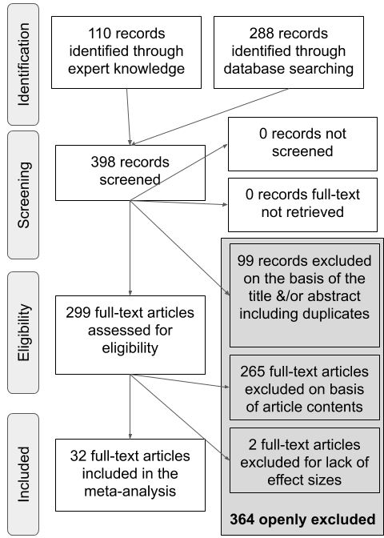

```{r Setup, echo = FALSE, warning=FALSE, error = FALSE, message = FALSE, tidy = TRUE}
knitr::opts_chunk$set(echo = FALSE, warning = FALSE, tidy = TRUE, message = FALSE, error = FALSE)

# wordcount()
# doesn't work...
# https://github.com/benmarwick/wordcountaddin

# able to use linguistics down by copying over some front matter from the linguistics down Untitled.Rmd template
# https://yongfu.name/linguisticsdown/

#options(encoding = "UTF-8")

### Load libraries
library(papaja)
library(metafor)
library(meta)
library(pwr)
library(knitr)
library(ggplot2)
library(wesanderson)
library(grid)
library(gridExtra)
library(xtable)
library(schoRsch)
library(multcomp)
library(poibin)
library(tidyverse)

# can't call reshape here, because it will interfere with other libraries
#library(reshape)

```


```{r ReadIn}

#Load helpful little functions
source("scripts/starter_functions.R")

#Get the effect size data
source("scripts/calculateES.R")

```

```{r Preprocess}


noES <- db_ET %>%
  filter(is.na(d_calc)) %>%
  group_by(short_cite) %>%
  summarise(n_records = n())

db_ET$same_infant_calc <- paste(db_ET$study_ID, db_ET$expt_num, db_ET$same_infant, sep = "_")

# assign language families

db_ET$lang_family = ifelse(db_ET$native_lang=="American English" | db_ET$native_lang=="British English" | db_ET$native_lang=="Dutch" |
db_ET$native_lang=="Danish" | db_ET$native_lang=="Swedish" |
db_ET$native_lang=="English" | db_ET$native_lang=="German", "Germanic", ifelse(db_ET$native_lang == "French" | db_ET$native_lang == "Catalan" | db_ET$native_lang == "Spanish" | db_ET$native_lang == "Catalan-Spanish" | db_ET$native_lang == "Swiss French", 
                                "Romance", "Sino-Tibetian"))

db_ET <- db_ET %>%
  filter(!is.na(d_calc))


db_ET <- db_ET %>%
  mutate(age.C = (mean_age_1-mean(mean_age_1, na.rm=TRUE))/30.44) %>%
  filter(mean_age_months < 31)

#Split into correct and MP database

db_ET_correct <- db_ET[db_ET$is_correct=="1",]
db_ET_MP <- db_ET[db_ET$is_mp=="1",]


#remove outliers
db_ET_MP$nooutlier = ifelse(db_ET_MP$g_calc > mean(db_ET_MP$g_calc, na.rm = TRUE) + 3*sd(db_ET_MP$g_calc, na.rm = TRUE) 
                         | db_ET_MP$g_calc < mean(db_ET_MP$g_calc, na.rm = TRUE) - 3*sd(db_ET_MP$g_calc, na.rm = TRUE),FALSE, TRUE)

n_outlier_MP = sum(db_ET_MP$nooutlier==FALSE)

db_ET_MP = db_ET_MP[db_ET_MP$nooutlier,]

# 3 outliers

db_ET_correct$nooutlier = ifelse(db_ET_correct$g_calc > mean(db_ET_correct$g_calc, na.rm = TRUE) + 3*sd(db_ET_correct$g_calc, na.rm = TRUE) 
                         | db_ET_correct$g_calc < mean(db_ET_correct$g_calc, na.rm = TRUE) - 3*sd(db_ET_correct$g_calc, na.rm = TRUE),FALSE, TRUE)

n_outlier_correct = sum(db_ET_correct$nooutlier==FALSE)
  
db_ET_correct = db_ET_correct[db_ET_correct$nooutlier,]
  

# 2 outliers


# make sure that both correct and mispronounced conditions are considered in descriptives

db_ET_correct$condition <- 1
db_ET_MP$condition <- 0


db_ET_correct$short_cite.same_infant_calc <- paste0(db_ET_correct$short_cite, ".", db_ET_correct$same_infant_calc)
db_ET_MP$short_cite.same_infant_calc <- paste0(db_ET_MP$short_cite, ".", db_ET_MP$same_infant_calc)

db_ET_correct$unique_row <- factor(seq(from = 1, to = nrow(db_ET_correct), by = 1))
db_ET_MP$unique_row <- factor(seq(from = 1, to = nrow(db_ET_MP), by = 1))


dat <- bind_rows(db_ET_correct, db_ET_MP)

dat$unique_row <- factor(seq(from = 1, to = nrow(dat), by = 1))


#dat$short_cite.same_infant_calc <- paste0(dat$short_cite, ".", dat$same_infant_calc)
#random = list(~ same_infant_calc | short_cite, ~ unique_row |  short_cite.same_infant_calc)  


descriptive_dat <- dat

# need data set of unique short cite by expt_num
# in order to calculate total number of infants

# need data set of unique short cite by condition

sum_dat <- dat[!duplicated(dat[c("short_cite", "same_infant")]),]
time_wind_dat <- dat[!duplicated(dat[c("short_cite", "offset", "post_nam_dur")]),]
distract_dat <- dat[!duplicated(dat[c("short_cite", "object_pair")]),]
mix_co_mp <- dat[!duplicated(dat[c("short_cite", "word_correct_and_MP")]),]


```

In a mature phono-lexical system, word recognition must balance flexibility to slight variation (e.g., speaker identity, accented speech) while distinguishing between phonological contrasts  that differentiate words in a given language (e.g. cat-hat). Twenty years' worth of studies have examined infants' application of phonological category knowledge during word recognition through the mispronunciation sensitivity paradigm to probe the development of this latter distinction. At this point, a picture on the functional use of language-specific phonetic and phonological knowledge began to emerge. At the turn of the millennium, infant language acquisition researchers had begun to explore the phonetic information that infants attend to while segmenting words from the speech stream [@Jusczyk1995] and learning minimal pairs [@Stager1997]. Both studies and the lines of research they sparked showed that under the right conditions, even young infants can use their emerging native language phonological skills during word-level language processing.
@Swingley2000 expanded this exploration to infants's existing representations, investigating how infants interpret phonological variation in familiar word recognition. American-English learning 18- to 23-month-olds were presented with pairs of images of words they were very likely to know (e.g. a baby and a dog) and their eye movements to each image were recorded. Infants either heard the correct label (e.g. "baby") or a mispronounced label (e.g. "vaby") for one of the images. Although infants looked at the correct target image in response to both types of labels, correct labels elicited more looks to the target image than mispronounced labels. @Swingley2000 concluded that already before the second birthday, children's representations for familiar words are phonologically well specified.

Why should sensitivity to mispronunciations pose a challenge to the young infant and thus the findings of @Swingley2000 be found novel? There are two key challenges the infant learner has to contend with. First, the native language being learned determines the relevant contrasts for the infant language-learner. These contrasts are therefore not innate, but must be learned. For an infant learning Catalan, the vowel contrast /e/-/\textipa{E}/ signifies a change in meaning, whereas this is not the case for an infant learning Spanish. Second, across talkers, these sounds might be realized differently, and change even as the talker talks to an infant or adult [e.g. @Benders2013]. As we will review below, there are opposing theories and resulting predictions, supported by empirical data, as to how this knowledge is acquired and applied to lexical representations. The time is thus ripe to aggregate all publicly available evidence using a meta-analysis. In doing so, we can examine developmental trends making use of data from a much larger and diverse sample of infants than is possible in most single studies (see @Frank2017; @MB1; for notable exceptions). Before we outline the meta-analytical approach and its advantages in detail, we first discuss the proposals this study seeks to disentangle and the data supporting each of the accounts.

Regarding the change in mispronunciation sensitivity over development, only roughly half of studies have compared more than one age group on the same mispronunciation task (see Table \@ref(tab:SummaryTable)) and of those, all possible patterns of development are found. This renders conclusions regarding developmental change in mispronunciation sensitivity difficult. Given the diverse evidence for developmental change, or lack thereof, the question arises as to what could be driving these differences. We thus summarize the existing empirical evidence, as well as developmental and methodological explanations for an increase, a decrease, or unchanged sensitivity to mispronunciations throughout infancy.

An *increase* in mispronunciation sensitivity is predicted by a maturation from holistic to more detailed phono-lexical representations and has been supported by several studies [@Mani2007; @Altvater2014; @vanderFeest2015; @Altvater2010]. More precisely, the difference in target looking for correct and mispronounced trials is reported to be smaller in younger infants and grows as infants develop. The first words that infants learn are often not similar sounding [e.g. mama, ball, kitty; @CharlesLuce1995] and encoding representations for these words using fine phonological detail may not be necessary. According to PRIMIR [@Curtin2011; @Curtin2007; @Werker2005] infants's initially episodic representations give way to more abstract phonological word forms, as the infant learns more words, the detail of which can be accessed more or less easily depending on factors such as the infant's age or the demands of the task. A growing vocabulary also reflects increased experience or familiarity with words, which may sharpen the phonological detail of their representations [@Barton1980]. This argument is supported by the results of @Mani2010kepstups. Here, 12-month-old infants were divided into low and high vocabulary groups. High vocabulary infants showed greater sensitivity to vowel mispronunciations than low vocabulary infants, although this was not the case for consonant mispronunciations (see below for further discussion on consonant-vowel assymmetry). If increasing age and/or vocabulary growth leads to an increase in the phonological specificity of infants' word representation, we should find a relationship of either with mispronunciation sensitivity.

Yet, the majority of studies examining a potential association between mispronunciation sensitivity and vocabulary size have concluded that there is no relationship [@Swingley2000; @Swingley2002; @Swingley2009; @Zesiger2012; @Mani2008; @Bailey2002; @Mani2007; @Ballem2005]. Furthermore, other studies testing more than one age have found *no difference* in mispronunciation sensitivity [@Swingley2000; @Bailey2002; @Zesiger2012]. Such evidence supports an early specificity hypothesis, which suggests continuity in how infants represent familiar words. According to this account, infants represent words with phonological detail already at the onset of lexical acquisition and that this persists throughout development. 

There are no theoretical accounts that would predict *decreased* mispronunciation sensitivity, but at least one study has found a decrease in sensitivity to small mispronunciations . @Mani2011 tested 18- and 24-month-olds' sensitivity to increasingly larger mispronunciations: 1- (bed-bud), 2- (foot-fit), and 3-feature phonological changes (doll-deal). Although both age groups were sensitive to mispronunciations overall, 18- but not 24-month-olds showed sensitivity to more subtle 1-feature mispronunciations. To account for this pattern of results, the authors suggest that when faced with large and salient mispronunciations, sensitivity to small 1-feature mispronunciations may be obscured, especially if infants show graded sensitivity to different degrees of mispronunciations (see below), as @Mani2011 found with 24-month-olds in their study. In contrast, 18-month-olds did not show graded sensitivity, showing similar disruptions to word recognition for smaller and larger mispronunciations.

To disentangle the predictions that phono-lexical representations are progressively becoming more specified or are specified early, we investigate the relationship between mispronunciation sensitivity and age as well as vocabulary size. But, this may not account for all variability found in the literature. Although infant mispronunciation sensitivity studies are generally interested in the phonological detail with which infants represent familiar words, many studies pose more nuanced questions, such as examining the impact of number of phonological features changed (mispronunciation size) or the location of the mispronunciation. Some studies may differ in their experimental design, presenting a distractor image that overlaps with the target image in the onset phoneme or a completely novel, unfamiliar distractor image. These experimental manipulations have the potential to create experimental tasks that are more or less difficult for the infant to successfully complete. We thus follow our analyses of a developmental trajectory with one of features of the task, and line out here task effects which can shed further light on early phono-lexical representations and their maturation.  
  
The PRIMIR Framework [Processing Rich Information from Multidimensional Interactive Representations; @Curtin2011; @Curtin2007; @Werker2005] describes how infants acquire and organize the incoming speech signal into phonetic and indexical detail. The ability to access and use this detail, however, is governed by the task or developmental demands probed in a particular experiment. In a particularly demanding task, such as when the target and distractor image share the same onset (e.g. doggie and doll), infants' ability to access the phonological detail of familiar words may be restricted [@Swingley1999]. If older infants are more likely to be tested using a more demanding mispronunciation sensitivity task, this may attenuate developmental effects across studies. Note, however, that those studies reporting change [@Mani2007; @Altvater2014; @vanderFeest2015; @Altvater2010] or no change [@Swingley2000; @Bailey2002; @Zesiger2012] all presented the same task across ages .
  
The manipulations that might increase task demands, such as overlap between target and distractor, are also theoretically interesting, focusing on issues at the intersection of phonological development and lexical processing. For specific questions where we can aggregate multiple studies, we take the opportunity to shine a meta-analytic light on what modulates infants' ability to detect mispronunciations in follow-up analyses. We outline first which nuanced questions have been frequently asked to provide a more in-depth overview of the current literature.
  
The first set of questions concern how infants' sensitivity is modulated by different kinds of mispronunciations. Some experiments examine infants’ sensitivity to factors that change the identity of a word on a measurable level, or *mispronunciation size* (i.e. 1-feature, 2-features, 3-features, etc.), finding graded sensitivity to both consonant [@White2008; @Bernier2017; @Tamasi2016] and vowel [@Mani2011] feature changes. This also has consequences for understanding the developmental trajectory of mispronunciation sensitivity, as adults show similar graded sensitivity [@Bailey2005]

The *position of mispronunciation* in the word may differentially interrupt the infant's word recognition process, with onset mispronunciations leading to greater mispronunciation sensitivity than medial or coda mispronunciations. Models of spoken word processing place more or less importance on the position of a phoneme in a word. The COHORT model [@Marslen-Wilson1989] describes lexical access in one direction, with the importance of each phoneme decreasing as its position comes later in the word. In contrast, the TRACE model [@McClelland1986] describes lexical access as constantly updating and reevaluating the incoming speech input in the search for the correct lexical entry, and therefore can recover from word onset and to a lesser extent medial mispronunciations.
  
Consonantal changes may be more disruptive to lexical processing than vowel changes in both adults [@Nazzi2018] and infants [@Nazzi2016], known as the consonant bias. A learned account predicts that a consonant bias emerges over development [@Floccia2014; @Nazzi2016; @Keidel2007] and that this emergence is impacted by the language family of the infants' native language [@Nazzi2016]. In mispronunciation sensitivity, this would first translate to consonant mispronunciations impairing word recognition to a greater degree than vowel mispronunciations. Yet, the handful of studies directly comparing sensitivity to consonant and vowel mispronunciations mostly find symmetry as opposed to an asymmetry between consonants and vowels for English- [@Mani2007; @Mani2010kepstups] and Danish-learning infants [@Hojen] and do not compare infants learning different native languages [for cross-linguistic evidence from word-learning see @Nazzi2009a]. One study with English-learning infants did find weak evidence for greater sensitivity to consonant compared to vowel mispronunciations [@Swingley2016]. In the current meta-analysis, we examine infants' sensitivity to the *type of mispronunciation*, whether consonant or vowel, across different ages and native language families to assess the predictions of the learned account of the consonant bias.
  
A second set of questions is whether the context modulates infants' responses to mispronunciations. In order to study the influence of mispronunciation position, many studies control the *phonological overlap between target and distractor labels*. For example, when examining sensitivity to a vowel mispronunciation of the target word "doggie", the image of a dog would be paired with a distractor image that shares onset overlap, such as "doll". This ensures that infants can not use the onset of the word to differentiate between the target and distractor images [@Swingley1999]. Instead, infants must pay attention to the mispronounced phoneme in order to successfully detect the change. Note that in this case, the mispronunciation is necessarily either word-medial or –final, thus possibly creating an interaction between mispronunciation position and phonological overlap.
  
We may find that if mispronunciation sensitivity changes as children develop, that this change is modulated by *distractor familiarity*: whether the distractor used is familiar or unfamiliar. This is a particularly fruitful question to investigate within the context of a meta-analysis, as mispronunciation sensitivity in the presence of a familiar compared to unfamiliar distractor has not been directly compared. Most studies present infants with pictures of two known objects, thereby ruling out the unlabeled competitor, or distractor, as possible target. It is thus not surprising that infants tend to look towards the target more, even when its label is mispronounced. In contrast, other studies present infants with pairs of familiar (labeled target) and unfamiliar (unlabeled distractor) objects [@White2008; @Mani2011; @Skoruppa2013; @Swingley2016]. By using an unfamiliar object as a distractor, the infant is presented with a viable option onto which the mispronounced label can be applied [@Halberda2003; @Markman2003], an ability that is developing from 18 to 30 months [@Bion2013].
  
In sum, the studies we have reviewed begin to paint a picture of the development of infants' use of phonological detail in familiar word recognition. Each study contributes one separate brushstroke and it is only by examining all of them together that we can achieve a better understanding of the big picture of early phono-lexical development. Meta-analyses can provide unique insights by estimating the population effect, both of infants' responses to correct and mispronounced labels, and of their mispronunciation sensitivity. Because we aggregate data over  age groups, this meta-analysis can investigate the role of maturation by assessing the impact of age, and when possible vocabulary size. We also test the influence of different linguistic (mispronunciation size, position, and type) and contextual (overlap between target and distractor labels; distractor familiarity) factors on the study of mispronunciation sensitivity. Finally, we explore potential data analysis choices that may influence different conclusions about mispronunciation sensitivity development as well as offer recommendations for experiment planning, for example by providing an effect size estimate for a priori power analyses [@Bergmann2018]. 

# Methods

The present meta-analysis was conducted with maximal transparency and reproducibility in mind. To this end, we provide all data and analysis scripts on the supplementary website (https://osf.io/rvbjs/) and open our meta-analysis up for updates [@Tsuji2014]. The most recent version is available via the website and the interactive platform MetaLab [https://metalab.stanford.edu; @Bergmann2018]. Since the present paper was written with embedded analysis scripts in R [@R] using the papaja package [@papaja] in R Markdown [@RMarkdown], it is always possible to re-analyze an updated dataset. In addition, we followed the Preferred Reporting Items for Systematic Reviews and Meta-Analyses (PRISMA) guidelines and make the corresponding information available as supplementary materials [@Moher2009]. Figure \@ref(fig:PRISMA-image) plots our PRISMA flowchart illustrating the paper selection procedure.

(Insert Figure \@ref(fig:PRISMA-image) about here)

```{r PRISMA-image, echo= FALSE, out.width = "100%", fig.cap="A PRISMA flowchart illustrating the selection procedure used to include studies in the current meta-analysis."}




# ! [Figure X. PRISMA Flowchart.] (Users/KatesOld/Documents/R_Git/figures/PRISMA_MA_Mispronunciation.png)

```

```{r SummaryTable, results = "asis"}


dat_st <- descriptive_dat

dat_st$type_feature <- as.character(dat_st$type_feature)
dat_st$mispron_location <- as.character(dat_st$mispron_location)
dat_st$distractor_overlap <- as.character(dat_st$distractor_overlap)


dat_st$object_pair <- ifelse(dat_st$object_pair == "familiar_familiar", "fam", "unfam")

dat_st$distractor_overlap <- ifelse(dat_st$distractor_overlap == "no", "none", dat_st$distractor_overlap)


Sum_table <- dat_st %>%
      group_by(short_cite) %>% 
      summarise(Publication = unique(publication_status),
        Ages_Tested_months = paste(unique(trunc(mean_age_1/30.44)), collapse=', '),
                Vocabulary = ifelse(all(is.na(r_comprehension)) & all(is.na(r_production)), "None",
                                ifelse(!all(is.na(r_comprehension)) & !all(is.na(r_production)), "Comp/Prod",
                                       ifelse(!all(is.na(r_comprehension)) & all(is.na(r_production)), "Comp", "Prod"))),
        distractor = paste(unique(object_pair), collapse =', '),
        dist_overlap = paste(unique(distractor_overlap), collapse =', '),
        number_features = paste(unique(n_feature), collapse=', '),
        misp_posit = paste(unique(mispron_location), collapse =', '),
        misp_type = paste(unique(type_feature), collapse =', '),
        Effect_sizes_n = n())

# can't chain these together, since it only checks each line once

Sum_table$misp_posit <- ifelse(Sum_table$misp_posit == "NA", "unspec", Sum_table$misp_posit)
Sum_table$misp_posit <- ifelse(grepl("onset", Sum_table$misp_posit), gsub("onset", "O", Sum_table$misp_posit), Sum_table$misp_posit)
Sum_table$misp_posit <- ifelse(grepl("medial", Sum_table$misp_posit), gsub("medial", "M", Sum_table$misp_posit), Sum_table$misp_posit)
Sum_table$misp_posit <- ifelse(grepl("coda", Sum_table$misp_posit), gsub("coda", "C", Sum_table$misp_posit), Sum_table$misp_posit)

Sum_table$dist_overlap <- ifelse(grepl("onset", Sum_table$dist_overlap), gsub("onset", "O", Sum_table$dist_overlap), Sum_table$dist_overlap)
Sum_table$dist_overlap <- ifelse(grepl("medial", Sum_table$dist_overlap), gsub("medial", "M", Sum_table$dist_overlap), Sum_table$dist_overlap)
Sum_table$dist_overlap <- ifelse(grepl("coda", Sum_table$dist_overlap), gsub("coda", "C", Sum_table$dist_overlap), Sum_table$dist_overlap)
Sum_table$dist_overlap <- ifelse(grepl("novel", Sum_table$dist_overlap), gsub("novel", "unfam", Sum_table$dist_overlap), Sum_table$dist_overlap)


Sum_table$number_features <- ifelse(grepl("0, ",Sum_table$number_features), gsub("0, ", "", Sum_table$number_features), 
                                           ifelse(grepl(", 0",Sum_table$number_features), gsub(", 0", "", Sum_table$number_features), Sum_table$number_features))
Sum_table$number_features <- ifelse(Sum_table$number_features == "NA", "unspec", Sum_table$number_features)

Sum_table$number_features <- ifelse(grepl("1_2_3,", Sum_table$number_features), gsub("1_2_3", "1-3", Sum_table$number_features), Sum_table$number_features)
Sum_table$number_features <- ifelse(grepl("1_2,", Sum_table$number_features), gsub("1_2", "1-2", Sum_table$number_features), Sum_table$number_features)
Sum_table$number_features <- ifelse(grepl("2_3", Sum_table$number_features), gsub("2_3", "2-3", Sum_table$number_features), Sum_table$number_features)


Sum_table$misp_type <- ifelse(grepl("consonant_and_vowel", Sum_table$misp_type), gsub("consonant_and_vowel", "C/V", Sum_table$misp_type),
                              ifelse(grepl("consonant_vowel_tone", Sum_table$misp_type), gsub("consonant_vowel_tone", "C/V/T", Sum_table$misp_type) , Sum_table$misp_type))


Sum_table$misp_type <- ifelse(grepl("consonant", Sum_table$misp_type), gsub("consonant", "C", Sum_table$misp_type), Sum_table$misp_type)

Sum_table$misp_type <- ifelse(grepl("vowel", Sum_table$misp_type), gsub("vowel", "V", Sum_table$misp_type), Sum_table$misp_type)

Sum_table$misp_type <- ifelse(grepl("tone", Sum_table$misp_type), gsub("tone", "T", Sum_table$misp_type), Sum_table$misp_type)

#kable(Sum_table, col.names = c("Paper", "Publication format", "Age", "Vocabulary", "N Effect Sizes"))


apa_table(Sum_table, col.names = c("Paper", "Format", "Age", "Vocabulary", "Familiarity", "Target Overlap", "Size", "Position", "Type", "N Effect Sizes"), caption = "Summary of all studies. Age: mean age(s) reported in the paper (in months). Vocabulary: Comp = comprehension, Prod = production. Distractor Familiarity: Fam = Familiar Distractor, Unfam = Unfamiliar Distractor. Target Overlap: position of overlap between target and distractor; O = onset, M = medial, C = coda. Mispronunciation Size: number of features changed; commas indicate when sizes were compared separately (e.g. 1, 2, 3), dashes indicate the range of sizes were aggregated (e.g. 1-3). Mispronunciation Position: O = onset, M = medial, C = coda. Mispronunciation Type: C = consonant, V = vowel, T = tone. For both Mispronunciation Position and Type, a slash separator indicates that is was tested but a distinction was not made in the stimuli. For all categories, unspec. indicates that the value was unspecified in the paper", landscape = TRUE, font_size = "scriptsize", col_spanners = list(`Distractor` = c(5, 6), `Mispronunciation` = c(7, 9)))


```

## Study Selection

We first generated a list of potentially relevant items to be included in our meta-analysis by creating an expert list. This process yielded 110 items. We then used the Google Scholar search engine to search for papers citing the original @Swingley2000 publication. This search was conducted on 22 September, 2017 and yielded 288 results. We removed 99 duplicate items and screened the remaining 299 items for their title and abstract to determine whether each met the following inclusion criteria: (1) original data was reported; (2) the experiment examined familiar word recognition and mispronunciations; (3) infants studied were under 31-months-of-age and typically developing; (4) the dependent variable was derived from proportion of looks to a target image versus a distractor in a eye movement experiment; (5) the stimuli were auditory speech. The final sample (*n* = `r length(unique(descriptive_dat$short_cite))`) consisted of `r with(descriptive_dat, n_distinct(short_cite[publication_status == "paper"]))` journal articles, `r with(descriptive_dat, n_distinct(short_cite[publication_status == "proceedings"]))` proceedings paper, `r with(descriptive_dat, n_distinct(short_cite[publication_status == "dissertation"]))` theses, and `r with(descriptive_dat, n_distinct(short_cite[publication_status == "gray paper"]))` unpublished reports. We will refer to these items collectively as papers. Table \@ref(tab:SummaryTable) provides an overview of all papers included in the present meta-analysis.

(Insert Table 1 about here)

```{r DescriptivesPubtype}

pub_info <- dat %>%
  group_by(publication_status) %>%
  summarize(n_unique = n_distinct(short_cite), count = n())

#kable(pub_info, col.names = c("Publication Type", "# Items", "# Effect Sizes"))

bil_info <- dat %>%
  group_by(group_name_1, short_cite) %>%
  summarize(count = n())

bil_infants <- with(bil_info, count[group_name_1 == "bilingual"])

```

## Data Entry

The `r length(unique(descriptive_dat$short_cite))` papers we identified as relevant were then coded with as much consistently reported detail as possible [@Tsuji2014; @Bergmann2018]. For each experiment (note that a paper typically has multiple experiments), we entered variables describing the publication, population, experiment design and stimuli, and results. For the planned analyses to evaluate the development of mispronunciation sensitivity and modulating factors, we focus on the following characteristics:   

1. Condition: Were words mispronounced or not;
2. Mean age reported per group of infants, in days; 
3. Vocabulary size, measured by a standardized questionnaire or list;
4. Size of mispronunciation, measured in features changed;
5. Position of mispronunciation: onset, medial, offset, or mixed;
6. Type of mispronunciation: consonant, vowel, or both;
7. Phonological overlap between target and distractor: onset, onset/medial, rhyme, none, novel word;
8. Distractor familiarity: familiar or unfamiliar

A detailed explanation for moderating factors 3-8 can be found in their respective sections in the Results [^1]. We separated conditions according to whether or not the target word was mispronounced to be able to investigate infants' looking to the target picture as well as their mispronunciation sensitivity, which is the difference between looks to the target in correct and mispronounced trials. When the same infants were further exposed to multiple mispronunciation conditions and the results were reported separately in the paper, we also entered each condition as a separate row  [e.g., consonant versus vowel mispronunciations; @Mani2007].  The fact that the same infants contributed data to multiple rows (minimally those containing information on correct and mispronounced trials) leads to shared variance across effect sizes, which we account for in our analyses (see next section). We will call each row a record; in total there were `r nrow(descriptive_dat)` records in our data.

[^1]: Two papers tested bilingual infants [@Ramon-Casas2009; @Ramon-Casas2010], yielding `r bil_infants` records, respectively. Due to this small number, we do not investigate the role of multilingualism, but do note that removing these papers from the meta-analysis did not alter the pattern of results.

## Data analysis

```{r DescriptivesComparison, echo = FALSE}
db_ET_correct$within_measure_descriptive <- ifelse(db_ET_correct$within_measure == "post",
 "post-naming phase compared with chance (=50%)",
ifelse(db_ET_correct$within_measure == "pre_post", "post-naming compared to pre-naming phase", "post-pre difference score compared with chance (=0)"))

comparison_info <- db_ET_correct %>%
  group_by(within_measure) %>%
  summarize(n_unique = n_distinct(short_cite), count = n())

#kable(comparison_info, col.names = c("Type of comparison", "# Papers", "# Effect Size"))
#table(db_ET_MP$es_method)
```

```{r DescriptivesES}
#how did we calculate effect sizes?

es_info <- descriptive_dat %>%
  filter(!is.na(d_calc)) %>%
  group_by(es_method) %>%
  summarize(n_unique = n_distinct(short_cite), count = n())


corr_info <- descriptive_dat %>%
  filter(!is.na(d_calc)) %>%
  group_by(imputed_corr) %>%
  summarize(n_unique = n_distinct(short_cite), count = n())

```


Effect sizes are reported for infants' looks to target pictures after hearing a correctly pronounced or a mispronounced label (object identification) as well as the difference between effect sizes for correct and mispronounced trials (i.e. mispronunciation sensitivity). The effect size reported in the present paper is based on comparison of means, standardized by their variance. The most well-known effect size from this group is Cohen's *d* [@cohen]. To correct for the small sample sizes common in infant research, however, we used Hedges' *g* instead of Cohen's *d* [@Hedges1981; @morris2002combining]. 

We calculated Hedges' *g* using the raw means and standard deviations reported in the paper (*n* = `r with(es_info, sum(count[es_method == "group_means_one" | es_method == "group_means_two"]))` records from `r with(es_info, sum(n_unique[es_method == "group_means_one" | es_method == "group_means_two"]))` papers) or reported t-values (*n* = `r with(es_info, sum(count[es_method == "t_one" | es_method == "t_two"]))` records from `r with(es_info, sum(n_unique[es_method == "t_one" | es_method == "t_two"]))` papers). Two papers reported raw means and standard deviations for some records and just t-values for the remaining records [@Swingley2016; @Altvater2014]. Raw means and standard deviations were extracted from figures for `r with(descriptive_dat, n_distinct(short_cite[ x_from_graph == "yes"]))` papers. In a within-participant design, when two means are compared (i.e. looking during pre- and post-naming) it is necessary to obtain correlations between the two measurements at the participant level to calculate effect sizes and effect size variance. Upon request we were provided with correlation values for one paper [@Altvater2010]; we were able to compute correlations using means, standard deviations, and t-values for `r with(corr_info, n_unique[imputed_corr == "no"])` papers [following @Csibra2016; see also @Rabagliati2018]. Correlations were imputed for the remaining papers [see @Black2017 for the same procedure]. For two papers, we could not derive any effect size [@Ballem2005; @Renner2017], and for a third paper, we do not have sufficient information in one record to compute effect sizes [@Skoruppa2013]. We compute a total of `r sum(dat$is_mp == 0)+n_outlier_correct` effect sizes for correct pronunciations and `r sum(dat$is_mp == 1)+n_outlier_MP` for mispronunciations. Following standard meta-analytic practice, we remove outliers, i.e. effect sizes more than 3 standard deviations from the respective mean effect size. This leads to the exclusion of `r n_outlier_correct` records for correct pronunciations and `r n_outlier_MP` records for mispronunciations. 


To consider the fact that the same infants contributed to multiple datapoints, we analyze our results in a multilevel approach using the R [@R] package metafor [@metafor]. We use a multilevel random effects model which estimates the mean and variance of effect sizes sampled from an assumed distribution of effect sizes. In the random effect structure we take into account the shared variance of effect sizes drawn from the same paper, and nested therein that the same infants might contribute to multiple effect sizes.


Mispronunciation sensitivity studies typically examine infants' proportion of target looks (PTL) in comparison to some baseline measurement. PTL is calculated by dividing the percentage of looks to the target by the total percentage of looks to both the target and distractor images. Across papers the baseline comparison varied; since other options were not available to us, we used the baseline reported by the authors of each paper. Most papers (*n* = `r with(comparison_info, count[within_measure == "pre_post_naming_effect"])` records from `r with(comparison_info, n_unique[within_measure == "pre_post_naming_effect"])` papers) subtracted the PTL score for a pre-naming baseline phase from the PTL score for a post-naming phase and report a difference score. Other papers either compared post- and pre-naming PTL with one another (*n* = `r with(comparison_info, count[within_measure == "pre_post"])` records from `r with(comparison_info, n_unique[within_measure == "pre_post"])` papers), thus reporting two variables, or compared post-naming PTL with a chance level of 50% (*n* = `r with(comparison_info, count[within_measure == "post"])` records from `r with(comparison_info, n_unique[within_measure == "post"])` papers). For all these comparisons, positive values or values above 50% (either as reported or after subtraction of chance level or a pre-naming baseline PTL) indicate target looks towards the target object after hearing the label, i.e. a recognition effect. Standardized effect sizes based on mean differences, as calculated here, preserve the sign. Consequently, positive effect sizes reflect more looks to the target picture after naming, and larger positive effect sizes indicate comparatively more looks to the target. 

Finally, we assess the statistical power of studies included in our meta-analysis, as well as calculate the sample size required to achieve a 80% power considering our estimate of the population effect and its variance. Failing to take effect sizes into account can lead to either underpowered research or testing too many participants. Underpowered studies will lead to false negatives more frequently than expected, which in turn results in an unpublished body of literature [@Bergmann2018]. At the same time, underpowered studies with significant outcomes are likely to overestimate the effect, leading to wrong estimations of the population effect when paired with publication bias [@Jennions2002]. Overpowered studies mean that participants were tested unnecessarily, which has ethical implications particularly when working with infants and other difficult to recruit and test populations.

## Publication Bias

In the psychological sciences, there is a documented reluctance to publish null results. As a result, significant results tend to be over-reported and thus might be over-represented in our meta-analyses [see @Ferguson2012]. To examine whether this is also the case in the mispronunciation sensitivity literature, which would bias the data analyzed in this meta-analysis, we conducted two tests. We first examined whether effect sizes are distributed as expected based on sampling error using the rank correlation test of funnel plot asymmetry with the R [@R] package metafor [@metafor]. Effect sizes with low variance were expected to fall closer to the estimated mean, while effect sizes with high variance should show an increased, evenly-distributed spread around the estimated mean. Publication bias would lead to an uneven spread. 

Second, we analyze all of the significant results in the dataset using a p-curve from the p-curve app [v4.0, http://p-curve.com; @pcurve]. This p-curve tests for evidential value by examining whether the p-values follow the expected distribution of a right skew in case the alternative hypothesis is true, versus a flat distribution that speaks for no effect being present in the population and all observed significant effects being spurious. 

Responses to correctly pronounced and mispronounced labels were predicted to show different patterns of looking behavior. In other words, there is an expectation that infants should look to the target when hearing a correct pronunciation, but studies vary in their report of significant looks to the target when hearing a mispronounced label (i.e. there might be no effect present in the population); as a result, we conducted these two analyses to assess publication bias separately for both conditions.

## Meta-analysis

The models reported here are multilevel random-effects models of variance-weighted effect sizes, which we computed with the R [@R] package metafor [@metafor]. To investigate how development impacts mispronunciation sensitivity, our core theoretical question, we first introduced age (centered; continuous and measured in days but transformed into months for ease of interpreting estimates by dividing by 30.44) as a moderator to our main model. Second, we analyzed the correlation between reported vocabulary size and mispronunciation sensitivity using the package meta [@meta]. For a subsequent investigation of experimental characteristics, we introduced each as a moderator: size of mispronunciation, position of mispronunciation, type of mispronunciation, phonological overlap between target and distractor labels, and distractor familiarity (more detail below).

# Results

## Publication Bias

```{r FunnelPlotAsymm_correct}

rma_correct = rma.mv(g_calc, g_var_calc, data = db_ET_correct, random = list(~ same_infant_calc | short_cite, ~ unique_row |  short_cite.same_infant_calc))
# Publication bias can become visible in funnel plot asymmetry. 
# Metafor comes with several options to check this, I chose ranktest and regtest
# correct object identification
rmac <- ranktest(rma_correct)
#rmac

```

```{r FunnelPlotAsymm_misp}

rma_MP = rma.mv(g_calc, g_var_calc, data = db_ET_MP, random = list(~ same_infant_calc | short_cite, ~ unique_row |  short_cite.same_infant_calc))

# mispronounced object identification
rmam <- ranktest(rma_MP)
#rmam
```

Figure \@ref(fig:FunnelCombo) shows the funnel plots for both correct pronunciations and mispronunciations [code adapted from @Sakaluk2016]. Funnel plot asymmetry was significant for both correct pronunciations (Kendall's $\tau$ = `r r2(rmac$tau)`, *p* `r psig(rmac$pval)`) and mispronunciations (Kendall's $\tau$ = `r r2(rmam$tau)`, *p* `r psig(rmam$pval)`). These results, quantifying the asymmetry in the funnel plots (Figure \@ref(fig:FunnelCombo)), indicate bias in the literature. This is particularly evident for correct pronunciations, where larger effect sizes have greater variance (bottom right corner) and the more precise effect sizes (i.e. smaller variance) tend to be smaller than expected (top left, outside the triangle).

The stronger publication bias for correct pronunciation might reflect the status of this condition as a control. If infants were not looking to the target picture after hearing the correct label, the overall experiment design is called into question. However, even in a well-powered study one would expect the regular occurrence of null results even though as a population, infants would reliably show the expected object identification effect.

We should also point out that funnel plot asymmetry can be caused by multiple factors besides publication bias, such as heterogeneity in the data. There are various possible sources of heterogeneity, which our subsequent moderator analyses will begin to address. Nonetheless, we will remain cautious in our interpretation of our findings and hope that an open dataset which can be expanded by the community will attract previously unpublished null results so we can better understand infants' developing mispronunciation sensitivity.

```{r FunnelPrep}
### Plots adapted from Sakaluk, 2016, see also Black & Bergmann, 2017
### https://sakaluk.wordpress.com/2016/02/16/7-make-it-pretty-plots-for-meta-analysis/

#Themes and plot
funnel_theme=theme_bw()+
  theme(#panel.grid.major=element_blank(),
    #panel.grid.minor=element_blank(),
    #panel.border=element_blank(),
    axis.line=element_line(),
    text=element_text(family='Times', size=18),
    legend.position='none')

```

```{r FunnelCorrect}

#Rename a bunch of things for ease
dat_co = db_ET_correct %>% 
  rename(cite = short_cite,
         yi = g_calc,
         vi = g_var_calc) %>%
  mutate(study_ref = paste(cite, expt_num, same_infant, sep=',')) %>% 
  dplyr::select(cite, expt_num, same_infant, mean_age_1, yi, vi) %>%
  arrange(desc(yi))

#Reorder bibliographic info based on value of g (yi), so effect sizes can be plotted in descending order


#Get standard errors from variances
dat_co$se = sqrt(dat_co$vi)

#Calculate 95% CI values
dat_co$lowerci = (-1.96*dat_co$se)+dat_co$yi
dat_co$upperci = (1.96*dat_co$se)+dat_co$yi


#Store the meta-analytic estimate and its standard error from whatever model you run
#summary(rma_correct)
estimate_co = coef(summary(rma_correct))$estimate
se_co = coef(summary(rma_correct))$se

#Store a vector of values that spans the range from 0
#to the max value of impression (standard error) in your dataset.
#Make the increment (the final value) small enough (I choose 0.001)
#to ensure your whole range of data is captured
se.seq_co=seq(0, max(dat_co$se), 0.001)

#Now, compute vectors of the lower-limit and upper limit values for
#the 95% CI region, using the range of SE that you generated in the previous step, 
#and the stored value of your meta-analytic estimate.
ll95_co = estimate_co-(1.96*se.seq_co)
ul95_co = estimate_co+(1.96*se.seq_co)

#You can do this for a 99% CI region too
ll99_co = estimate_co-(3.29*se.seq_co)
ul99_co = estimate_co+(3.29*se.seq_co)

#And finally, do the same thing except now calculating the confidence interval
#for your meta-analytic estimate based on the stored value of its standard error
meanll95_co = estimate_co-(1.96*se_co)
meanul95_co = estimate_co+(1.96*se_co)

#Now, smash all of those calculated values into one data frame (called 'dfCI').
#You might get a warning about '...row names were found from a short variable...'
#You can ignore it.
dfCI_co = data.frame(ll95_co, ul95_co, ll99_co,
                  ul99_co, se.seq_co, estimate_co, meanll95_co, meanul95_co)

#Now we can actually make the funnel plot.
#Using your original data-frame, map standard error to your x-axis (for now) and Zr to your y-axis
fp_co = ggplot(aes(x = se, y = yi), data = dat_co) +
  #Regression line for the FP asymmetry
  geom_smooth(aes(x = se, y = yi), method = "lm", colour = "darkgrey", alpha = .5, se = FALSE, data = dat_co) +
  #Add your data-points to the scatterplot
  geom_point(size = 2, colour="black", alpha = .5) +
  #
  #Give the x- and y- axes informative labels
  xlab('Standard Error') + ylab('Hedges\' g')+
  # give it a title
    ggtitle("Correct") +
    # make sure both plots have same scale
    # still ylim because we haven't flipped yet
    #coord_cartesian(ylim = c(0.5, 0))+
  #Now using the 'dfCI' data-frame we created, plot dotted lines corresponding
  #to the lower and upper limits of your 95% CI region
  #And dashed lines corresponding to your 99% CI region
  #Add lines corresponding to 0 and estimate
  geom_line(aes(x = se.seq_co, y = 0), linetype = 'solid', data = dfCI_co) +
  geom_line(aes(x = se.seq_co, y = estimate_co), linetype = 'dashed', data = dfCI_co) +
  geom_line(aes(x = se.seq_co, y = ll95_co), linetype = 'dotted', data = dfCI_co) +
  geom_line(aes(x = se.seq_co, y = ul95_co), linetype = 'dotted', data = dfCI_co) +
  #  geom_line(aes(x = se.seq, y = ll99), linetype = 'dashed', data = dfCI) +
  #  geom_line(aes(x = se.seq, y = ul99), linetype = 'dashed', data = dfCI) +
  #Now plot dotted lines corresponding to the 95% CI of your meta-analytic estimate
  #geom_segment(aes(x = min(se.seq), y = meanll95, xend = max(se.seq), yend = meanll95), linetype='dotted', data=dfCI) +
  #geom_segment(aes(x = min(se.seq), y = meanul95, xend = max(se.seq), yend = meanul95), linetype='dotted', data=dfCI) +
  #Reverse the x-axis ordering (se) so that the tip of the funnel will appear
  #at the top of the figure once we swap the x- and y-axes...
  scale_x_reverse()+
  #Specify the range and interval for the tick-marks of the y-axis (Zr);
  #Choose values that work for you based on your data
  #scale_y_continuous(breaks=seq(-.45,0.8,0.25))+
  #And now we flip the axes so that SE is on y- and Zr is on x-
  coord_flip()+
  #Finally, apply my APA-format theme (see code at end of post).
  #You could, alternatively, specify theme_bw() instead.
  funnel_theme

#Call the pretty funnel plot
#fp_co
#ggsave("figures/FunnelPlot_correct.pdf")

```

```{r FunnelMisp}

  #Rename a bunch of things for ease
dat_mp = db_ET_MP %>%
    rename(cite = short_cite,
           yi = g_calc,
           vi = g_var_calc) %>%
    dplyr::select(cite, expt_num, same_infant, mean_age_1, yi, vi) %>% 
    mutate(study_ref = paste(cite, expt_num, same_infant, sep=',')) %>% 
    arrange(desc(yi))
  
  #Reorder bibliographic info based on value of g (yi), so effect sizes can be plotted in descending order
  

  #Get standard errors from variances
  dat_mp$se = sqrt(dat_mp$vi)
  
  #Calculate 95% CI values
  dat_mp$lowerci = (-1.96*dat_mp$se)+dat_mp$yi
  dat_mp$upperci = (1.96*dat_mp$se)+dat_mp$yi
  
  
  #Store the meta-analytic estimate and its standard error from whatever model you run (substitute your own values)
  #summary(rma_MP)
  estimate_mp = coef(summary(rma_MP))$estimate
  se_mp = coef(summary(rma_MP))$se
  
  #Store a vector of values that spans the range from 0
  #to the max value of impression (standard error) in your dataset.
  #Make the increment (the final value) small enough (I choose 0.001)
  #to ensure your whole range of data is captured
  se.seq_mp=seq(0, max(dat_mp$se), 0.001)
  
  #Now, compute vectors of the lower-limit and upper limit values for
  #the 95% CI region, using the range of SE that you generated in the previous step, 
  #and the stored value of your meta-analytic estimate.
  ll95_mp = estimate_mp-(1.96*se.seq_mp)
  ul95_mp = estimate_mp+(1.96*se.seq_mp)
  
  #You can do this for a 99% CI region too
  ll99_mp = estimate_mp-(3.29*se.seq_mp)
  ul99_mp = estimate_mp+(3.29*se.seq_mp)
  
  #And finally, do the same thing except now calculating the confidence interval
  #for your meta-analytic estimate based on the stored value of its standard error
  meanll95_mp = estimate_mp-(1.96*se_mp)
  meanul95_mp = estimate_mp+(1.96*se_mp)
  
  #Now, smash all of those calculated values into one data frame (called 'dfCI').
  #You might get a warning about '...row names were found from a short variable...'
  #You can ignore it.
  dfCI_mp = data.frame(ll95_mp, ul95_mp, ll99_mp,
                       ul99_mp, se.seq_mp, estimate_mp, meanll95_mp, meanul95_mp)
  
  #Now we can actually make the funnel plot.
  #Using your original data-frame, map standard error to your x-axis (for now) and Zr to your y-axis
  fp_mp = ggplot(aes(x = se, y = yi), data = dat_mp) +
    #Regression line for the FP asymmetry
    geom_smooth(aes(x = se, y = yi), method = "lm", colour = "darkgrey", alpha = .5, se = FALSE, data = dat_mp) +
    #Add your data-points to the scatterplot
  geom_point(size = 2, colour="black", alpha = .5) +
    #
  #Give the x- and y- axes informative labels
  xlab('Standard Error') + 
    # remove y label because it will be combined with the other funnel plot
    ylab('Hedges\' g')+
    # give it a title
    ggtitle("Mispronunciation") +
    # make sure both plots have same scale
    # still xlim because we haven't flipped yet
    #coord_cartesian(xlim = c(0.5, 1))+
    #Now using the 'dfCI' data-frame we created, plot dotted lines corresponding
    #to the lower and upper limits of your 95% CI region
    #And dashed lines corresponding to your 99% CI region
    #Add lines corresponding to 0 and estimate
    geom_line(aes(x = se.seq_mp, y = 0), linetype = 'solid', data = dfCI_mp) +
    geom_line(aes(x = se.seq_mp, y = estimate_mp), linetype = 'dashed', data = dfCI_mp) +
    geom_line(aes(x = se.seq_mp, y = ll95_mp), linetype = 'dotted', data = dfCI_mp) +
    geom_line(aes(x = se.seq_mp, y = ul95_mp), linetype = 'dotted', data = dfCI_mp) +
    #  geom_line(aes(x = se.seq, y = ll99), linetype = 'dashed', data = dfCI) +
    #  geom_line(aes(x = se.seq, y = ul99), linetype = 'dashed', data = dfCI) +
    #Now plot dotted lines corresponding to the 95% CI of your meta-analytic estimate
    #geom_segment(aes(x = min(se.seq), y = meanll95, xend = max(se.seq), yend = meanll95), linetype='dotted', data=dfCI) +
    #geom_segment(aes(x = min(se.seq), y = meanul95, xend = max(se.seq), yend = meanul95), linetype='dotted', data=dfCI) +
    #Reverse the x-axis ordering (se) so that the tip of the funnel will appear
    #at the top of the figure once we swap the x- and y-axes...
    scale_x_reverse()+
    #Specify the range and interval for the tick-marks of the y-axis (Zr);
    #Choose values that work for you based on your data
    #scale_y_mpntinuous(breaks=seq(-.45,0.8,0.25))+
    #And now we flip the axes so that SE is on y- and Zr is on x-
    coord_flip()+
    #Finally, apply my APA-format theme (see previous).
    #You could, alternatively, specify theme_bw() instead.
    funnel_theme +
    theme(axis.title.y = element_blank())
  
  #Call the pretty funnel plot
  #fp_mp
#  ggsave("figures/FunnelPlot_misp.pdf")

```


```{r FunnelCombo, echo = FALSE, fig.cap="Funnel plots for object identification, plotting the standard error of the effect size in relation to the effect size. The black line marks zero, the dashed grey line marks the effect estimate, and the grey line marks funnel plot asymmetry.", results="hide"}


  jpeg(filename = "figures/Figure_2_Funnel_Plots_Object_Identification.jpg", 
       width = 600, height = 400, units = "px")
  
  p <-   grid.arrange(fp_co, fp_mp, nrow = 1)
                      #top = textGrob("Object Identification", gp=gpar(fontsize=25)))
                      #top = "Figure 1. Funnel Plots")
  dev.off()

    grid.draw(p)
  
```


```{r PcurveExport, results = "hide"}

textfile_co = "p_curve_app/p_curve_co.txt"

# make sure the file is made new with our loop
if (file.exists(textfile_co)) {file.remove(textfile_co)}

for(line in 1:length(db_ET_correct$n_1)){
  if(!is.na(db_ET_correct[line,]$t)){
    newline = paste("t(", db_ET_correct[line,]$n_1-1, ")=",db_ET_correct[line,]$t, sep = "")
    write(newline, file = textfile_co, append = TRUE)
    #cat("\n")
    #write(newline, file = textfile, append = TRUE)    
  }
}

textfile_mp = "p_curve_app/p_curve_mp.txt"

# make sure the file is made new with our loop
if (file.exists(textfile_mp)) {file.remove(textfile_mp)}

for(line in 1:length(db_ET_MP$n_1)){
  if(!is.na(db_ET_MP[line,]$t)){
    newline = paste("t(", db_ET_MP[line,]$n_1-1, ")=",db_ET_MP[line,]$t, sep = "")
    write(newline, file = textfile_mp, append = TRUE)
    #cat("\n")
    #write(newline, file = textfile, append = TRUE)    
  }
}

```

```{r ReadIn_pcurve_app,  echo = FALSE, error = FALSE}


#Get the effect size data
source("scripts/p_curve_app_code.R")

# this gives the number of significant results
# the Z value
# and the significance
pcd_correct <- pcurve_app("p_curve_co.txt", "p_curve_app")
```


```{r ReadIn_pcurve_app_2,  echo = FALSE, error = FALSE}
pcd_misp <- pcurve_app("p_curve_mp.txt", "p_curve_app")

```

(Insert Figure \@ref(fig:FunnelCombo) about here)

We next examined the p-curves for significant values from the correctly pronounced and mispronounced conditions. The p-curve based on `r pcd_correct$ksig` statistically significant values for correct pronunciations indicates that the data contain evidential value (Z = `r r2(pcd_correct$Zppr)`, *p* `r psig(pcd_correct$p.Zppr)`) and we find no evidence of a large proportion of p-values just below the typical alpha threshold of .05 that researchers consistently apply in this line of research. The p-curve based on `r pcd_misp$ksig` statistically significant values for mispronunciations indicates that the data contain evidential value (Z = `r r2(pcd_misp$Zppr)`, *p* `r psig(pcd_misp$p.Zppr)`) and there is again no evidence of a large proportion of p-values just below the typical alpha threshold of .05.

Taken together, the results suggest a tendency in the literature towards publication bias. As a result, our meta-analysis may systematically overestimate effect sizes and we therefore interpret all estimates with caution. Yet, the p-curve analysis suggests that the literature contains evidential value, reflecting a "real" effect. We therefore continue our meta-analysis.

## Meta-analysis

### Object Identification for Correct and Mispronounced Words

```{r MAcorrect}

# rma_correct = rma.mv(g_calc, g_var_calc, data = db_ET_correct, random = list(~ same_infant_calc | short_cite, ~ unique_row |  short_cite.same_infant_calc))


# new random effects structure
rma_correct = rma.mv(g_calc, g_var_calc, data = db_ET_correct, random = list(~ same_infant_calc | short_cite, ~ unique_row |  short_cite.same_infant_calc))


#summary(rma_correct)
#kable(round(coef(summary(rma_correct)), 2))

sum_eff <- coef(summary(rma_correct))[1,]

```

We first calculated the meta-analytic effect for infants' ability to identify objects when hearing correctly pronounced labels. The variance-weighted meta-analytic effect size Hedges' *g* was `r g_SE(sum_eff)` which was significantly different from zero `r CI_p(sum_eff)`. This is a small to medium effect size [according to the criteria set by @Mills-Smith2015]. That the effect size is significantly above zero suggests that when presented with the correctly pronounced label, infants tended to fixate on the corresponding object. Although the publication bias present in our analysis of funnel plot asymmetry suggests that the effect size Hedges' *g* may be overestimated for object identification in response to correctly pronounced words, the p-curve results and a CI lower bound of `r r2(sum_eff$ci.lb)`, which is substantially above zero, together suggest that this result is somewhat robust. In other words, we are confident that the true population mean lies above zero for object recognition of correctly pronounced words.


```{r MAMP}

#rma_MP = rma.mv(g_calc, g_var_calc, data = db_ET_MP, random = list(~ same_infant_calc | short_cite, ~ unique_row |  short_cite.same_infant_calc))

#
rma_MP = rma.mv(g_calc, g_var_calc, data = db_ET_MP, random = list(~ same_infant_calc | short_cite, ~ unique_row |  short_cite.same_infant_calc))


#summary(rma_MP)

sum_eff <- coef(summary(rma_MP))[1,]

```

We then calculated the meta-analytic effect for object identification in response to mispronounced words. In this case, the variance-weighted meta-analytic effect size was `r g_SE(sum_eff)` which was also significantly different from zero `r CI_p(sum_eff)`. This is considered a small effect size [@Mills-Smith2015], but significantly above zero, which suggests that even when presented with a mispronounced label, infants fixated the correct object. In other words, infants are able to resolve mispronunciations, a key skill in language processing We again note the publication bias (which was smaller in this condition), and the possibility that the effect size may be overestimated. But, as the p-curve indicated evidential value, we are confident in the overall pattern, namely that infants fixate the target even after hearing a mispronounced label. 


### Mispronunciation Sensitivity Meta-Analytic Effect

```{r MPEffect}

rma_MPeffect <- rma.mv(g_calc, g_var_calc, mods = ~condition, data = dat, random = list(~ same_infant_calc | short_cite, ~ unique_row |  short_cite.same_infant_calc))
  
#summary(rma_MPeffect)  

#rma_MPeffect_1 <- rma.mv(g_calc, g_var_calc, mods = ~condition-1, data = dat, random = list(~ same_infant_calc | short_cite, ~ unique_row |  short_cite.same_infant_calc))
  
#summary(rma_MPeffect_1)  

sum_eff <- coef(summary(rma_MPeffect))[2,]

```

```{r MPEffect_forest, echo = FALSE, results="hide"}

##Borrowing some code to make this a ggplot: 
#https://sakaluk.wordpress.com/2016/02/16/7-make-it-pretty-plots-for-met#a-analysis/
#Rename a bunch of things for ease

mean_correct <- with(dat, mean(g_calc[is_correct == 1]))
mean_misp <- with(dat, mean(g_calc[is_correct == 0]))

new.dat <- dat
#new.dat <- subset(new.dat, x_type == "percent_post")

# new.dat <- subset(new.dat, short_cite == "Højen et al. (n.d.)" | short_cite == "Swingley & Aslin (2000)" | short_cite == "Swingley (2003)")

new.dat <-
  new.dat %>% 
  rename(cite = short_cite,
         yi = g_calc,
         vi = g_var_calc)
#Reorder bibliographic info based on value of g (yi), so effect sizes can be plotted in descending order
new.dat <-
  new.dat %>% 
  select(cite, expt_num, expt_condition, same_infant, is_correct, mean_age_1, yi, vi, within_measure) %>% 
  mutate(study_ref = paste(cite, expt_num, expt_condition, same_infant, is_correct, sep=',')) %>% 
  arrange(desc(yi))


new.dat$condition <- ifelse(new.dat$is_correct == 1, "correct", "mispronunciation")

#Get standard errors from variances
new.dat$se = sqrt(new.dat$vi)
#Calculate 95% CI values
new.dat$lowerci = (-1.96*new.dat$se)+new.dat$yi
new.dat$upperci = (1.96*new.dat$se)+new.dat$yi
#Themes and plot
apatheme2=theme_bw()+
  theme(panel.grid.major=element_blank(),
        panel.grid.minor=element_blank(),
        panel.border=element_blank(),
        axis.line=element_line(),
        text=element_text(family='Times'),
        legend.position='none')
p=
  ggplot(new.dat, aes(y=reorder(study_ref, -yi), x=yi, xmin=lowerci, xmax=upperci))+
  #Add data points and color them black
  geom_point(color = 'black')+
  #Add 'special' points for the summary estimates, by making them diamond shaped
#  geom_point(data=subset(dat, tester=='Summary'), color='black', shape=18, size=4)+
  #add the CI error bars
  geom_errorbarh(height=.1)+
  #Specify the limits of the x-axis and relabel it to something more meaningful
  #scale_x_continuous(limits=c(-1.5,1.5), name='Standardized Mean Difference (g)')+
  #Give y-axis a meaningful label
  ylab('Reference')+
  #Add a vertical dashed line indicating an effect size of zero, for reference
  geom_vline(xintercept=0, color='grey', linetype='dashed')+
  #Add a vertical line to show mean effect
  geom_vline(xintercept=mean_correct, color='orange', linetype='dashed')+
    geom_vline(xintercept=mean_misp, color='blue', linetype='dashed')+
  #Create sub-plots (i.e., facets) based on levels of setting
  #And allow them to have their own unique axes (so authors don't redundantly repeat)
  facet_grid(condition~., scales= 'free', space='free')+
  #Apply my APA theme
  apatheme2
#p

```

The above two analyses considered the data from mispronounced and correctly pronounced words separately. To evaluate mispronunciation sensitivity, we compared the effect size Hedges' *g* for correct pronunciations with mispronunciations directly. To this end, we combined the two datasets. When condition was included (correct, mispronounced), the moderator test was significant (`r mod_test(rma_MPeffect)`). The estimate for mispronunciation sensitivity was `r g_SE(sum_eff)`, and infants' looking behavior across conditions was significantly different `r CI_p(sum_eff)`. This confirms that although infants fixate the correct object for both correct pronunciations and mispronunciations, the observed fixations to target (as measured by the effect sizes) were significantly greater for correct pronunciations. In other words, we observe a significant difference between the two conditions and can now quantify the modulation of fixation behavior in terms of standardized effect sizes and their variance. This first result has both theoretical and practical implications, as we can now reason about the amount of perturbation caused by mispronunciations and can plan future studies to further investigate this effect with suitable power. 


```{r Power_calculation, echo = FALSE, results = "hide"}

# effect size for mispronunciation sensitivity
mp_effect <- r2(coef(summary(rma_MPeffect))[2,1])

si <- dat[,c("short_cite", "expt_num", "same_infant", "n_1")]
si <- unique(si)

median_sample <- median(si$n_1)

# resulting power, anova
pat <- pwr.anova.test(k = 2, n = median_sample, f = mp_effect, sig.level = 0.05, power = NULL)
ptt <- pwr.t.test(n = median_sample, d = mp_effect, sig.level = 0.05, power = NULL)

ptt_power <- round(ptt$power*100, 0)

ptt.correct <- pwr.t.test(n = median_sample, d = .9, sig.level = 0.05, power = NULL)
ptt.misp <- pwr.t.test(n = median_sample, d = .25, sig.level = 0.05, power = NULL)


# 80% power, anova
pat.est <- pwr.anova.test(k = 2, n = NULL, f = mp_effect, sig.level = 0.05, power = .8)
ptt.est <- pwr.t.test(n = NULL, d = mp_effect, sig.level = 0.05, power = .8)


```

The estimated effect for mispronunciation sensitivity in this meta-analysis is `r mp_effect`, and the most frequently observed sample size is `r median_sample` participants. If we were to assume that researchers assess mispronunciation sensitivity in a simple paired t-test, the resulting power is `r ptt_power`%. In other words, only about half the studies should report a significant result even with a true population effect. Reversely, to achieve 80% power, one would need to test `r round(ptt.est$n, 0)` participants. While this number does not seem to differ dramatically from the observed sample sizes, the impact of the smaller sample sizes on power is thus substantial and should be kept in mind when planning future studies. Furthermore, many studies in this meta-analysis included further factors to be tested, leading to two-way interactions (age versus mispronunciation sensitivity is a common example), which by some estimates require four times the sample size to detect an effect of similar magnitude as the main effect for both ANOVA [@Fleiss1986] and mixed-effect-model [@Leon2009] analyses. We thus strongly advocate for a consideration of power and the reported effect sizes to test infants’ mispronunciation sensitivity and factors influencing this ability.

Heterogeneity was significant for both correctly pronounced (Q(103) = `r r2(rma_correct$QE)`, *p* `r psig(rma_correct$QEp)`) and mispronounced words, (Q(146) = `r r2(rma_MP$QE)`, *p* `r psig(rma_MP$QEp)`), as well as mispronunciation sensitivity, which included the moderator condition (QE(249) = `r r2(rma_MPeffect$QE)`, *p* `r psig(rma_MPeffect$QEp)`). This indicated that the sample contains unexplained variance leading to significant difference between studies beyond what is to be expected based on random sampling error. In our moderator analysis we investigate possible sources of this variance. 

### Object Recognition and Mispronunciation Sensitivity Modulated by Age

```{r MAcorrect_age}

rma_correct_age = rma.mv(g_calc, g_var_calc, mods = ~age.C, data = db_ET_correct, random = list(~ same_infant_calc | short_cite, ~ unique_row |  short_cite.same_infant_calc))

#summary(rma_correct_age)
#kable(round(coef(summary(rma_correct_age)), 2))
#aov.type <- anova(rma_correct_age)

Csum_eff <- coef(summary(rma_correct_age))[2,]

```


```{r MAMP_age}

rma_MP_age = rma.mv(g_calc, g_var_calc, mods = ~age.C, data = db_ET_MP, random = list(~ same_infant_calc | short_cite, ~ unique_row |  short_cite.same_infant_calc))

#summary(rma_MP_age)
#aov.type <- anova(rma_MP_age)

Msum_eff <- coef(summary(rma_MP_age))[2,]

```

To evaluate the different predictions we laid out in the introduction for how mispronunciation sensitivity will change as infants develop, we next added the moderator age (centered; continuous and measured in days but transformed into months for ease of interpreting estimates by dividing by 30.44 for Figure \@ref(fig:PlotMPEffect)). 

In the first analyses, we investigate the impact of age separately on conditions where words were either pronounced correctly or not. Age did not significantly modulate object identification in response to correctly pronounced (`r mod_test(rma_correct_age)`) or mispronounced words (`r mod_test(rma_MP_age)`). The lack of a significant modulation together with the small estimates for age (correct: $\beta$ `r full_estimate(Csum_eff)`; mispronunciation: $\beta$ `r full_estimate(Msum_eff)`) indicates that there might be no relationship between age and target looks in response to a correctly pronounced or mispronounced label. We note that the estimates in both cases are positive, however, which is in line with the general assumption that infants’ language processing overall improves as they mature [@Fernald1998]. We plot both object recognition and mispronunciation sensitivity as a function of age in Figure \@ref(fig:PlotMPEffect). 


```{r MPEffect_age}

rma_MPeffect_age <- rma.mv(g_calc, g_var_calc, mods = ~age.C*condition, data = dat, random = list(~ same_infant_calc | short_cite, ~ unique_row |  short_cite.same_infant_calc))
  
# summary(rma_MPeffect_age)  
# 
# aov.type <- anova(rma_MPeffect_age)

sum_eff <- coef(summary(rma_MPeffect_age))[4,]

```

We then examined the interaction between age and mispronunciation sensitivity (correct vs. mispronounced words) in our whole dataset. The moderator test was significant (`r mod_test(rma_MPeffect_age)`). The interaction between age and mispronunciation sensitivity, however, was not significant ($\beta$ `r full_estimate(sum_eff)`); the moderator test was mainly driven by the difference between conditions. The small estimate, as well as inspection of Figure \@ref(fig:PlotMPEffect), suggests that as infants age, their mispronunciation sensitivity neither increases or decreases.

(Insert Figure \@ref(fig:PlotMPEffect) about here)

```{r PlotMPEffect, echo = FALSE, fig.width=10,fig.height=11, fig.cap="Panel a: Effect sizes for correct pronunciations (orange) and mispronunciations (blue) by participant age. Panel b: Effect sizes for mispronunciation sensitivity (correct - mispronunciations) by participant age. For both panels, point size depicts inverse variance and the dashed line indicates zero (chance).", results="hide"}

dat$condition_label = ifelse(dat$condition==1, "Correct", "Mispronunciation")

p <- ggplot(dat, aes(mean_age_1/30.44, g_calc, color = condition_label)) + 
  ggtitle("a. Object Recognition")+
  geom_point(aes(size = weights_g),show.legend=FALSE, alpha = .5) + 
  geom_segment(aes(x = 6, y = 0, xend = 31, yend = 0), linetype="dotted", color = "black")+
  #geom_line(y= 0, linetype="dotted") + 
  geom_smooth(method = "lm", formula = y ~ log(x), aes(weight=weights_g)) +
  scale_colour_manual(values=cbPalette)+
  xlim(6, 31) +
  apatheme +
  theme(legend.title = element_blank(),
        legend.position = "bottom") + 
  xlab("Age in months") + 
  ylab("Hedges' g")
  
#p


dat.cm <- dat[,c("short_cite", "is_correct", "is_mp","condition", "g_calc", "weights_g", "mean_age_1", "n_1")]

dat.c <- subset(dat.cm, is_correct == 1)
dat.m <- subset(dat.cm, is_mp == 1)

dat.cm <- merge(dat.c, dat.m, by = c("short_cite", "mean_age_1", "n_1"))

dat.cm$Misp_sensitivity <- dat.cm$g_calc.x - dat.cm$g_calc.y
dat.cm$weight <- (dat.cm$weights_g.x + dat.cm$weights_g.y)/2

p.diff <- ggplot(dat.cm, aes(mean_age_1/30.44, Misp_sensitivity)) + 
  ggtitle("b. Mispronunciation Sensitivity")+
  geom_point(aes(size = weight),show.legend=FALSE, alpha = .3) + 
  geom_segment(aes(x = 6, y = 0, xend = 31, yend = 0), linetype="dotted", color = "black")+
  #geom_line(y= 0, linetype="dotted") + 
  geom_smooth(method = "lm", formula = y ~ log(x), aes(weight=n_1), color = "black") +
  scale_colour_manual(values=cbPalette)+
  xlim(6, 31) +
  apatheme +
  theme(legend.title = element_blank(),
        legend.position = "bottom") + 
  xlab("Age in months") + 
  ylab("Hedges' g")


# min(dat$mean_age_1/30.44)
# max(dat$mean_age_1/30.44)

#ggsave("figures/AgeEffect_log.jpg", p,height= 7,width= 6)


lay <- rbind(c(1), c(2))
#lay <- rbind(c(1,2))

  jpeg(filename = "figures/Figure_3_AgeEffect.jpg", 
       width = 500, height = 700, units = "px")
  
MS_plot <- grid.arrange(p, p.diff,
                             layout_matrix = lay)

dev.off()

  
grid.draw(MS_plot)

```

### Vocabulary Size: Correlation Between Mispronunciation Sensitivity and Vocabulary

```{r VocabularyData, echo = FALSE}
vocab_info <- dat %>%
  mutate(has_vocab = ifelse(!is.na(r_comprehension), "comprehension", 
                            ifelse(!is.na(r_production), "production", "none"))) %>%
  group_by(has_vocab) %>%
  summarize(count = n(),
            papers = n_distinct(short_cite))
  
#kable(vocab_info)

vocab_info2 <- dat %>%
  mutate(has_vocab = ifelse(!is.na(r_comprehension) | !is.na(r_production), "vocab", 
                            "none")) %>%
  group_by(has_vocab) %>%
  summarize(count = n(),
            papers = n_distinct(short_cite))

vi1 <- as.data.frame(vocab_info)
vi2 <- as.data.frame(vocab_info2)


```


Of the `r n_distinct(dat$short_cite)` papers included in the meta-analysis, `r with(vi2, papers[has_vocab == "vocab"])` analyzed the relationship between vocabulary scores and object recognition for correct pronunciations and mispronunciations (comprehension = `r with(vi1, papers[has_vocab == "comprehension"])` papers and `r with(vi1, count[has_vocab == "comprehension"])` records; production = `r with(vi1, papers[has_vocab == "production"])` papers and `r with(vi1, count[has_vocab == "production"])` records). Children comprehend more words than they can produce, leading to different estimates for comprehension and production. Production data is easier to estimate for parents in the typical questionnaire-based assessment and may therefore be more reliable [@Tomasello1994]. As a result, we planned to analyze these two types of vocabulary measurement separately. However, because only `r with(vi1, papers[has_vocab == "production"])` papers reported correlations with productive vocabulary scores, only limited conclusions can be drawn. We also note that because individual effect sizes in our analysis were related to object recognition and not mispronunciation sensitivity, we were only able to calculate the relationship between vocabulary scores and the former. In our vocabulary analysis, we therefore focus exclusively on the relationship between comprehension and object recognition for correct pronunciations and mispronunciations.


```{r ComprehensionMeta_correct}

# coweeta.uga.edu/publications/10436.pdf, page 80 as a model for writing up these results

#we're relying on the library meta function metacor
compr  <- subset(db_ET_correct, !is.na(db_ET_correct$r_comprehension) & r_comprehension > -1)

CC <- metacor(cor=r_comprehension, n=n_1, studlab = short_cite, data = compr, sm = "COR")

# https://rdrr.io/cran/meta/man/forest.html
#forest(CC)

# number of positive correlations
#CC$TE
rel <- ifelse(CC$TE > 0, "pos", "neg")
pos_rel <- sum(rel == "pos")
neg_rel <- sum(rel == "neg")
tot_rel <- pos_rel + neg_rel

min_cor <- min(CC$TE)
max_cor <- max(CC$TE)


```

```{r ProductionMeta_correct}
#we're relying on the library meta function metacor
#prodr  <- subset(db_ET_correct, !is.na(db_ET_correct$r_production) & r_production < 1)

#CP <- metacor(cor=r_production, n=n_1, studlab = short_cite, data = prodr, sm = "COR")

#Higher production scores were also associated with greater object recognition in response to correct pronunciations for 9 of 16 experimental conditions, with correlation values ranging from -0.23 to 0.44. The mean effect size XXX was again small and not significantly different from zero with 0.0601 (CI [-0.0331; 0.1533] *p* = .2061). For both comprehension and production scores, the small correlation effect sizes and large variances suggest a lack of relationship between vocabulary and object recognition for correct pronunciations. However, we note again that comparatively few studies report the correlation between vocabulary and infants' responses to correct pronunciations to begin with and thus we cannot draw any firm conclusions based on this small sample of studies.

```

We first considered the relationship between vocabulary and object recognition for correct pronunciations. Higher comprehension scores were associated with greater object recognition in response to correct pronunciations for `r pos_rel` of `r tot_rel` records, with correlation values ranging from `r min_cor` to `r max_cor`. The weighted mean effect size Pearson's *r* of `r r2(CC$TE.fixed)` was small but did differ significantly from zero (CI [`r r2(CC$lower.fixed)`; `r r2(CC$upper.fixed)`] *p* `r psig(CC$pval.fixed)`). As a result, we can draw a tentative conclusion that there is a positive relationship between comprehension scores and object recognition in response to correct pronunciations.


```{r ComprehensionMeta_MP}
#we're relying on the library meta function metacor
compr  <- subset(db_ET_MP, !is.na(db_ET_MP$r_comprehension) & r_comprehension > -1)

MC <- metacor(cor=r_comprehension, n=n_1, studlab = short_cite, data = compr, sm = "COR")

# number of positive correlations
#CC$TE
rel <- ifelse(MC$TE > 0, "pos", "neg")
pos_rel <- sum(rel == "pos")
neg_rel <- sum(rel == "neg")
tot_rel <- pos_rel + neg_rel

min_cor <- min(MC$TE)
max_cor <- max(MC$TE)

```

```{r ProductionMeta_MP}
#we're relying on the library meta function metacor
# prodr  <- subset(db_ET_MP, !is.na(db_ET_MP$r_production) & r_production < 1)
# 
# MP <- metacor(cor=r_production, n=n_1, studlab = short_cite, data = prodr, sm = "COR")

#For production, however, lower production scores were associated with greater object recognition in response to mispronunciations for 16 of 31 experimental conditions, with correlation values ranging from -0.28 to 0.44. The mean effect size XXX was -0.0402, (CI [-0.1043; 0.0238] *p* = .2181).

```

We next considered the relationship between vocabulary and object recognition for mispronunciations. Higher comprehension scores were associated with greater object recognition in response to mispronunciations for `r pos_rel` of `r tot_rel` records, with correlation values ranging from `r min_cor` to `r max_cor`. The weighted mean effect size Pearson's *r* of `r r2(MC$TE.fixed)` was small and did not differ significantly from zero (CI [`r r2(MC$lower.fixed)`; `r r2(MC$upper.fixed)`] *p* `r psig(MC$pval.fixed)`). The small correlation suggests either a very small positive or no relationship between vocabulary and object recognition for mispronunciations.

Figure \@ref(fig:Vocabdescribe1) plots the year of publication for all the mispronunciation sensitivity studies included in this meta-analysis. This figure illustrates two things: the increasing number of mispronunciation sensitivity studies in general and the decreasing number of mispronunciation studies measuring vocabulary. The lack of evidence for a relationship between mispronunciation sensitivity and vocabulary size in some early studies may have contributed to increasingly fewer researchers including vocabulary measurements in their mispronunciation sensitivity experimental design. This may explain our underpowered analysis of the relationship between object recognition for correct pronunciations and mispronunciations and vocabulary size, despite its theoretical interest.

(Insert Figure \@ref(fig:Vocabdescribe1) about here)

```{r Vocabdescribe1, echo = FALSE, fig.width=10,fig.height=8, fig.cap="Counts of studies included in the meta-analysis as a function of publication year, representing whether the study did not measure vocabulary (orange), did measure vocabulary and was reported to predict mispronunciation sensitivity (blue), or did measure vocabulary and was reported to not predict mispronunciation sensitivity (green).", results="hide"}
#how did vocabulary collection change over time?

dv <- read.csv("data/vocab_collection.csv", header = T)

years.v <- as.data.frame(seq(from = 2000, to = 2018, by = 1))
relat.v <- c("no_vocab", "no_relationship", "positive")

fake.v <- merge(years.v, relat.v, all = T)
names(fake.v) <- c("year", "relationship")
dat.v <- merge(dv, fake.v, by = c("year", "relationship"), all.y = T)
dat.v$vocab <- as.character(dat.v$vocab)
dat.v$relationship <- as.character(dat.v$relationship)
dat.v$short_cite <- as.character(dat.v$short_cite)

dat.v$vocab[is.na(dat.v$vocab)] <- "none"
dat.v$short_cite <- ifelse(dat.v$vocab == "none", "none", dat.v$short_cite)


dat.v$short_cite[is.na(dat.v$short_cite)] <- "none"


dat.v$tested <- ifelse(dat.v$short_cite == "none", "no", "yes")


dat.v$relationship <- ifelse(dat.v$relationship == "no_vocab", "No Vocabulary",
                                   ifelse(dat.v$relationship == "positive", "Predictive",
                                          "No Relationship"))
dat.v$relationship <- factor(dat.v$relationship, levels = c("No Vocabulary", "Predictive", "No Relationship"))

d.v <- subset(dat.v, short_cite != "none")

d.v$Year <- d.v$year

vocab_year <- ggplot(d.v,aes(x=Year, fill = relationship)) + 
  apatheme+
  geom_histogram(alpha = 0.5, bins = 20) +
    scale_fill_manual(values=cbPalette)+
     theme(legend.position = "bottom",
           legend.title = element_blank())

#vocab_year

  jpeg(filename = "figures/Figure_4_Vocab_findings.jpg", 
       width = 500, height = 300, units = "px")

vocab_year
  
  dev.off()

  
grid.draw(vocab_year)  
    
#   
# 
# vocab_data1 <- dat.v %>%
#   group_by(year, relationship, tested) %>%
#   summarize(count = n())
# 
# vocab_data1 <- as.data.frame(vocab_data1)
# vocab_data1$count <- ifelse(vocab_data1$tested == "no", 0, vocab_data1$count)
# vocab_data1$year <- as.numeric(vocab_data1$year)
# 
# vocab_data1$relationship <- ifelse(vocab_data1$relationship == "no_vocab", "None",
#                                    ifelse(vocab_data1$relationship == "positive", "Predicts",
#                                           "No Relationship"))
# vocab_data1$relationship <- factor(vocab_data1$relationship, levels = c("Predicts", "No Relationship", "None"))
# 
# 
# p <- ggplot(vocab_data1, aes(year, count, color = relationship)) + 
#   geom_line() + 
#   geom_point()+
#   scale_y_continuous(breaks = c(0, 1, 2, 3, 4), limits = c(0,4))+
#   scale_colour_manual(values=cbPalette)+
#   apatheme +
#   theme(legend.title = element_blank(),
#         legend.position = "bottom")
# p
# 
#   jpeg(filename = "figures/Vocab_findings.jpg", 
#        width = 500, height = 300, units = "px")
# 
#   p
#   
#   dev.off()
#  
```


### Interim discussion: Development of infants' mispronunciation sensitivity

Although infants consider a mispronunciation to be a better match to the target image than to a distractor image, there was a constant and stable effect of mispronunciation sensitivity across all ages. Furthermore, although we found a relationship between vocabulary size (comprehension) and target looking for correct pronunciations, we found no relationship between vocabulary and target looking for mispronunciations. This may be due to too few studies including reports of vocabulary size and more investigation is needed to draw a firm conclusion. These findings support the arguments set by the early specification hypothesis that infants represent words with phonological detail already at the beginning of the second year of life. 

The studies examined in this meta-analysis examined mispronunciation sensitivity, but many also included more specific questions aimed at uncovering more detailed phonological processes at play during word recognition. Not only are these questions theoretically interesting, they also have the potential to change the difficulty of a mispronunciation sensitivity experiment. It is possible that the lack of developmental change in mispronunciation sensitivity found by our meta-analysis does not capture a true lack of change, but is instead influenced by differences in the types of tasks given to infants of different ages. If infants' word recognition skills are generally thought to improve with age and vocabulary size, research questions that tap more complex processes may be more likely to be investigated in older infants. In the following section, we investigate the role that different moderators play in mispronunciation sensitivity. To investigate the possibility of systematic differences in the tasks across ages, we additionally include an exploratory analysis of whether different moderators and experimental design features were included at different ages.

## Moderator Analyses

In this section, we consider each moderator individually and investigate its influence on mispronunciation sensitivity. For most moderators (except mispronunciation size), we combine the correct and mispronounced datasets and include the moderator of condition, to study mispronunciation sensitivity as opposed to object recognition. To better understand the impact of these moderators on developmental change, we include age as subsequent moderator. Finally, we analyze the relationship between infant age and the moderator condition they were tested in using Fisher's exact test, which is more appropriate for small sample sizes [@Fisher1922]. This evaluates the independence of infants' age group (divided into quartiles unless otherwise specified) and assignment to each type of condition in a particular moderator.

### Size of mispronunciation

```{r NFeatures_demographics, results = "hide"}

dat.f <- subset(dat, n_feature != "2_3" & n_feature != "1_2" & n_feature != "1_2_3")

dat.f$n_feature <- factor(dat.f$n_feature, levels = c("0", "1", "2", "3"))

dat.f$n_feature <- as.numeric(as.character(dat.f$n_feature))

dat.f$n_feature <- ifelse(dat.f$condition == 1, 0, dat.f$n_feature)
 
nfeature_info <- dat.f %>%
  group_by(n_feature) %>%
  summarize(n_exp_conditions =  n())

```

To assess whether the size of the mispronunciation tested, as measured by the number of features changed, modulates mispronunciation sensitivity, we calculated the meta-analytic effect for object identification in response to words that were pronounced correctly and mispronounced using 1-, 2-, and 3-feature changes. We did not include data for which the number of features changed in a mispronunciation was not specified or the number of features changed was not consistent (e.g., one mispronunciation included a 2-feature change whereas another only a 1-feature change). This analysis was therefore based on a subset of the overall dataset, with `r with(nfeature_info, n_exp_conditions[n_feature == 0])` records for correct pronunciations, `r with(nfeature_info, n_exp_conditions[n_feature == 1])` for 1-feature mispronunciations, `r with(nfeature_info, n_exp_conditions[n_feature == 2])` for 2-feature mispronunciations, and `r with(nfeature_info, n_exp_conditions[n_feature == 3])` for 3-feature mispronunciations. Each feature change (from 0 to 3; 0 representing correct pronunciations) was considered to have an equal impact on mispronunciation sensitivity, following the argument of graded sensitivity [@White2008; @Mani2011], and this moderator was coded as a continuous variable. 

```{r NFeatures, results = "hide"}

dat.f <- subset(dat, n_feature != "2_3" & n_feature != "1_2" & n_feature != "1_2_3")

dat.f$n_feature <- factor(dat.f$n_feature, levels = c("0", "1", "2", "3"))

dat.f$n_feature <- as.numeric(as.character(dat.f$n_feature))

dat.f$n_feature <- ifelse(dat.f$condition == 1, 0, dat.f$n_feature)


# overall object recognition
rma_NFeatures <- rma.mv(g_calc, g_var_calc, mods = ~n_feature, data = dat.f, random = list(~ same_infant_calc | short_cite, ~ unique_row |  short_cite.same_infant_calc))

 sum_eff <- coef(summary(rma_NFeatures))[2,]

 linear_feature <- sum_eff$estimate
 
```
 
```{r NFeatures_age, results = "hide"}

dat.f <- subset(dat, n_feature != "2_3" & n_feature != "1_2" & n_feature != "1_2_3")

dat.f$n_feature <- factor(dat.f$n_feature, levels = c("0", "1", "2", "3"))

dat.f$n_feature <- as.numeric(as.character(dat.f$n_feature))

dat.f$n_feature <- ifelse(dat.f$condition == 1, 0, dat.f$n_feature)
 
# age moderator
rma_NFeatures_age <- rma.mv(g_calc, g_var_calc, mods = ~n_feature*age.C, data = dat.f, random = ~same_infant_calc | short_cite)

 sum_eff_age <- coef(summary(rma_NFeatures_age))[4,]

 # divide into age groups
 
 dat.f$age_group <- ntile(dat.f$mean_age_1, 4)

 nfeature_ages <- dat.f %>%
  group_by(age_group, n_feature) %>%
  summarize(n =  n())

 #nfeature_ages <- subset(nfeature_ages, n_feature != 0)
 
 nfeature_ages <- nfeature_ages %>% spread(n_feature, n)

 #chisq <- chisq.test(nfeature_ages, simulate.p.value = TRUE)
fish.test <- fisher.test(nfeature_ages)

```


```{r PlotFeatEffect, echo = FALSE, fig.width=10,fig.height=6, fig.cap="Effect sizes for correct pronunciations, 1-, 2-, and 3-feature mispronunciations.", results="hide"}


dat.f <- subset(dat, n_feature != "2_3" & n_feature != "1_2" & n_feature != "1_2_3")
dat.f$n_feature <- factor(dat.f$n_feature, levels = c("0", "1", "2", "3"))
dat.f$n_feature <- as.numeric(as.character(dat.f$n_feature))
dat.f$n_feature <- ifelse(dat.f$condition == 1, 0, dat.f$n_feature)

dat.f$feat_cat <- ifelse(dat.f$n_feature == 1, "1-feature",
                         ifelse(dat.f$n_feature == 2, "2-feature",
                                ifelse(dat.f$n_feature == 3, "3-feature",
                                       ifelse(dat.f$n_feature == 0, "correct", "none"))))

dat.f <- subset(dat.f, feat_cat != "none")

dat.f$Features_changed <- factor(dat.f$feat_cat, levels = c("correct", "1-feature", "2-feature", "3-feature"))

p.MS <- ggplot(dat.f, aes(Features_changed, g_calc, fill = Features_changed)) + 
  geom_violin() + 
  geom_boxplot(width=0.1)+
  #geom_jitter(height = 0, width = 0.1, alpha = 0.5)+
  #geom_smooth(method = "lm", formula = y ~ log(x), aes(weight=weights_g)) + 
  scale_fill_manual(values=cbPalette)+
  apatheme +
  theme(text = element_text(size=25),
        legend.title = element_blank(),
        legend.position = "none",
        axis.title.x = element_blank()) + 
  #xlab("Number of Features Changed") + 
  geom_hline(yintercept = 0, linetype="dotted") + 
  ylab("Hedges' g")

p.MS


ms.age <- ggplot(dat.f, aes(mean_age_1/30.44, g_calc, color = Features_changed)) + 
    #facet_grid(.~dv_label)+
  geom_point(aes(size = n_1),show.legend=FALSE) +
  labs(title="b")+
  geom_line(y= 0, linetype="dotted") + 
  geom_smooth(method = "lm", formula = y ~ log(x), aes(weight=n_1)) +
  scale_colour_manual(values=cbPalette)+
  apatheme +
  theme(legend.title = element_blank(),
        legend.position = "bottom") + 
  xlab("Age in months") + 
  ylab("Hedges' g")

# ms.age

  jpeg(filename = "figures/Figure_5_Number_of_Features.jpg", 
       width = 500, height = 300, units = "px")

  p.MS
  
  dev.off()
  

```

To understand the relationship between mispronunciation size and mispronunciation sensitivity, we  evaluated the effect size Hedges' *g* with number of features changed as a moderator. The moderator test was significant, `r mod_test(rma_NFeatures)`. Hedges' *g* for number of features changed was `r g_SE(sum_eff)`, which indicated that as the number of features changed increased, the effect size Hedges' *g* significantly decreased `r CI_p(sum_eff)`. We plot this relationship in Figure \@ref(fig:PlotFeatEffect). This confirms previous findings of a graded sensitivity to the number of features changed for both consonant [@Bernier2017; @Tamasi2016; @White2008] and vowel [@Mani2011] mispronunciations as well as the importance of controlling for the degree of phonological mismatch in experimental design. In other words, the infants' ability to detect a mispronunciation depends on the size of the mispronunciation.

When age was added as a moderator to the model, the moderator test was significant, `r mod_test(rma_NFeatures_age)`, but the estimate for the interaction between age and number of features changed was small and not significant, $\beta$`r full_estimate(sum_eff_age)`. This suggests that the impact of number of features changed on mispronunciation sensitivity does not substantially change with infant age. We note, however, that only a handful of studies have explicitly examined the effect of the number of features changed on mispronunciation sensitivity and only these studies include 3-feature changes [@Bernier2017; @Tamasi2016; @White2008; @Mani2011], which may narrow our ability to draw conclusions about developmental change.

Finally, results of Fisher's exact test were not significant, *p* `r psig(fish.test$p.value)`. This lack of a relationship suggests that older and younger infants are not being tested in experimental conditions that differentially manipulate the number of features changed.

(Insert Figure \@ref(fig:PlotFeatEffect) about here)

### Position of mispronunciation

```{r Location_descrip}

misp_location_info <- dat %>%
  group_by(mispron_location) %>%
  summarize(n_exp_conditions =  n())

misp_location_info$vary_loc <- ifelse(misp_location_info$mispron_location == "coda/medial", misp_location_info$n_exp_conditions,
                                      ifelse(misp_location_info$mispron_location == "onset/medial", misp_location_info$n_exp_conditions,
                                             ifelse(misp_location_info$mispron_location == "onset/medial/coda", misp_location_info$n_exp_conditions,0)))
                                                           
vary_loc <- sum(misp_location_info$vary_loc, na.rm = T)

mli <- misp_location_info %>%
  filter(!is.na(mispron_location))


```


We next calculated the meta-analytic effect of mispronunciation sensitivity (moderator: condition) in response to mispronunciations on the onset, medial, and coda phonemes. We did not include data for which the mispronunciation varied within record in regard to position (*n* = `r vary_loc`) or was not reported (*n* = `r with(misp_location_info, n_exp_conditions[is.na(mispron_location)])`). The analysis was therefore based on a subset of records of the overall dataset, testing mispronunciations on the onset (*n* = `r with(mli, n_exp_conditions[mispron_location == "onset"])` records), medial (*n* = `r with(mli, n_exp_conditions[mispron_location == "medial"])`), and coda (*n* = `r with(mli, n_exp_conditions[mispron_location == "coda"])`) phonemes. We coded the onset, medial, and coda positions as continuous variables, to evaluate the importance of each subsequent position [@Marslen-Wilson1989].

```{r Location_misp}

db_ET_MPl = dat %>%
  filter(mispron_location == "onset"  | mispron_location == "medial"| mispron_location == "coda")

# linear
db_ET_MPl$m_posit <- ifelse(db_ET_MPl$mispron_location == "onset", 1,
                            ifelse(db_ET_MPl$mispron_location == "medial", 2, 3))

db_ET_MPl$m_posit <- as.numeric(as.character(db_ET_MPl$m_posit))

rma_LinearLocationCondition <- rma.mv(g_calc, g_var_calc, mods = ~m_posit*condition, data = db_ET_MPl, random = ~same_infant_calc | short_cite)
 
sum_eff <- coef(summary(rma_LinearLocationCondition))[4,]

 linear_position <- sum_eff$estimate

```


```{r Misp_Posit_age}

# mispronunciation sensitivity

db_ET_MPl = dat %>%
  filter(mispron_location == "onset"  | mispron_location == "medial"| mispron_location == "coda")

# linear
db_ET_MPl$m_posit <- ifelse(db_ET_MPl$mispron_location == "onset", 1,
                            ifelse(db_ET_MPl$mispron_location == "medial", 2, 3))

db_ET_MPl$m_posit <- as.numeric(as.character(db_ET_MPl$m_posit))

rma_LinearLocationCondition_age <- rma.mv(g_calc, g_var_calc, mods = ~age.C*m_posit*condition, data = db_ET_MPl, random = ~same_infant_calc | short_cite)
 
sum_eff_age <- coef(summary(rma_LinearLocationCondition_age))[8,]


 # divide into age groups
 
 db_ET_MPl$age_group <- ntile(db_ET_MPl$mean_age_1, 3)

 misp_posit_ages <- db_ET_MPl %>%
  group_by(age_group, mispron_location) %>%
  summarize(n =  n())

 #nfeature_ages <- subset(nfeature_ages, n_feature != 0)
 
 misp_posit_ages <- misp_posit_ages %>% spread(mispron_location, n)

 #chisq <- chisq.test(nfeature_ages, simulate.p.value = TRUE)
fish.test <- fisher.test(misp_posit_ages)


```


```{r PlotMispPosit, echo = FALSE, fig.width=10,fig.height=11, fig.cap="Panel a: Effect sizes for mispronunciation sensitivity (correct - mispronunciations) for mispronunciations on the onset, medial, and coda positions. Panel b: Effect sizes for mispronunciation sensitivity (correct - mispronunciations) for mispronunciations on the onset, medial, and coda positions by age. For both panels, point size depicts inverse variance and the dashed line indicates zero (chance).", results="hide"}


db_ET_MPl = dat %>%
  filter(mispron_location == "onset"  | mispron_location == "medial"| mispron_location == "coda")

db_ET_MPl$condition_label <- ifelse(db_ET_MPl$condition==1, "Correct", "Mispronunciation")

db_ET_MPl$location_label <- ifelse(db_ET_MPl$mispron_location=="onset", "Onset",
                                   ifelse(db_ET_MPl$mispron_location == "medial", "Medial", "Coda"))

db_ET_MPl$location_label <- factor(db_ET_MPl$location_label, levels = c("Onset", "Medial", "Coda"))

db_ET_MPl <- db_ET_MPl[,c("short_cite", "is_correct", "is_mp", "location_label", "condition_label", "g_calc", "weights_g", "mean_age_1", "n_1")]

dat.c <- subset(db_ET_MPl, is_correct == 1)
dat.m <- subset(db_ET_MPl, is_mp == 1)

dat.cm <- merge(dat.c, dat.m, by = c("short_cite", "location_label", "mean_age_1", "n_1"))

dat.cm$Misp_sensitivity <- dat.cm$g_calc.x - dat.cm$g_calc.y
dat.cm$weight <- (dat.cm$weights_g.x + dat.cm$weights_g.y)/2


ms.agg <- ggplot(dat.cm, aes(location_label, Misp_sensitivity, fill = location_label)) + 
  #facet_grid(.~dv_label)+
    geom_violin() + 
    geom_boxplot(width=0.1)+
  #geom_jitter(height = 0, width = 0.1, alpha = 0.5)+
  labs(title="a")+
  #geom_smooth(method = "lm", formula = y ~ log(x), aes(weight=weights_g)) + 
  scale_fill_manual(values=cbPalette)+
  apatheme +
  theme(text = element_text(size=25),
        legend.title = element_blank(),
        legend.position = "bottom",
        axis.title.x = element_blank(),
        axis.text.x = element_blank(),
        axis.ticks.x = element_blank()) + 
  #xlab("Number of Features Changed") + 
  geom_hline(yintercept = 0, linetype="dotted") + 
  ylab("Misp. Sensitivity")

ms.agg

ms.age <- ggplot(dat.cm, aes(mean_age_1/30.44, Misp_sensitivity, color = location_label)) + 
    #facet_grid(.~dv_label)+
  geom_point(aes(size = n_1),show.legend=FALSE) +
  labs(title="b")+
  geom_line(y= 0, linetype="dotted") + 
  geom_smooth(method = "lm", formula = y ~ log(x), aes(weight=n_1)) +
  scale_colour_manual(values=cbPalette)+
  apatheme +
  theme(legend.title = element_blank(),
        legend.position = "bottom") + 
  xlab("Age in months") + 
  ylab("Misp. Sensitivity")


# lay <- rbind(c(1), c(2))
# #lay <- rbind(c(1,2))
# 
#   jpeg(filename = "figures/Figure_7_Misp_position.jpg",
#        width = 500, height = 600, units = "px")
# 
# ger.plot.age <- grid.arrange(ms.agg, ms.age,
#                              layout_matrix = lay)
# 
#  dev.off()
# 
# grid.draw(ger.plot.age)

  jpeg(filename = "figures/Figure_6_Misp_Position.jpg", 
       width = 500, height = 300, units = "px")

  ms.agg
  
  dev.off()
  
```


When mispronunciation position was included as a moderator, the moderator test was significant, `r mod_test(rma_LinearLocationCondition)`. For the interaction between condition and mispronunciation position, the estimate was small but significant ($\beta$ `r full_estimate(sum_eff)`. As can be seen in Figure \@ref(fig:PlotMispPosit), mispronunciation sensitivity decreased linearly as the position of the mispronunciation moved later in the word, with sensitivity greatest for onset mispronunciations and smallest for coda mispronunciations.

When age was added as a moderator, the moderator test was significant, `r mod_test(rma_LinearLocationCondition_age)`. The estimate for the three-way interaction between age, condition, and mispronunciation position was small and not significant ($\beta$ `r full_estimate(sum_eff_age)`.

Due to the small sample size of coda mispronunciations, we only included 3 age groups in Fisher's exact test. The results were significant, *p* `r psig(fish.test$p.value)`. Older infants were more likely to be tested on onset mispronunciations, while younger infants were more likely to be tested on medial mispronunciations. An onset mispronunciation may be more disruptive to lexical access than mispronunciations in subsequent positions [@Marslen-Wilson1989], and therefore easier to detect. For this reason, it is rather unsuprising that onset mispronunciations show the greatest estimate of mispronunciation sensitivity. However, it also means that younger infants, who were more likely to be tested on medial mispronunciations, had a comparably harder task than older infants, who were more likely to be tested on onset mispronunciations. It is unlikely that this influenced our developmental trajectory estimate, as the consequence would have been mispronunciation sensitivity that increases with age.

(Insert Figure \@ref(fig:PlotMispPosit) about here)

### Type of mispronunciation (consonant or vowel)

```{r CV_descript}

CV_info <- dat %>%
  group_by(type_feature) %>%
  summarize(n_exp_conditions =  n())

CV_location_info <- dat %>%
  group_by(type_feature, mispron_location) %>%
  summarize(n_exp_conditions =  n())

```

We next calculated the meta-analytic effect of mispronunciation sensitivity (moderator: condition) in response to the type of mispronunciation, consonant or vowel. Furthermore, sensitivity to consonant and vowel mispronunciations is hypothesized to differ depending on the language family of the infant's native language. We therefore conducted two sets of analyses, one analyzing consonants and vowels alone and a second including langauge family (Germanic vs. Romance) as a moderator. We did not include data for which mispronunciation type varied within experiment and was not reported separately (*n* = `r with(CV_info, sum(n_exp_conditions[type_feature == "consonant_and_vowel" | type_feature == "consonant_vowel_tone"]))`). The analysis was therefore based on a subset of the overall dataset, comparing records with consonant (*n* = `r with(CV_info, n_exp_conditions[type_feature == "consonant"])`) and vowel (*n* = `r with(CV_info, n_exp_conditions[type_feature == "vowel"])`) mispronunciations.

```{r MPtype_cv}

# C vs. V with condition 

db_type <- subset(dat, type_feature == "consonant" | type_feature == "vowel")

db_type$type_feature <- factor(db_type$type_feature, levels = c("consonant", "vowel"))

rma_TypeFeaturesMP_Condition <- rma.mv(g_calc, g_var_calc, mods = ~type_feature*condition, data = db_type, random = ~same_infant_calc | short_cite)

sum_eff2 <- coef(summary(rma_TypeFeaturesMP_Condition))[4,]

```

```{r MPtype_cv_age}

# with condition
db_type <- subset(dat, type_feature == "consonant" | type_feature == "vowel")

db_type$type_feature <- factor(db_type$type_feature, levels = c("consonant", "vowel"))

rma_TypeFeaturesMP_Condition <- rma.mv(g_calc, g_var_calc, mods = ~type_feature*condition*age.C, data = db_type, random = ~same_infant_calc | short_cite)

sum_eff_age <- coef(summary(rma_TypeFeaturesMP_Condition))[8,]


 # divide into age groups
 
 db_type$age_group <- ntile(db_type$mean_age_1, 4)

 type_ages <- db_type %>%
  group_by(age_group, type_feature) %>%
  summarize(n =  n())

 #nfeature_ages <- subset(nfeature_ages, n_feature != 0)
 
 type_ages <- type_ages %>% spread(type_feature, n)

 #chisq <- chisq.test(nfeature_ages, simulate.p.value = TRUE)
fish.test <- fisher.test(type_ages, workspace=2e8)


```


```{r PlotMispType, echo = FALSE, fig.width=10,fig.height=11, fig.cap="Panel a: Effect sizes for mispronunciation sensitivity (correct - mispronunciations) for consonant and vowel mispronunciations. Panel b: Effect sizes for mispronunciation sensitivity (correct - mispronunciations) for consonant and vowel mispronunciations by age. For both panels, point size depicts inverse variance and the dashed line indicates zero (chance).", results="hide"}

db_type = dat %>%
  filter(type_feature == "consonant" | type_feature == "vowel")

db_type$type_feature <- factor(db_type$type_feature, levels = c("consonant", "vowel"))

db_type$condition_label <- ifelse(db_type$condition==1, "Correct", "Mispronunciation")

db_type$type_label <- ifelse(db_type$type_feature=="consonant", "Consonant", "Vowel")

db_type <- db_type[,c("short_cite", "is_correct", "is_mp", "type_label", "condition_label", "g_calc", "weights_g", "mean_age_1", "n_1")]

dat.c <- subset(db_type, is_correct == 1)
dat.m <- subset(db_type, is_mp == 1)

dat.cm <- merge(dat.c, dat.m, by = c("short_cite", "type_label", "mean_age_1", "n_1"))

dat.cm$Misp_sensitivity <- dat.cm$g_calc.x - dat.cm$g_calc.y
dat.cm$weight <- (dat.cm$weights_g.x + dat.cm$weights_g.y)/2


ms.agg <- ggplot(dat.cm, aes(type_label, Misp_sensitivity, fill = type_label)) + 
  #facet_grid(.~dv_label)+
    geom_violin() + 
    geom_boxplot(width=0.1)+
  #geom_jitter(height = 0, width = 0.1, alpha = 0.5)+
  labs(title="a")+
  #geom_smooth(method = "lm", formula = y ~ log(x), aes(weight=weights_g)) + 
  scale_fill_manual(values=cbPalette)+
  apatheme +
  theme(text = element_text(size=25),
        legend.title = element_blank(),
        legend.position = "bottom",
        axis.title.x = element_blank(),
        axis.text.x = element_blank(),
        axis.ticks.x = element_blank()) + 
  #xlab("Number of Features Changed") + 
  geom_hline(yintercept = 0, linetype="dotted") + 
  ylab("Misp. Sensitivity")


ms.age <- ggplot(dat.cm, aes(mean_age_1/30.44, Misp_sensitivity, color = type_label)) + 
    #facet_grid(.~dv_label)+
  geom_point(aes(size = n_1),show.legend=FALSE) +
  labs(title="b")+
  geom_line(y= 0, linetype="dotted") + 
  geom_smooth(method = "lm", formula = y ~ log(x), aes(weight=n_1)) +
  scale_colour_manual(values=cbPalette)+
  apatheme +
  theme(legend.title = element_blank(),
        legend.position = "bottom") + 
  xlab("Age in months") + 
  ylab("Misp. Sensitivity")


lay <- rbind(c(1), c(2))
#lay <- rbind(c(1,2))

  jpeg(filename = "figures/Figure_8_CV.jpg",
       width = 500, height = 600, units = "px")

ger.plot.age <- grid.arrange(ms.agg, ms.age,
                             layout_matrix = lay)

 dev.off()

grid.draw(ger.plot.age)

  
```

When mispronunciation type was included as a moderator, the moderator test was significant, `r mod_test(rma_TypeFeaturesMP_Condition)`, but the interaction between mispronunciation type and condition ($\beta$`r full_estimate(sum_eff2)`) was not significant. The results suggest that overall, infants' sensitivity to consonant and vowel mispronunciations was similar (Figure \@ref(fig:PlotMispType)a).

When age was added as a moderator, the moderator test was significant, `r mod_test(rma_TypeFeaturesMP_Condition)` and the estimate for the three-way interaction between age, condition, and mispronunciation type was significant, but relatively small ($\beta$ `r full_estimate(sum_eff_age)`. As can be seen in Figure \@ref(fig:PlotMispType)b, as infants age, mispronunciation sensitivity grows larger for vowel mispronunciations but stays steady for consonant mispronunciations. Noticeably, mispronunciation sensitivity appears greater for consonant compared to vowel mispronunciations at younger ages, but this difference diminishes as infants age.

The results of Fisher's exact test were significant, *p* `r psig(fish.test$p.value)`. Older infants were more likely to be tested on consonant mispronunciations, while younger infants were more likely to be tested on vowel mispronunciations. It is not immediately clear whether the relationship between infant age and type of mispronunciation influences our estimate of how mispronunciation sensitivity changes with development. Whether consonant or vowel mispronunciations are more "difficult" is a matter of theoretical debate, but some evidence suggest that it may be influenced by infants' native language [@Nazzi2016]. We next examined whether this was the case.

(Insert Figure \@ref(fig:PlotMispType) about here)

```{r MPtype_cv_lang_descript}

family <- dat %>%
  group_by(lang_family) %>%
  summarize(count = n())

lang_family <- dat %>%
  group_by(native_lang, lang_family) %>%
  summarize(count = n())

cv_family <- dat %>%
  group_by(type_feature, lang_family) %>%
  summarize(count = n())

```

```{r MPtype_cv_lang}

# with condition
db_type <- subset(dat, type_feature == "consonant" | type_feature == "vowel")

db_type$type_feature <- factor(db_type$type_feature, levels = c("consonant", "vowel"))

db_type <- subset(db_type, lang_family != "Sino-Tibetian")

rma_TypeFeaturesMPC <- rma.mv(g_calc, g_var_calc, mods = ~type_feature*condition*lang_family, data = db_type, random = ~same_infant_calc | short_cite)

sum_eff_fam <- coef(summary(rma_TypeFeaturesMPC))[7,]
sum_eff_famcv <- coef(summary(rma_TypeFeaturesMPC))[8,]


```

```{r MPtype_cv_lang_age}
# with condition
db_type <- subset(dat, type_feature == "consonant" | type_feature == "vowel")

db_type$type_feature <- factor(db_type$type_feature, levels = c("consonant", "vowel"))

db_type <- subset(db_type, lang_family != "Sino-Tibetian")

rma_TypeFeaturesMPC_age <- rma.mv(g_calc, g_var_calc, mods = ~type_feature*condition*lang_family*age.C, data = db_type, random = ~same_infant_calc | short_cite)

sum_eff2_lang_age <- coef(summary(rma_TypeFeaturesMPC_age))[16,]

# summary(glht(rma_TypeFeaturesMPC, linfct=cbind(contrMat(rep(1,8), type="Tukey"))), test=adjusted("none"))
# 
# ranef(rma_TypeFeaturesMPC)


# divide into age groups
 
 db_type$age_group <- ntile(db_type$mean_age_1, 3)

 db_type$lang_cv <- paste(db_type$lang_family, db_type$type_feature, sep = "_")
 
 
 type_lang_ages <- db_type %>%
  group_by(age_group, lang_cv) %>%
  summarize(n =  n())

 #nfeature_ages <- subset(nfeature_ages, n_feature != 0)
 
 type_lang_ages <- type_lang_ages %>% spread(lang_cv, n)


 #chisq <- chisq.test(nfeature_ages, simulate.p.value = TRUE)
fish.test <- fisher.test(type_lang_ages, workspace=2e8)


```


```{r PlotCVEffectLang, echo = FALSE, fig.width=10,fig.height=11, fig.cap="Panel a: Effect sizes for mispronunciation sensitivity (correct - mispronunciations) for consonant and vowel mispronunciations for infants learning a Germanic (left) or a Romance (right) native language. Panel b: Effect sizes for mispronunciation sensitivity (correct - mispronunciations) for consonant and vowel mispronunciations for infants learning a Germanic (left) or a Romance (right) native language by age. For both panels, point size depicts inverse variance and the dashed line indicates zero (chance).", results="hide"}

db_type = dat %>%
  filter(type_feature == "consonant" | type_feature == "vowel")

db_type$type_feature <- factor(db_type$type_feature, levels = c("consonant", "vowel"))

db_type <- subset(db_type, lang_family != "Sino-Tibetian")

db_type$condition_label <- ifelse(db_type$condition==1, "Correct", "Mispronunciation")

db_type$type_label <- ifelse(db_type$type_feature=="consonant", "Consonant", "Vowel")

db_type <- db_type[,c("short_cite", "is_correct", "is_mp", "type_label", "condition_label", "lang_family", "g_calc", "weights_g", "mean_age_1", "n_1")]

dat.c <- subset(db_type, is_correct == 1)
dat.m <- subset(db_type, is_mp == 1)

dat.cm <- merge(dat.c, dat.m, by = c("short_cite", "type_label", "lang_family", "mean_age_1", "n_1"))

dat.cm$Misp_sensitivity <- dat.cm$g_calc.x - dat.cm$g_calc.y
dat.cm$weight <- (dat.cm$weights_g.x + dat.cm$weights_g.y)/2


ms.agg <- ggplot(dat.cm, aes(type_label, Misp_sensitivity, fill = type_label)) + 
  facet_grid(.~lang_family)+
    geom_violin() + 
  geom_boxplot(width=0.1)+
  #geom_jitter(height = 0, width = 0.1, alpha = 0.5)+
  labs(title="a")+
  #geom_smooth(method = "lm", formula = y ~ log(x), aes(weight=weights_g)) + 
  scale_fill_manual(values=cbPalette)+
  apatheme +
  theme(text = element_text(size=25),
        legend.title = element_blank(),
        legend.position = "bottom",
        axis.title.x = element_blank(),
        axis.text.x = element_blank(),
        axis.ticks.x = element_blank()) + 
  #xlab("Number of Features Changed") + 
  geom_hline(yintercept = 0, linetype="dotted") + 
  ylab("Hedges' g")


ms.age <- ggplot(dat.cm, aes(mean_age_1/30.44, Misp_sensitivity, color = type_label)) + 
  facet_grid(.~lang_family)+
  geom_point(aes(size = n_1),show.legend=FALSE) +
  labs(title="b")+
  geom_line(y= 0, linetype="dotted") + 
  geom_smooth(method = "lm", formula = y ~ log(x), aes(weight=n_1)) +
  scale_colour_manual(values=cbPalette)+
  apatheme +
  theme(legend.title = element_blank(),
        legend.position = "bottom") + 
  xlab("Age in months") + 
  ylab("Hedges' g")


lay <- rbind(c(1), c(2))
#lay <- rbind(c(1,2))

  jpeg(filename = "figures/Figure_9_LangCV.jpg",
       width = 500, height = 900, units = "px")

ger.plot.age <- grid.arrange(ms.agg, ms.age,
                             layout_matrix = lay)

 dev.off()

grid.draw(ger.plot.age)


# The interaction between condition and language family was significant ($\beta$`r full_estimate(sum_eff_fam)`), suggesting that the estimate for mispronunciation sensitivity was greater for infants learning a Romance compared to Germanic language. However, when a model evaluating this specific interaction, without mispronunciation type, was calculated, the estimate was much smaller and not significant. This suggests that the interaction between condition and language family may be over-estimated. 
  
  
```

We first classified infants into language families. Infants learning American English (*n* = `r with(lang_family, count[native_lang == "American English"])`), British English (*n* = `r with(lang_family, count[native_lang == "British English"])`), Danish (*n* = `r with(lang_family, count[native_lang == "Danish"])`), Dutch (*n* = `r with(lang_family, count[native_lang == "Dutch"])`), and German (*n* = `r with(lang_family, count[native_lang == "German"])`) were classified into the Germanic language family (*n* = `r with(family, count[lang_family == "Germanic"])`). Infants learning Catalan (*n* = `r with(lang_family, count[native_lang == "Catalan"])`), Spanish (*n* = `r with(lang_family, count[native_lang == "Spanish"])`), French (*n* = `r with(lang_family, count[native_lang == "French"])`), Catalan and Spanish simultaneously (i.e. bilinguals; *n* = `r with(lang_family, count[native_lang == "Catalan-Spanish"])`), and Swiss French (*n* = `r with(lang_family, count[native_lang == "Swiss French"])`) were classified into the Romance language family (*n* = `r with(family, count[lang_family == "Romance"])`). 

When language family was included as a moderator, the moderator test was significant, `r mod_test(rma_TypeFeaturesMPC)`. The three-way interaction between mispronunciation type, condition, language family was large and also significant, $\beta$`r full_estimate(sum_eff_famcv)`. As can be seen in Figure \@ref(fig:PlotCVEffectLang)a, mispronunciation sensitivity for consonants was similar for Germanic and Romance languages. Mispronunciation sensitivity for vowels, however, was greater for Germanic compared to Romance languages.

We next added age as a moderator, resulting in a significant moderator test, `r mod_test(rma_TypeFeaturesMPC_age)`, and a small but significant estimate for the four-way interaction between mispronunciation type, condition, language family, and age $\beta$`r full_estimate(sum_eff2_lang_age)`. As can also be seen in Figure \@ref(fig:PlotCVEffectLang)b, for infants learning Germanic languages, sensitivity to consonant and vowel mispronunciations did not change with age. In contrast, infants learning Romance languages show a decrease in sensitivity to consonant mispronunciations, but an increase in sensitivity to vowel mispronunciations with age.

We were unable to use Fisher's exact test to evaluate whether infants of different ages were more or less likely to be tested on consonant or vowel mispronunciations depending on their native language. This was due to the small sample size of infants learning Romance languages (*n* = `r with(family, count[lang_family == "Romance"])`).

(Insert Figure \@ref(fig:PlotCVEffectLang) about here)

### Phonological overlap between target and distractor

```{r DistractorOverlap_descrip}


dist_overlap_info <- dat %>%
  group_by(distractor_overlap) %>%
  summarize(n_exp_conditions =  n())

```

We next examined the meta-analytic effect of mispronunciation sensitivity (moderator: condition) in response to mispronunciations when the target-distractor pairs either had no overlap or shared the same onset phoneme. We did not include data for which the overlap included both the onset and medial phonemes (*n* = `r with(dist_overlap_info, n_exp_conditions[distractor_overlap == "onset/medial"])`), coda phonemes (*n* = `r with(dist_overlap_info, n_exp_conditions[distractor_overlap == "coda"])`), or for targets paired with an unfamiliar distractor image (*n* = `r with(dist_overlap_info, n_exp_conditions[distractor_overlap == "novel"])`). The analysis was therefore based on a subset of the overall dataset, comparing `r with(dist_overlap_info, n_exp_conditions[distractor_overlap == "onset"])` records containing onset phoneme overlap between the target and distractor with `r with(dist_overlap_info, n_exp_conditions[distractor_overlap == "no"])` containing no overlap between target and distractor.


```{r DistractorOverlap}

db_ET_MPo_MS = dat %>%
  filter(distractor_overlap == "onset"  | distractor_overlap == "no")


dist_overlap_info <- db_ET_MPo_MS %>%
  group_by(distractor_overlap, mispron_location) %>%
  summarize(n_exp_conditions =  n())


 db_ET_MPo_MS = db_ET_MPo_MS %>%
   filter(mispron_location == "onset")


db_ET_MPo_MS$distractor_overlap <- factor(db_ET_MPo_MS$distractor_overlap, levels = c("no", "onset"))

rma_DistractorOverlapMS <- rma.mv(g_calc, g_var_calc, mods = ~condition*distractor_overlap, data = db_ET_MPo_MS, random = list(~ same_infant_calc | short_cite, ~ unique_row |  short_cite.same_infant_calc))

#summary(rma_DistractorOverlapMS)

sum_eff2 <- coef(summary(rma_DistractorOverlapMS))[4,]

```

```{r DistractorOverlap_age}

# mispronunciation sensitivity
dat_MPo = dat %>%
  filter(distractor_overlap == "onset"  | distractor_overlap == "no")

# db_ET_MPo_MS = db_ET_MPo_MS %>%
#   filter(mispron_location != "onset")
# 

dat_MPo$distractor_overlap <- factor(dat_MPo$distractor_overlap, levels = c("no", "onset"))

rma_DistractorOverlap_age_MS <- rma.mv(g_calc, g_var_calc, mods = ~age.C*distractor_overlap*condition, data = dat_MPo, random = list(~ same_infant_calc | short_cite, ~ unique_row |  short_cite.same_infant_calc))
  
#summary(rma_DistractorOverlap_age_MS)

sum_eff_age <- coef(summary(rma_DistractorOverlap_age_MS))[8,]


 # divide into age groups
 
 dat_MPo$age_group <- ntile(dat_MPo$mean_age_1, 4)

 dist_overlap_ages <- dat_MPo %>%
  group_by(age_group, distractor_overlap) %>%
  summarize(n =  n())

 #nfeature_ages <- subset(nfeature_ages, n_feature != 0)
 
 dist_overlap_ages <- dist_overlap_ages %>% spread(distractor_overlap, n)

 #chisq <- chisq.test(nfeature_ages, simulate.p.value = TRUE)
fish.test <- fisher.test(dist_overlap_ages, workspace=2e8)


```


```{r PlotDistOverlap, echo = FALSE, fig.width=10,fig.height=11, fig.cap="Panel a: Effect sizes for mispronunciation sensitivity (correct - mispronunciations) for target-distractor pairs with onset overlap or no overlap. Panel b: Effect sizes for mispronunciation sensitivity (correct - mispronunciations) for target-distractor pairs with onset overlap or no overlap by age. For both panels, point size depicts inverse variance and the dashed line indicates zero (chance).", results="hide"}


db_ET_MPo = dat %>%
  filter(distractor_overlap == "onset"  | distractor_overlap == "no")

# db_ET_MPo_MS = db_ET_MPo_MS %>%
#   filter(mispron_location != "onset")


db_ET_MPo$distractor_overlap <- factor(db_ET_MPo$distractor_overlap, levels = c("onset", "no"))

db_ET_MPo$condition_label <- ifelse(db_ET_MPo$condition==1, "Correct", "Mispronunciation")

db_ET_MPo$distractor_label <- ifelse(db_ET_MPo$distractor_overlap=="onset", "Onset Overlap", "No Overlap")

db_ET_MPo <- db_ET_MPo[,c("short_cite", "is_correct", "is_mp", "distractor_label", "condition_label", "g_calc", "weights_g", "mean_age_1", "n_1")]

dat.c <- subset(db_ET_MPo, is_correct == 1)
dat.m <- subset(db_ET_MPo, is_mp == 1)

dat.cm <- merge(dat.c, dat.m, by = c("short_cite", "distractor_label", "mean_age_1", "n_1"))

dat.cm$Misp_sensitivity <- dat.cm$g_calc.x - dat.cm$g_calc.y
dat.cm$weight <- (dat.cm$weights_g.x + dat.cm$weights_g.y)/2


ms.agg <- ggplot(dat.cm, aes(distractor_label, Misp_sensitivity, fill = distractor_label)) + 
  #facet_grid(.~dv_label)+
    geom_violin() + 
    geom_boxplot(width=0.1)+
  #geom_jitter(height = 0, width = 0.1, alpha = 0.5)+
  labs(title="a")+
  #geom_smooth(method = "lm", formula = y ~ log(x), aes(weight=weights_g)) + 
  scale_fill_manual(values=cbPalette)+
  apatheme +
  theme(text = element_text(size=25),
        legend.title = element_blank(),
        legend.position = "bottom",
        axis.title.x = element_blank(),
        axis.text.x = element_blank(),
        axis.ticks.x = element_blank()) + 
  #xlab("Number of Features Changed") + 
  geom_hline(yintercept = 0, linetype="dotted") + 
  ylab("Misp. Sensitivity")


ms.age <- ggplot(dat.cm, aes(mean_age_1/30.44, Misp_sensitivity, color = distractor_label)) + 
    #facet_grid(.~dv_label)+
  geom_point(aes(size = n_1),show.legend=FALSE) +
  labs(title="b")+
  geom_line(y= 0, linetype="dotted") + 
  geom_smooth(method = "lm", formula = y ~ log(x), aes(weight=n_1)) +
  scale_colour_manual(values=cbPalette)+
  apatheme +
  theme(legend.title = element_blank(),
        legend.position = "bottom") + 
  xlab("Age in months") + 
  ylab("Misp. Sensitivity")


lay <- rbind(c(1), c(2))
#lay <- rbind(c(1,2))

  jpeg(filename = "figures/Figure_6_Distractor_Overlap.jpg",
       width = 500, height = 600, units = "px")

ger.plot.age <- grid.arrange(ms.agg, ms.age,
                             layout_matrix = lay)

 dev.off()

grid.draw(ger.plot.age)

  
```

When target-distractor overlap was included as a moderator, the moderator test was significant, `r mod_test(rma_DistractorOverlapMS)`. The estimate for the interaction between condition and distractor overlap was small, but significant ($\beta$ `r full_estimate(sum_eff2)`, suggesting that mispronunciation sensitivity was greater when target-distractor pairs shared the same onset phoneme compared to when they shared no phonological overlap. This relationship be seen in Figure \@ref(fig:PlotDistOverlap)a. 

When age was added as a moderator, the moderator test was significant, `r mod_test(rma_DistractorOverlap_age_MS)` and the estimate for the three-way interaction between age, condition, and distractor overlap was significant, but relatively small ($\beta$ `r full_estimate(sum_eff_age)`. As can be seen in Figure \@ref(fig:PlotDistOverlap)b, mispronunciation sensitivity increases with age for target-distractor pairs containing onset overlap, but decreases with age for target-distractor pairs containing no overlap.

The results of Fisher's exact test were significant, *p* `r psig(fish.test$p.value)`. Older infants were more likely to be tested in experimental conditions where target and distractor images overlapped on their onset phoneme, while younger infants were more likely to be tested with target and distractor images that did not control for overlap. A distractor image that overlaps in the onset phoneme with the target image is considered a more challenging task to the infant, as infants must pay attention to the mispronounced phoneme and can not use the differing onsets between target and distractor images to differentiate [@Fernald2001a]. It therefore appears that older infants were given a more challenging task than younger infants. We return to this issue in the General Discussion.

(Insert Figure \@ref(fig:PlotDistOverlap) about here)

### Distractor familiarity

```{r DistFam_demographics, results = "hide"}

distr_info <- dat %>%
  group_by(object_pair) %>%
  summarize(n_exp_conditions =  n())

```

We next calculated the meta-analytic effect of mispronunciation sensitivity (moderator: condition) in experiments were the target image was paired with a familiar or unfamiliar distractor image. A familiar distractor was used in `r with(distr_info, n_exp_conditions[object_pair == "familiar_familiar"])` records and a unfamiliar distractor in `r with(distr_info, n_exp_conditions[object_pair == "familiar_novel"])` records.


```{r DistractorType, results= "asis"}

rma_Distractor <- rma.mv(g_calc, g_var_calc, mods = ~as.factor(object_pair)*condition, data = dat, random = list(~ same_infant_calc | short_cite, ~ unique_row |  short_cite.same_infant_calc))

d_fam <- coef(summary(rma_Distractor))[2,]
d_fam_condit <- coef(summary(rma_Distractor))[4,]


```


```{r DistractorType_age, results= "asis"}


# age moderator
rma_Distractor_age <- rma.mv(g_calc, g_var_calc, mods = ~as.factor(object_pair)*condition*age.C, data = dat, random = list(~ same_infant_calc | short_cite, ~ unique_row |  short_cite.same_infant_calc))


 sum_eff_age <- coef(summary(rma_Distractor_age))[8,]
 sum_eff_2 <- coef(summary(rma_Distractor_age))[5,]

 # divide into age groups
 
 dat$age_group <- ntile(dat$mean_age_1, 4)

 dist_fam_ages <- dat %>%
  group_by(age_group, object_pair) %>%
  summarize(n =  n())

 #nfeature_ages <- subset(nfeature_ages, n_feature != 0)
 
 dist_fam_ages <- dist_fam_ages %>% spread(object_pair, n)

 #chisq <- chisq.test(nfeature_ages, simulate.p.value = TRUE)
fish.test <- fisher.test(dist_fam_ages)

```

When distractor familiarity was included as a moderator, the moderator test was significant, `r mod_test(rma_NFeatures)`, but the effect of distractor familiarity ($\beta$`r full_estimate(d_fam)`) as well as the interaction between distractor familiarity and condition ($\beta$`r full_estimate(d_fam_condit)`) were not significant. The results suggest that overall, infants' familiarity with the distractor object (familiar or unfamiliar) did not impact their mispronunciation sensitivity.

When age was added as a moderator, the moderator test was significant `r mod_test(rma_Distractor_age)`. The estimate for the  three-way-interaction between condition, distractor familiarity, and age was small and not significant ($\beta$ = `r full_estimate(sum_eff_age)`. These results suggest that regardless of age, mispronunciation sensitivity was similar whether the distractor image was familiar or unfamiliar.

The results of Fisher's exact test were not significant, *p* `r psig(fish.test$p.value)`. This lack of a relationship suggests that older and younger infants were not tested in experimental conditions that differentially employ distractor images that are familiar or unfamiliar.

### Interim discussion: Moderator analyses

Mispronunciation sensitivity was modulated overall by the size of the mispronunciation tested, whether target-distractor pairs shared phonological overlap, and the position of the mispronunciation. Neither distractor familiarity (familiar, unfamiliar) or type of mispronunciation (consonant, vowel) were found to impact mispronunciation sensitivity. The developmental trajectory of mispronunciation sensitivity was influenced by type of mispronunciation and overlap between the target and distractor labels, but mispronunciation size, mispronunciation position, and distractor familiarity were found to have no influence. Finally, in some cases there was evidence that older and younger infants were given experimental manipulations that may have rendered the experimental task more or less difficult. In one instance, younger infants were given a more difficult task, mispronunciations on the medial position, which is unlikely to contribute to the lack of developmental effects in our main analysis. Yet, this was not always the case; in a different instance, older children were more likely to be given target-distractor pairs that overlapped on their onset phoneme, a situation in which it is more difficult to detect a mispronunciation and may have bearing on our main developmental results. We return to these findings in the General Discussion.

## Exploratory Analyses

We next considered whether an effect of maturation might have been masked by other factors we have not yet captured in our analyses. A strong candidate that emerged during the construction of the present dataset and careful reading of the original papers was the analysis approach. We observed, as mentioned in the Methods section, variation in the dependent variable reported, and additionally noted that the size of the chosen post-naming analysis window varied substantially across papers. Researchers' analysis strategy may be adapted to infants' age or influenced by having observed the data. For example, consider the possibility that there is a true increase in mispronunciation sensitivity over development. In this scenario, younger infants should show no or only little sensitivity to mispronunciations while older infants would show a large sensitivity to mispronunciations. This lack of or small mispronunciation sensitivity in younger infants is likely to lead to non-significant results, especially given the prevalent small sample sizes, which would be more difficult to publish [@Ferguson2012]. In order to have publishable results, adjustments to the analysis approach could be made until a significant effect of mispronunciation sensitivity is found. This would lead to an increase in significant results and alter the observed developmental trajectory of mispronunciation sensitivity in the current meta-analysis. Such a scenario is in line with the publication bias we observe [@Simmons2011]. 

We examine whether variation in the approach to data analysis may be have an influence on our conclusions regarding infants’ developing mispronunciation sensitivity. To do so, we analyzed analysis choices related to timing (post-naming analysis window; offset time) and type of dependent variable in our coding of the dataset because they are consistently reported. Further, since we observe variation in both aspects of data analysis, summarizing typical choices and their impact might be useful for experiment design in the future and might help establish field standards. In the following, we discuss the possible theoretical motivation for these data analysis choices, the variation present in the current meta-analysis dataset, and the influence these analysis choices may have on reported mispronunciation sensitivity and its development. We focus specifically on the size of the mispronunciation sensitivity effect, considering the whole dataset and including condition (correct pronunciation, mispronunciation) as a moderator. 

### Timing

```{r time_choices_info}


# can't call reshape earlier, because it will interfere with other libraries
library(reshape)

# trial length
dat$post_nam_actual <- dat$trial_length - dat$pre_nam_dur

post_length_info <- dat %>%
  group_by(post_nam_actual) %>%
  summarize(n_exp_conditions =  n())
        #post_naming = paste(unique(post_nam_dur), collapse=', '))

trial.l <- cor.test(dat$post_nam_actual, dat$mean_age_1)

tdl <- dat[,c("short_cite", "post_nam_actual", "post_nam_dur")]
tdl <- melt(tdl, id = "short_cite")

trial_length_hist <- ggplot(dat,aes(x=value)) + 
  apatheme+
    geom_histogram(data=subset(tdl,variable == 'post_nam_actual'),fill = "red", alpha = 0.5) +
    geom_histogram(data=subset(tdl,variable == 'post_nam_dur'),fill = "blue", alpha = 0.5)


# post-naming
post_name_info <- dat %>%
  group_by(post_nam_dur) %>%
  summarize(n_exp_conditions =  n())
        #post_naming = paste(unique(post_nam_dur), collapse=', '))

post.l <- cor.test(dat$post_nam_dur, dat$mean_age_1)
post_nam_dur.plot <- ggplot(dat, aes(post_nam_dur, age.C)) + geom_point() +geom_smooth(method = "lm")

# difference post vs. trial length
dat$post_trial_match <- ifelse(dat$post_nam_dur == dat$post_nam_actual, "same", "different")
dat$post_trial_prop <- dat$post_nam_dur/(dat$trial_length-dat$pre_nam_dur)

post_trial_match_info <- dat %>%
  group_by(post_trial_match) %>%
  summarize(n_exp_conditions =  n())
        #post_naming = paste(unique(post_nam_dur), collapse=', '))

post_trial_prop_info <- dat %>%
  group_by(post_trial_prop) %>%
  summarize(n_exp_conditions =  n())
        #post_naming = paste(unique(post_nam_dur), collapse=', '))


post_match.l <- cor.test(dat$post_trial_prop, dat$mean_age_1)
post_match.plot <- ggplot(subset(dat, post_trial_prop != 1), aes(post_trial_prop, age.C)) + geom_point() +geom_smooth(method = "lm")


# offset
offset_info <- dat %>%
  group_by(offset) %>%
  summarize(n_exp_conditions =  n())
        #post_naming = paste(unique(post_nam_dur), collapse=', '))

dob <- subset(dat, !is.na(offset) & offset < 1000)
dob$offset_bin <- ifelse(dob$offset <371 & dob$offset > 359, 367, dob$offset)

# offset
offset_bin_info <- dob %>%
  group_by(offset_bin) %>%
  summarize(n_exp_conditions =  n())
        #post_naming = paste(unique(post_nam_dur), collapse=', '))


offset.l <- cor.test(dat$offset, dat$mean_age_1)
offset.plot <- ggplot(dat, aes(offset, age.C)) + geom_point() +geom_smooth(method = "lm")

detach("package:reshape", unload=TRUE)

```

When designing mispronunciation sensitivity studies, experimenters can choose the length of time each trial is presented. This includes both the length of time before the target object is named (pre-naming phase) as well as after (post-naming phase) and is determined prior to data collection. The post-naming phase represents the amount of time the infant viewed the target-distractor image pairs after auditory presentation of the target word, and the post-naming analysis window represents how much of this phase was included in the statistical analysis. Unlike the post-naming phase, however, the post-naming analysis window can be chosen after the experimental data is collected. Evidence suggests that the speed of word recognition processing is slower in young infants [@Fernald1998], which may lead researchers to include longer post-naming phases in their experiments with younger infants. If this is the case, we expect a negative correlation between post-naming phase length and infant age.

Across papers, the length of the post-naming phase varied from `r with(post_length_info, min(post_nam_actual))*1000` to `r with(post_length_info, max(post_nam_actual))*1000` ms, with a median value of `r with(dat, median(post_nam_actual))*1000` ms. The most popular post-naming phase length was `r with(dat, getmode(post_nam_actual))*1000` ms, used in `r with(post_length_info, n_exp_conditions[post_nam_actual == getmode(post_length_info$n_exp_conditions)])` records. Regarding the post-naming analysis window, about half of the records were analyzed using the whole post-naming phase presented to the infant (*n* = `r with(post_trial_match_info, n_exp_conditions[post_trial_match == "same"])`), while the other half were analyzed using a shorter portion of the post-naming time window, usually excluding later portions (*n* = `r with(post_trial_match_info, n_exp_conditions[post_trial_match == "different"])`). Across papers, the length of the post-naming analysis window varied from `r with(post_name_info, min(post_nam_dur))*1000` to `r with(post_name_info, max(post_nam_dur))*1000` ms, with a median value of `r with(dat, median(post_nam_dur))*1000` ms.
The most popular post-naming analysis window length was `r with(dat, getmode(post_nam_dur))*1000` ms, used in `r with(post_name_info, n_exp_conditions[post_nam_dur == with(dat, getmode(post_nam_dur))])` records. 

There was no apparent relation between infant age and post-naming phase length (*r* = `r trial.l$estimate`, 95% CI[`r trial.l$conf.int[1]`, `r trial.l$conf.int[2]`], *p* `r psig(trial.l$p.value)`), but there was a significant negative relationship between infant age and post-naming analysis window length, such that younger infants' looking times were analyzed using a longer post-naming analysis window (*r* = `r post.l$estimate`, 95% CI[`r post.l$conf.int[1]`, `r post.l$conf.int[2]`], *p* `r psig(post.l$p.value)`). Although we observe no relationship between age and post-naming phase length, a value that is determine before data collection, we do observe a relationship with post-naming analysis window length, a value that may be determined after data collection and can even be driven by observation of the data itself. In other words, we observe variation in time-related analysis decisions related to infants' age.

Another potential source of variation considers the amount of time it takes for an eye movement to be initiated in response to a visual stimulus, which we refer to as offset time (time between the onset of the target word and the offset of the post-naming analysis window). Previous studies examining simple stimulus response latencies first determined that infants require at least 233 ms to initiate an eye-movement in response to a stimulus [@Canfield1991]. In the first infant mispronunciation sensitivity study, @Swingley2000 used an offset time of 367 ms, which was "an 'educated guess' based on studies... showing that target and distractor fixations tend to diverge at around 400 ms." [@Swingley2000, p. 155]. Upon inspecting the offset time values used in the papers in our meta-analysis, the majority used a similar offset time value (between 360 and 370 ms) for analysis (*n* = `r with(offset_bin_info, n_exp_conditions[offset_bin == "367"])`), but offset values ranged from `r with(offset_bin_info, min(offset_bin))` to `r with(offset_bin_info, max(offset_bin))` ms, and were not reported for `r with(offset_info, n_exp_conditions[is.na(offset)])` records. We note that @Swingley2009 also included offset values of 1133 ms to analyze responses to coda mispronunciations. There was an inverse relationship between infant age and size of offset, such that younger infants were given longer offsets, although this correlation was not significant (*r* = `r offset.l$estimate`, 95% CI[`r offset.l$conf.int[1]`, `r offset.l$conf.int[2]`], *p* `r psig(offset.l$p.value)`). This lack of a relationship is possibly driven by the field's consensus that an offset of about 367 ms is appropriate for analyzing word recognition in infants, including studies that evaluate mispronunciation sensitivity.

#### Post-naming analysis window length

```{r time_post}

rma_post_dur <- rma.mv(g_calc, g_var_calc, mods = ~as.numeric(post_nam_dur), data = db_ET_MP, random = ~same_infant_calc | short_cite)

 rma_post_dur_eff <- coef(summary(rma_post_dur))[2,]


 rma_post_dur_MS <- rma.mv(g_calc, g_var_calc, mods = ~as.numeric(post_nam_dur)*condition, data = dat, random = ~same_infant_calc | short_cite)

  rma_post_dur_MS_eff <- coef(summary(rma_post_dur_MS))[4,]

  # age
 
 rma_post_dur_AGE <- rma.mv(g_calc, g_var_calc, mods = ~as.numeric(post_nam_dur)*age.C, data = db_ET_MP, random = ~same_infant_calc | short_cite)

   rma_post_dur_AGE_eff <- coef(summary(rma_post_dur_MS))[4,]

 
  rma_post_dur_AGE_MS <- rma.mv(g_calc, g_var_calc, mods = ~as.numeric(post_nam_dur)*age.C*condition, data = dat, random = ~same_infant_calc | short_cite)

    rma_post_dur_AGE_MS_eff <- coef(summary(rma_post_dur_AGE_MS))[8,]

    
# First, we calculated the meta-analytic effect for object identification in response to mispronounced target words/images, including post-naming time window size as a moderator. The moderator test was not significant `r mod_test(rma_post_dur)` and the estimate for post-naming phase size was relatively small, $\beta$`r full_estimate(rma_post_dur_eff)`. 

#[Christina] Even if a test is not significant, this next sentence is always wrong because we did not test whether it's the same (i.e. we did not do an equivalence or Bayesian test!)
#This suggests that upon hearing a mispronunciation, infants' looks to the target image did not differ as a result of the size of the post-naming time window analyzed. We next assessed whether post-naming phase size was related to mispronunciation sensitivity. 

#[Christina] To be sure, you base this again on the combined data and only plot differences for easier visualizations in figure 3? Ideally make that clear. Also, some suggestions to vary this sentence (also earlier in the paper)
#"To investigate mispronunciation sensitivity, we considered data from both conditions in a joint analysis"
#"Analyzing all data with condition (c, mp) as additional moderator leads to the following results"
#etcetc    

    
# For object recognition in response to a mispronunciation, including age as a moderator resulted in a moderator test that was not significant `r mod_test(rma_post_dur_AGE)`, and a small estimate for the interaction between age and size of post-naming phase ($\beta$`r full_estimate(rma_post_dur_AGE_eff)`. This suggests that upon hearing a mispronunciation, infant measured looks to the target image were similar, regardless of infant age or size of the post-naming phase analyzed. We next assessed whether the relationship between size of the post-naming phase analyzed and mispronunciation sensitivity was modulated by age.    
        
```

```{r PlotPostNameCondAge, echo = FALSE, fig.width=10,fig.height=11, fig.cap="Effect sizes for the different lengths of the post-naming analysis window: 2000 ms or less (orange), 2001 to 3000 ms (blue), and 3001 ms or greater (green). Although length of the post-naming analysis window was included as a continuous variable in the meta-analytic model, it is divided into categories for ease of viewing. Panel a plots mispronunciation sensitivity aggregated over age, while panel b plots mispronunciation sensitivity as a function of age. The lines plot the linear regression and the gray shaded area indicates the standard error.", results="hide"}

dat$condition_label <- ifelse(dat$condition==1, "Correct", "Mispronunciation")

dat$post_size <- ifelse(dat$post_nam_dur <= 2, "2000 ms or less",
                       ifelse(dat$post_nam_dur > 2 & dat$post_nam_dur <= 3, "2001-3000 ms", "3001 ms or greater"))

dat$post_size <- factor(dat$post_size, levels = c("2000 ms or less", "2001-3000 ms", "3001 ms or greater"))

dat.cm <- dat[,c("short_cite", "is_correct", "is_mp", "post_size", "condition", "g_calc", "weights_g", "mean_age_1", "n_1")]

dat.c <- subset(dat.cm, is_correct == 1)
dat.m <- subset(dat.cm, is_mp == 1)

dat.cm <- merge(dat.c, dat.m, by = c("short_cite", "post_size", "mean_age_1", "n_1"))

dat.cm$Misp_sensitivity <- dat.cm$g_calc.x - dat.cm$g_calc.y
dat.cm$weight <- (dat.cm$weights_g.x + dat.cm$weights_g.y)/2


p.MS <- ggplot(dat.cm, aes(post_size, Misp_sensitivity, fill = post_size)) + 
  #facet_grid(.~post_size)+
    geom_violin() + 
    geom_boxplot(width=0.1)+
  #geom_jitter(height = 0, width = 0.1, alpha = 0.5)+
  labs(title="a")+
  #geom_smooth(method = "lm", formula = y ~ log(x), aes(weight=weights_g)) + 
  scale_fill_manual(values=cbPalette)+
  apatheme +
  theme(text = element_text(size=25),
        legend.title = element_blank(),
        legend.position = "none",
        axis.title.x = element_blank(),
        axis.text.x = element_blank(),
        axis.ticks.x = element_blank()) + 
  #xlab("Number of Features Changed") + 
  geom_hline(yintercept = 0, linetype="dotted") + 
  ylab("Misp. Sensitivity")


p.AGE <- ggplot(dat.cm, aes(mean_age_1/30.44, Misp_sensitivity, color = post_size)) + 
    #facet_grid(.~post_size)+
  geom_point(aes(size = weight),show.legend=FALSE) +
  labs(title="b")+
  geom_line(y= 0, linetype="dotted") + 
  geom_smooth(method = "lm", formula = y ~ log(x), aes(weight=n_1)) +
  scale_colour_manual(values=cbPalette)+
  apatheme +
  theme(legend.title = element_blank(),
        legend.position = "bottom") + 
  xlab("Age in months") + 
  ylab("Misp. Sensitivity")


lay <- rbind(c(1), c(2))
#lay <- rbind(c(1,2))

  jpeg(filename = "figures/Figure_10_Post_name_size.jpg", 
       width = 600, height = 600, units = "px")
  
ger.plot.age <- grid.arrange(p.MS, p.AGE,
                             layout_matrix = lay)

dev.off()

grid.draw(ger.plot.age)
  
```

We first assessed whether post-naming analysis window length had an impact on the overall size of the reported mispronunciation sensitivity. We considered data from both conditions in a joint analysis and included condition (correct pronunciation, mispronunciation) as an additional moderator. The moderator test was significant (`r mod_test(rma_post_dur_MS)`). The estimate for the interaction between post-naming analysis window and condition was small but significant ($\beta$`r full_estimate(rma_post_dur_MS_eff)`). This relationship is plotted in Figure \@ref(fig:PlotPostNameCondAge)a. These results show that as the length of the post-naming analysis window increased, the difference between target fixations for correctly pronounced and mispronounced items (mispronunciation sensitivity) decreased.

Considering that we found a significant relationship between the post-naming analysis window length and infant age, such that younger ages had a longer window of analysis, we next examined whether post-naming analysis window length modulated the estimated size of mispronunciation sensitivity as infant age changed. When age was included as a moderator, the moderator test was significant (`r mod_test(rma_post_dur_AGE_MS)`). The estimate for the  three-way-interaction between condition, post-naming analysis window, and age was small, but significant ($\beta$ `r full_estimate(rma_post_dur_AGE_MS_eff)`). As can be seen in Figure \@ref(fig:PlotPostNameCondAge)b, when records were analyzed with a post-naming analysis window of 2000 ms or less (a limit we imposed for visualization purposes), mispronunciation sensitivity seems to increase with infant age. If the post-naming analysis window is greater than 2000 ms, however, there is no or a negative relation between mispronunciation sensitivity and age. In other words, all three possible developmental trajectories might be supported depending on analysis choices made regarding post-naming analysis window length. These results suggest that conclusions about the relationship between infant age and mispronunciation sensitivity may be mediated by the size of the post-naming analysis window.

(Insert Figure \@ref(fig:PlotPostNameCondAge) about here)

#### Offset time after target naming

```{r time_onset}

rma_offset <- rma.mv(g_calc, g_var_calc, mods = ~as.numeric(offset), data = db_ET_MP, random = ~same_infant_calc | short_cite)

rma_offset_eff <- coef(summary(rma_offset))[2,]


 rma_offset_MS <- rma.mv(g_calc, g_var_calc, mods = ~as.numeric(offset)*condition, data = dat, random = ~same_infant_calc | short_cite)

  rma_offset_MS_eff <- coef(summary(rma_offset_MS))[4,]

  # age
 
 rma_offset_AGE <- rma.mv(g_calc, g_var_calc, mods = ~as.numeric(offset)*age.C, data = db_ET_MP, random = ~same_infant_calc | short_cite)

   rma_offset_AGE_eff <- coef(summary(rma_offset_AGE))[4,]

 
  rma_offset_AGE_MS <- rma.mv(g_calc, g_var_calc, mods = ~as.numeric(offset)*age.C*condition, data = dat, random = ~same_infant_calc | short_cite)

    rma_offset_AGE_MS_eff <- coef(summary(rma_offset_AGE_MS))[8,]

```


We next assessed whether offset time had an impact on the size of the reported mispronunciation sensitivity. When we included both condition and offset time as moderators, the moderator test was significant (`r mod_test(rma_post_dur_MS)`), but the estimate for the interaction between offset time and condition was zero ($\beta$`r full_estimate(rma_offset_MS_eff)`). Although we found no relationship between offset time and infant age, we also examined whether the size of offset time modulated the measure of mispronunciation sensitivity over infant age. When age was added as a moderator, the moderator test was significant (`r mod_test(rma_offset_AGE_MS)`), but the three-way-interaction between condition, offset time, and age was again zero ($\beta$ `r full_estimate(rma_offset_AGE_MS_eff)`). Taken together, these results suggest that offset time does not modulate measured mispronunciation sensitivity nor its developmental trajectory.

## Dependent variable

```{r dv_info}

dv_info <- dat %>%
  group_by(within_measure) %>%
  summarize(n_exp_conditions =  n())

dv.l <- summary(lm(age.C ~ within_measure, data = dat))

dv.age.plot <- ggplot(dat, aes(within_measure, age.C)) +     geom_violin() + 
  geom_jitter(height = 0, width = 0.1, alpha = 0.5)

```

Mispronunciation sensitivity experiments, as mentioned previously, typically include a phase where a naming event has not yet occurred (pre-naming phase). This is followed by a naming event, whether correctly pronounced or mispronounced, and the subsequent phase (post-naming phase). The purpose of the pre-naming phase is to ensure that infants do not have systematic preferences for the target or distractor (greater interest in a cat compared to a cup) which may add variance to PTL scores in the post-naming phase. As described in the Methods section, however, there was considerable variation across papers in whether this pre-naming phase was used as a baseline measurement, or whether a different baseline measurement was used. This resulted in different measured outcomes or dependent variables. Over half of the records (*n* = `r with(dv_info, n_exp_conditions[within_measure == "pre_post_naming_effect"])`) subtracted the PTL score for a pre-naming phase from the PTL score for a post-naming phase, resulting in a Difference Score. The Difference Score is one value, which is then compared with a chance value of 0. In contrast, Pre vs. Post (*n* = `r with(dv_info, n_exp_conditions[within_measure == "pre_post"])` records), directly compare the post- and pre-naming PTL scores with one another using a statistical test (e.g. t-test, ANOVA). This requires two values, one for the pre-naming phase and one for the post-naming phase. A positive Difference Score or a greater Pre- vs. Post-naming phase PTL indicates that infants increased their target looks after hearing the naming label. The remaining records used a Post dependent variable (*n* = `r with(dv_info, n_exp_conditions[within_measure == "post"])` records), which compares the post-naming PTL score with a chance value of 50%. Here, the infants' pre-naming phase baseline preferences are not considered and instead target fixations are evaluated based on the likelihood to fixate one of two pictures (50%). As most papers do not specify whether any of these calculations are made before or after aggregating across trials and/or participants, we make no assumptions about how any aggregate scores or differences were computed.

The Difference Score and Pre vs. Post can be considered similar to one another, in that they are calculated on the same type of data and consider pre-naming preferences. The Post dependent variable, in contrast, does not consider pre-naming baseline preferences. To our knowledge, there is no theory or evidence that explicitly drives choice of dependent variable in analysis of preferential looking studies, which may explain the wide variation in dependent variable reported in the papers included in this meta-analysis. We next explored whether the type of dependent variable calculated influenced the estimated size of sensitivity to mispronunciations. Considering that the dependent variable Post differs in its consideration of pre-naming baseline preferences, substituting these for a chance value, we directly compared mispronunciation sensitivity between Post as a reference condition and both Difference Score and Pre vs. Post dependent variables.

```{r dependent_variable}

dat$dv_label <- ifelse(dat$within_measure=="post", "Post",
                       ifelse(dat$within_measure == "pre_post", "Post vs. Pre",
                              "Difference Score"))

dat$dv_label <- factor(dat$dv_label, levels = c("Post", "Post vs. Pre", "Difference Score"))

db_ET_MP$dv_label <- ifelse(db_ET_MP$within_measure=="post", "Post",
                       ifelse(db_ET_MP$within_measure == "pre_post", "Post vs. Pre",
                              "Difference Score"))

db_ET_MP$dv_label <- factor(db_ET_MP$dv_label, levels = c("Post", "Post vs. Pre", "Difference Score"))

#

rma_within <- rma.mv(g_calc, g_var_calc, mods = ~dv_label, data = db_ET_MP, random = ~same_infant_calc | short_cite)

rma_within_effprepost <- coef(summary(rma_within))[2,]
rma_within_effdiff <- coef(summary(rma_within))[3,]


 rma_within_MS <- rma.mv(g_calc, g_var_calc, mods = ~dv_label*condition, data = dat, random = ~same_infant_calc | short_cite)

  rma_within_MS_effprepost <- coef(summary(rma_within_MS))[5,]
  rma_within_MS_effdiff <- coef(summary(rma_within_MS))[6,]

  
  # age
 
 rma_within_AGE <- rma.mv(g_calc, g_var_calc, mods = ~dv_label*age.C, data = db_ET_MP, random = ~same_infant_calc | short_cite)

   rma_within_AGE_effprepost <- coef(summary(rma_within_AGE))[5,]
   rma_within_AGE_effdiff <- coef(summary(rma_within_AGE))[6,]
   
  rma_within_AGE_MS <- rma.mv(g_calc, g_var_calc, mods = ~dv_label*age.C*condition, data = dat, random = ~same_infant_calc | short_cite)

    rma_within_AGE_MS_effprepost <- coef(summary(rma_within_AGE_MS))[11,]
    rma_within_AGE_MS_effdiff <- coef(summary(rma_within_AGE_MS))[12,]
 
```

When we included both condition and dependent variable as moderators, the moderator test was significant (`r mod_test(rma_within_MS)`). The estimate for the interaction between Pre vs. Post and condition was significantly smaller than that of the Post dependent variable ($\beta$`r full_estimate(rma_within_MS_effprepost)`), but the difference between the Difference Score and Post in the interaction with condition was small and not significant ($\beta$`r full_estimate(rma_within_MS_effdiff)`). This relationship is plotted in Figure \@ref(fig:PlotWithinCondAgeDiffScore)a. The results suggest that the reported dependent variable significantly impacted the size of the estimated mispronunciation sensitivity effect, such that studies reporting the Post. vs. Pre dependent variable showed a smaller mispronunciation sensitivity effect than those reporting Post, but that there was no difference between the Difference Score and Post dependent variables.

When age was included as an additional moderator, the moderator test was significant (`r mod_test(rma_within_AGE_MS)`). The estimate for the interaction between Pre vs. Post, condition, and age was significantly smaller than that of the Post dependent variable ($\beta$`r full_estimate(rma_within_AGE_MS_effprepost)`), but the difference between the Difference Score and Post in the interaction with condition and age was small and not significant ($\beta$`r full_estimate(rma_within_AGE_MS_effdiff)`). When the dependent variable reported was Pre vs. Post, mispronunciation sensitivity was found to decrease with infant age, while in comparison, when the dependent variable was Post, mispronunciation sensitivity was found to increase with infant age (see This relationship is plotted in Figure \@ref(fig:PlotWithinCondAgeDiffScore)b.)

Similar to post-naming analysis window length, all three possible developmental trajectories might be supported depending on the dependent variable reported. In other words, choice of dependent variable may influence the conclusion drawn regarding how mispronunciation sensitivity may change with infant age. We address this issue in the General Discussion.

(Insert Figure \@ref(fig:PlotWithinCondAgeDiffScore) about here)

```{r PlotWithinCondAgeDiffScore, echo = FALSE, fig.width=10,fig.height=11, fig.cap="Effect sizes for the different types of dependent variables calculated: Post (orange), Post vs. Pre (blue), and Difference Score (green). Panel a plots mispronunciation sensitivity aggregated over age, while panel b plots mispronunciation sensitivity as a function of age. The lines plot the linear regression and the gray shaded area indicates the standard error.", results="hide"}

dat.cm <- dat[,c("short_cite", "is_correct", "is_mp", "within_measure", "condition", "g_calc", "weights_g", "mean_age_1", "n_1")]

dat.c <- subset(dat.cm, is_correct == 1)
dat.m <- subset(dat.cm, is_mp == 1)

dat.cm <- merge(dat.c, dat.m, by = c("short_cite", "within_measure", "mean_age_1", "n_1"))

dat.cm$Misp_sensitivity <- dat.cm$g_calc.x - dat.cm$g_calc.y

dat.cm$condition_label <- ifelse(dat.cm$is_correct.x==1, "Correct", "Mispronunciation")

dat.cm$dv_label <- ifelse(dat.cm$within_measure=="post", "Post",
                       ifelse(dat.cm$within_measure == "pre_post", "Post vs. Pre",
                              "Difference Score"))

dat.cm$dv_label <- factor(dat.cm$dv_label, levels = c("Post", "Post vs. Pre", "Difference Score"))


ms.agg <- ggplot(dat.cm, aes(dv_label, Misp_sensitivity, fill = dv_label)) + 
  #facet_grid(.~dv_label)+
    geom_violin() +
    geom_boxplot(width=0.1)+
  #geom_jitter(height = 0, width = 0.1, alpha = 0.5)+
  labs(title="a")+
  #geom_smooth(method = "lm", formula = y ~ log(x), aes(weight=weights_g)) + 
  scale_fill_manual(values=cbPalette)+
  apatheme +
  theme(text = element_text(size=25),
        legend.title = element_blank(),
        legend.position = "bottom",
        axis.title.x = element_blank(),
        axis.text.x = element_blank(),
        axis.ticks.x = element_blank()) + 
  #xlab("Number of Features Changed") + 
  geom_hline(yintercept = 0, linetype="dotted") + 
  ylab("Misp. Sensitivity")


ms.age <- ggplot(dat.cm, aes(mean_age_1/30.44, Misp_sensitivity, color = dv_label)) + 
    #facet_grid(.~dv_label)+
  geom_point(aes(size = n_1),show.legend=FALSE) +
  labs(title="b")+
  geom_line(y= 0, linetype="dotted") + 
  geom_smooth(method = "lm", formula = y ~ log(x), aes(weight=n_1)) +
  scale_colour_manual(values=cbPalette)+
  apatheme +
  theme(legend.title = element_blank(),
        legend.position = "bottom") + 
  xlab("Age in months") + 
  ylab("Misp. Sensitivity")


lay <- rbind(c(1), c(2))
#lay <- rbind(c(1,2))

  jpeg(filename = "figures/Figure_11_Dependent_variable.jpg", 
       width = 500, height = 600, units = "px")
  
ger.plot.age <- grid.arrange(ms.agg, ms.age,
                             layout_matrix = lay)

dev.off()

grid.draw(ger.plot.age)

```


```{r reanalysis_misp_sens_dv_label}

## Controlling for analysis choices

#[Christina: Do you want to add this section?]
#[Katie: From what I came up with, it makes no difference to the conclusions we make in the regular models. But, I am not sure I did it right. I don't really feel like they have to be included, but if you think it would be good, then we can work on it.]

dat$dv_label <- ifelse(dat$within_measure=="post", "Post",
                       ifelse(dat$within_measure == "pre_post", "Post vs. Pre",
                              "Difference Score"))

dat$dv_label <- factor(dat$dv_label, levels = c("Post", "Post vs. Pre", "Difference Score"))

db_ET_MP$dv_label <- ifelse(db_ET_MP$within_measure=="post", "Post",
                       ifelse(db_ET_MP$within_measure == "pre_post", "Post vs. Pre",
                              "Difference Score"))

db_ET_MP$dv_label <- factor(db_ET_MP$dv_label, levels = c("Post", "Post vs. Pre", "Difference Score"))

db_ET_correct$dv_label <- ifelse(db_ET_correct$within_measure=="post", "Post",
                       ifelse(db_ET_correct$within_measure == "pre_post", "Post vs. Pre",
                              "Difference Score"))

db_ET_correct$dv_label <- factor(db_ET_correct$dv_label, levels = c("Post", "Post vs. Pre", "Difference Score"))


rma_correct_DV = rma.mv(g_calc, g_var_calc, data = db_ET_correct, random = list(~ same_infant_calc | short_cite, ~ dv_label | short_cite))

#anova(rma_correct_DV, rma_correct)

rma_MP_DV = rma.mv(g_calc, g_var_calc, data = db_ET_MP, random = list(~ same_infant_calc | short_cite, ~ dv_label | short_cite))

#anova(rma_MP_DV, rma_MP)


rma_MPeffect_DV <- rma.mv(g_calc, g_var_calc, mods = ~condition, data = dat, random = list(~ same_infant_calc | short_cite, ~ dv_label | short_cite))

#anova(rma_MPeffect_DV, rma_MPeffect)


rma_correct_age_DV = rma.mv(g_calc, g_var_calc, mods = ~age.C, data = db_ET_correct, random = list(~ same_infant_calc | short_cite, ~ dv_label | short_cite))

#anova(rma_correct_age_DV, rma_correct_age)


rma_MP_age_DV = rma.mv(g_calc, g_var_calc, mods = ~age.C, data = db_ET_MP, random = list(~ same_infant_calc | short_cite, ~ dv_label | short_cite))

#anova(rma_MP_age_DV, rma_MP_age)


rma_MPeffect_age_DV <- rma.mv(g_calc, g_var_calc, mods = ~age.C*condition, data = dat, random = list(~ same_infant_calc | short_cite, ~ dv_label | short_cite))
  
#anova(rma_MPeffect_age_DV, rma_MPeffect_age)


```

```{r reanalysis_misp_sens_post_dur}


rma_correct_post_dur = rma.mv(g_calc, g_var_calc, data = db_ET_correct, random = list(~ same_infant_calc | short_cite, ~ as.factor(post_nam_dur) | short_cite))

#anova(rma_correct_post_dur, rma_correct)

rma_MP_post_dur = rma.mv(g_calc, g_var_calc, data = db_ET_MP, random = list(~ same_infant_calc | short_cite, ~ as.factor(post_nam_dur) | short_cite))

#anova(rma_MP_post_dur, rma_MP)


rma_MPeffect_post_dur <- rma.mv(g_calc, g_var_calc, mods = ~condition, data = dat, random = list(~ same_infant_calc | short_cite, ~ as.factor(post_nam_dur) | short_cite))

#anova(rma_MPeffect_post_dur, rma_MPeffect)


rma_correct_age_post_dur = rma.mv(g_calc, g_var_calc, mods = ~age.C, data = db_ET_correct, random = list(~ same_infant_calc | short_cite, ~ as.factor(post_nam_dur) | short_cite))

#anova(rma_correct_age_post_dur, rma_correct_age)


rma_MP_age_post_dur = rma.mv(g_calc, g_var_calc, mods = ~age.C, data = db_ET_MP, random = list(~ same_infant_calc | short_cite, ~ as.factor(post_nam_dur) | short_cite))

#anova(rma_MP_age_post_dur, rma_MP_age)


rma_MPeffect_age_post_dur <- rma.mv(g_calc, g_var_calc, mods = ~age.C*condition, data = dat, random = list(~ same_infant_calc | short_cite, ~ as.factor(post_nam_dur) | short_cite))
  
#anova(rma_MPeffect_age_post_dur, rma_MPeffect_age)


```

# General Discussion

In this meta-analysis, we set out to quantify and assess the phonological specificity of infants' representations for familiar words and how this is modulated with development, as measured by infant age and vocabulary size. Overall, the results of the meta-analysis showed that infants reliably fixate the target object when hearing both correctly pronounced and mispronounced labels. Infants not only recognize object labels when they were correctly pronounced, but are also likely to accept mispronunciations as labels for targets, in the presence of a distractor image. Nonetheless, there was a considerable difference in target fixations in response to correctly pronounced and mispronounced labels, suggesting that infants show an overall mispronunciation sensitivity based on the current experimental literature. In other words, infants show sensitivity to what constitutes unacceptable, possibly meaning-altering variation in word forms, thereby displaying knowledge of the role of phonemic changes throughout the ages assessed here (6 to 30 months). At the same time, infants, like adults, can recover from mispronunciations, a key skill in language processing, as speech errors resulting in mispronunciations are very common in spoken language.

Considering the variation in findings of developmental change in mispronunciation sensitivity (see Introduction), we next evaluated the developmental trajectory of infants' mispronunciation sensitivity, envisioning three possible developmental patterns: increasing, decreasing, and unchanging sensitivity. Our analysis of this relationship revealed a pattern of unchanging sensitivity over infant age, which has been reported by a handful of studies directly comparing infants over a small range of ages, such as 18-24 months [@Swingley2000; @Bailey2002] or 12-17 months [@Zesiger2012]. 

In accounts predicting gradual specification of phonological representations, vocabulary growth is thought to invoke changes in mispronunciation sensitivity. The need for phonologically well-specified word representations increases as children learn more words and must differentiate between them [@CharlesLuce1995]. An examination of the influence of vocabulary size revealed no relationship between object recognition in response to mispronunciations and group-level vocabulary. However, only fewer than half of the papers included in this meta-analysis measured vocabulary (*n* = `r with(vi2, papers[has_vocab == "vocab"])`; out of `r n_distinct(dat$short_cite)` papers total; see also Figure \@ref(fig:Vocabdescribe1)). We thus cannot draw strong conclusions about the role of vocabulary, despite their key role in theoretical models of phono-lexical development during early language acquisition. There are more mispronunciation sensitivity studies published every year, perhaps due to the increased use of eye-trackers, which reduce the need for offline coding and thus make data collection much more efficient, but this has not translated to an increasing number of mispronunciation sensitivity studies also reporting vocabulary scores. We suggest that this may be the result of publication bias favoring significant effects or an overall hesitation to invest in data collection that is not expected to yield significant outcomes. However, it is important to note that given the small sample sizes, only large correlations are expected to become significant. Meta-analysis can, on the other hand, reveal smaller significant correlations. We thus do not know whether there is indeed no relationship between vocabulary and infants’ responses in mispronunciation studies and more experimental work investigating and reporting the relationship between mispronunciation sensitivity and vocabulary size is needed if this link is to be evaluated.

```{r Young_age, echo = FALSE, results = "hide"}

youngsters <- dat %>%
  filter(mean_age_1 < (30.44*13)) %>%
  group_by(short_cite, same_infant) %>%
  summarise(n_records = n(),
            age_days = mean(mean_age_1),
            age_months = mean(mean_age_months),
            g = mean(g_calc))

# Bergelson & Swingley: no MP sensitivity at 6-7, MP sensitivity at 8-10 and 11-14
# Mani & Plunkett: MP sensitivity at 12 months
# Tao & Qinmei: MP sensitivity at 12 months
# Zesiger: MP sensitivity at 12 months

age_onset <- dat %>%
  #filter(mean_age_1 < (30.44*13)) %>%
  group_by(short_cite, same_infant) %>%
  summarise(age_months = mean(mean_age_months),
            g = mean(g_calc),
            onset = mean(offset),
            post = mean(post_nam_dur))

dv <- dat %>%
  #filter(mean_age_1 < (30.44*13)) %>%
  group_by(short_cite, same_infant) %>%
  summarise(age_months = mean(mean_age_months),
            g = mean(g_calc),
            dv = unique(within_measure))


```

What do our results regarding mispronunciation sensitivity, and its (lack of a) relationship with age and vocabulary size, mean for theories of language development? Evidence that infants accept a mispronunciation (object identification) while simultaneously holding correctly pronounced and mispronounced labels as separate (mispronunciation sensitivity) may indicate an abstract understanding of words' phonological structure being in place early on. It appears that young infants may understand that the phonological form of mispronunciations and correct pronunciations do not match, but that the mispronunciation is a better label for the target compared to the distractor image. The lack of age or vocabulary effects in our meta-analysis (carefully) suggest that this understanding is present from an early age and is maintained throughout early lexical development. If we were to take our results as robust, it becomes thus a pressing open question that theories have to answer which other factors might prompt acquiring and using language-specific phonological contrasts. 

## Moderator Analyses

With perhaps a few exceptions, the main focus of many of the experiments included in this meta-analysis was not to evaluate whether infants are sensitive to mispronunciations in general but rather to investigate specific questions related to phonological and lexical processing and development. We included a set of moderator analyses to better understand these issues by themselves, as well as how they may have impacted our main investigation of infants' development of mispronunciation sensitivity. Several of these moderators include manipulations that make mispronunciation detection more or less difficult for the infant. As a result, the size of the mispronunciation sensitivity effect may be influenced by the task, especially if older infants are given more demanding tasks in comparison to younger infants, potentially masking developmental effects. Considering this, we also evaluated whether the investigation of each of these manipulations was distributed evenly across infant ages, where an uneven distribution may have subsequently heightened or dampened our estimate of developmental change.

The results of the moderator analysis reflect several findings reported in the literature. Although words differ from one another on many acoustic dimensions, changes in phonemes, as measured by phonological features, signal changes in meaning. Several studies have found that infants show graded sensitivity to mispronunciations that differ in 1-, 2-, and 3-features from the correct pronunciation [@Bernier2017; @Tamasi2016; @White2008; @Mani2011], an adult-like ability. This was also captured in our meta-analysis, which showed that for each increase in number of phonological features changed, the effect size estimate for looks to the target decreases by `r r2(linear_feature)`. Yet, this graded sensitivity appears to be stable across infant ages, although our analysis was likely underpowered. At least one study suggests that this graded sensitivity develops with age, but this was the only study to examine more than one age [@Mani2011]. All other studies only test one age [@Bernier2017; @Tamasi2016; @White2008]. With more studies investigating graded sensitivity at multiple ages in infancy, we would achieve a better estimate of whether this is a stable or developing ability, thus also shedding more light on the progression of phono-lexical development in general that then needs to be captured in theories and models.

Although some theories place greater importance on onset position for word recognition and decreasing importance for phonemes in subsequent positions [i.e. COHORT; @Marslen-Wilson1989], other theories suggest that lexical access can still recover from onset and medial mispronunciations [i.e. TRACE; @McClelland1986]. Although many studies have examined mispronunciations on multiple positions, the handful of studies that have directly compared sensitivity between different positions find that position of the mispronunciation does not modulate sensitivity [@Swingley2009; @Zesiger2012]. This stands in contrast to the findings of our meta-analysis, which showed that for each subsequent position in the word that is changed, from onset to medial and medial to coda, the effect size estimate for looks to the target decreases by `r r2(linear_position)`; infants are more sensitive to changes in the sounds of familiar words when they occur in an earlier position as opposed to a late position. At face value, our results thus support theories placing more importance on earlier phonemes. 

One potential explanation for the discrepancy between the results of individual studies and that of the current meta-analysis is the difference in how the timing of different mispronunciation locations are considered in analysis. For example, @Swingley2009 adjusted the offset time from 367 ms for onset mispronunciations to 1133 for coda mispronunciations, to ensure that infants have a similar amount of time to respond to the mispronunciation, regardless of position. In contrast, if an experiment compares different kinds of medial mispronunciations, as in @Mani2011, it is not necessary to adjust offset time because the mispronunciations have a similar onset time. The length of the post-naming analysis window does impact mispronunciation sensitivity, as we discuss below, and by comparing effect sizes for different mispronunciation positions where position timing was not considered, mispronunciations that occur later in the word (i.e. medial and coda mispronunciations) may be at a disadvantage relative to onset mispronunciations. These issues can be addressed with the addition of more experiments that directly compare sensitivity to mispronunciations of different positions, as well as the use of analyses that account for timing differences.

For several moderators, we found no evidence of modulation of mispronunciation sensitivity. For example, sensitivity to mispronunciations was similar for experimental conditions that included either a familiar or an unfamiliar distrator image. Studies that include an unfamiliar, as opposed to familiar distractor image, often argue that the unfamiliar image provides a better referent candidate for mispronunciation than a familiar distractor image, where the name is already known. No studies have directly compared mispronunciation sensitivity for familiar and unfamiliar distractors, but these results suggest that this manipulation alone makes little difference in the design of the experiment. It remains possible that distractor familiarity interacts with other types of manipulations, such as number of phonological features changed [e.g. @White2008], but our meta-analysis is underpowered to detect such effects.

Despite the proposal that infants should be more sensitive to consonant compared to vowel mispronunciations [@Nazzi2016], we found no difference in sensitivity to consonant and vowel mispronunciations. But, a more nuanced picture was revealed regarding differences between consonant and vowel mispronunciations when further moderators were introduced. Sensitivity to consonant mispronunciations did not change with age and were similar for infants learning Germanic and Romance languages. In contrast, sensitivity to vowel mispronunciations increased with age and was greater overall for infants learning Germanic languages, although sensitivity to vowel mispronunciations did increase with age for infants learning Romance languages as well. These results show that sensitivity to vowel mispronunciations is modulated both by development and by native language, whereas sensitivity to consonant mispronunciations is fairly similar across age and native language. This pattern of results supports previous experimental evidence and a learned account of the so-called consonant bias that sensitivity to consonants and vowels have a different developmental trajectory and that this difference also depends on whether the infant is learning a Romance (French, Italian) or Germanic (British English, Danish) native language [@Nazzi2016]. TRACE simulations conducted by @Mayor2014 reveal a relationship between vocabulary size and sensitivity to vowel-medial mispronunciations, although here the authors give more weight to the role of mispronunciation position, a distinction we are unable to make in our analyses.

Our meta-analysis revealed that studies which include target and distractor images that overlap in their onset elicit greater mispronunciation sensitivity than studies who do not control for this factor. Based on reasoning in the literature, the opposite would be predicted: it should be more, not less, difficult to detect a mispronunciation (dag) when the target and distractor overlap in their onset phoneme (doggie-doll), because the infant cannot use differences in the onset sound between the target and distractor to identify the intended referent [@Swingley1999]. Perhaps including overlap between the target and distractor lead infants to pay more attention to mispronunciations, leading to an increased effect of mispronunciation sensitivity. When we examined the distribution of this manipulation across infant age, however, we found an alternate explanation for this pattern of results. Older children were more likely to receive the arguably more difficult manipulation where target-distractor pairs overlapped in their onset phoneme. If older children have greater mispronunciation sensitivity in general, then this may have led to greater mispronunciation sensitivity for overlapping target-distractor pairs, instead of the manipulation itself.

At the same time, our main developmental analysis found a lack of developmental change in mispronunciation sensitivity, suggesting that older children do not have greater mispronunciation sensitivity than younger children. If older children are given a more difficult task than younger children, however, this may dampen any developmental effects. It appears that this may be the case for overlap between target-distractor pairs. Older children were given a more difficult task (target-distractor pairs with onset overlap), which may have lowered the size of their mispronunciation sensitivity effect. Younger children were given an easier task (target-distractor pairs with no overlap), which may have relatively increased the size of their mispronunciation sensitivity effect. As a result, any developmental differences would be hidden by task differences in the experiments that older and younger infants participated in. This argument is supported by the PRIMIR Framework [@Curtin2011; @Curtin2007; @Werker2005], which argues that infants' ability to access the phonetic detail of familiar words is governed by the difficulty of their current task. Further support comes from evidence that sensitivity to mispronunciations when the target-distractor pair overlapped on the onset phoneme increased with age. This pattern of results suggests that when infants are given an equally difficult task, developmental effects may be revealed. This explanation can be confirmed by testing more young infants on overlapping target-distractor pairs.

## Data Analysis Choices 

During the coding of our meta-analysis database, we noted a potential for variation in a handful of variables that relate to data analysis, specifically relating to timing (post-naming analysis window; onset time) and to the calculation of the dependent variable reported. We focused on these variables in particular because they can be changed after researchers have examined the data, possibly leading to an inflated number of significant results which may also explain the publication bias observed in the funnel plot asymmetry analyses [@Simmons2011]. To further explore whether this variation contributed to the lack of developmental change observed in the overall meta-analysis, we included these variables as moderators in a set of exploratory analyses. We noted an interesting pattern of results, specifically that different conclusions about mispronunciation sensitivity, but more notably mispronunciation sensitivity development, could be drawn depending on the length of the post-naming analysis window as well as the type of dependent variable calculated in the experiment (see Figures \@ref(fig:PlotPostNameCondAge) and \@ref(fig:PlotWithinCondAgeDiffScore)).

We first examined whether variation in analysis timing impacted mispronunciation sensitivity. As infants mature, they recognize words more quickly [@Fernald1998], which may lead experimenters to adjust and lower offset times in their analysis as well as shorten the length of the analysis window. Yet, we find no relationship between age and offset times, nor that offset time modulated mispronunciation sensitivity. Indeed, a majority of studies used an offset time between 360 and 370 ms, which follows the "best guess" of @Swingley2000 for the amount of time needed for infants to initiate eye movements in response to a spoken target word. Without knowledge of the base reaction time in a given population of infants, use of this best guess reduces the number of free parameters used by researchers. In contrast, we found a negative correlation between infant age and the length of the post-naming analysis window, and that increasing the length of the post-naming analysis window decreases the size of mispronunciation sensitivity. TRACE also predicts that looks to the target in response to mispronunciations may be slower than that of correct pronunciations [@Mayor2014], and those studies with longer post-naming analysis windows capture this effect, thereby reducing the measured sensitivity to mispronunciations. Although we have no direct evidence, an analysis window can be potentially set after collecting data. At worst, this adjustment could be the result of a desire to confirm a hypothesis, increasing the rate of false-positives [@Gelman2013]: a "significant effect" of mispronunciation sensitivity is found with an analysis window of 2000 but not 3000 ms, therefore 2000 ms is chosen. At best, this variation introduces noise into the study of mispronunciation sensitivity, blurring the true developmental trajectory of mispronunciation sensitivity.

In further analyses on analysis parameters that can be chosen post hoc, we found that the type of dependent variable calculated moderated mispronunciation sensitivity and conclusions about its developmental trajectory. Unlike the exploratory analyses related to timing, there is no clear reason for one dependent variable to be chosen over another; the prevalence of each dependent variable appears distributed across ages and some authors always calculate the same dependent variable while others use them interchangeably in different publications. One clear difference is that both the Difference Score (reporting looks to the target image after hearing the label minus looks in silence) and Pre vs. Post (reporting both variables separately) dependent variables consider each infants' actual preference in the pre-naming baseline phase, while the Post dependent variable (reporting looks to target after labelling only) does not. Without access to the raw data, it is difficult to conclusively determine why different dependent variable calculations influence mispronunciation sensitivity.

## Recommendations to Establish Analysis Standards 

A lack of a field standard can have serious consequences, as our analyses show. On the one hand, this limits the conclusions we can draw regarding our key research question. Without access to the full datasets (and ideally analysis code) of the studies included in this meta-analysis, it is difficult to pinpoint the exact role played by these experimental design and data analysis choices. On the other hand, this finding emphasizes that current practices of free, potentially ad hoc choices regarding data analyses are not sustainable if the field wants to move towards quantitative evidence for theories of language development. 

We take this opportunity to make several recommendations to address the issue of varying, potential post hoc analysis decisions. First, preregistration can serve as proof of a priori decisions regarding data analysis, which can also contain a data-dependent description of how data analysis decisions will be made once data is collected [see @Havron for a primer]. The peer-reviewed form of preregistration, Registered Reports, has already been adopted by a large number of developmental journals, and general journals that publish developmental works, showing the field’s increasing acceptance of such practices for hypothesis-testing studies. Second, sharing data (Open Data) can allow others to re-analyze existing datasets to both examine the impact of analysis decisions and cumulatively analyze different datasets in the same way. Considering the specific issue of analysis time window, experimenters can opt to analyze the time course as a whole, instead of aggregating the proportion of target looking behavior. This allows for a more detailed assessment of infants' fixations over time and removes the need to reduce the post-naming analysis window. Both Growth Curve Analysis [@Mirman2008; @Law2015] and Permutation Clusters Analysis [@VonHolzen2012; @Maris2007; @DelleLuche2015] offer potential solutions to analyze the full time course. Third, it may be useful to establish standard analysis pipelines for mispronunciation studies. This would allow for a more uniform analysis of this phenomenon, as well as aid experimenters in future research planning [see @MB1 for a parallel effor for infant-directed speech preference studies]. In general, however, a better understanding of how different levels of linguistic knowledge may drive looking behavior is needed. We hope the above suggestions take us one step closer to this important goal that clarified the link between internal abilities and behavior in a laboratory study.

## Conclusion

This meta-analysis comprises an aggregation of two decades of research on mispronunciation sensitivity, finding that infants accept both correct pronunciations and mispronunciations as labels for a target image. However, they are more likely to accept correct pronunciations, which indicates sensitivity to mispronunciations in familiar words. This sensitivity was not modulated by infant age or vocabulary, suggesting that from a young age on, before the vocabulary explosion, infants’ word representations may be already phonologically well-specified. We recommend future theoretical frameworks take this evidence into account. Our meta-analysis was also able to confirm different findings in the literature, including the role of mispronunciation size, mispronunciation position, and the role of the native language in sensitivity to mispronunciation type (consonant vs. vowel). Furthermore, evidence of an interaction between task demands (phonological overlap between target-distractor pairs) and infant age may partially explain the lack of developmental change in our meta-analysis.

Despite this overall finding, however, we note evidence that data analysis choices can modulate conclusions about mispronunciation sensitivity development. Future studies should be carefully planned with this evidence in mind. Ideally, future experimental design and data analysis would become standardized which will be aided by the growing trend of preregistration and open science practices. Our analysis highlights how meta-analyses can aid in identification of issues in a particular field and play a vital role in how the field addresses such issues.

\newpage

*Acknowledgements*: The authors would like to thank Emelyne Gaudichau for valuable assistance in entering data. Author 1 was supported by the Agence Nationale de la Recherche (ANR-13-BSH2-0004) and by training grant DC-00046 from the National Institute of Deafness and Communicative Disorders of the National Institutes of Health. Author 2 was supported by the European Horizon 2020 programme (Marie Skłodowska-Curie grant No 660911), the Agence Nationale de la Recherche (ANR-10-IDEX-0001-02 PSL*, ANR-10-LABX-0087 IEC) and the Fondation de France. 

\newpage

# References
```{r create_r-references}
r_refs(file = "MISP_MA_BIB.bib")
```

\begingroup
\setlength{\parindent}{-0.5in}
\setlength{\leftskip}{0.5in}

<div id = "refs"></div>
\endgroup
